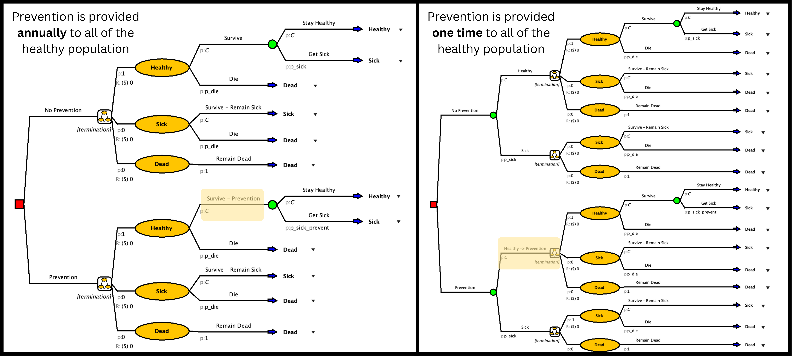

# Objectives

-   Use your decision problem, strategies, and decision tree from slides 3, 4, and 5
    -   Determine the health states of the decision problem
        -   *These become your Markov states*
    -   Determine the transitions
        -   *Which state(s) does your population move in and out of? Is there an order?*
    -   *Which state(s) does your population move in and out of? Is there an order?*
        -   Population – *who?*
        -   Cycle length – *how long does it take to move through the states?*
        -   Time horizon – *how far into the future?*
        -   Probabilities (fill these in later)

# Deliverables

-   Create slide for final presentation that displays your decision problem as a Markov schematic
    -   Slide 6 – bubble diagram graphic, transition matrix framework, parameter table
        -   Your draft bubble diagram should indicate the various health/intervention states and directional pathways between states

        -   Use the transition matrix to define the health/intervention states that the population can move between – probability estimates are not needed yet **\[We will cover this more tomorrow\]**

        -   The parameter table should list the parameters needed to define and run the model – ages, costs, utility weights, time horizon – it does not need parameter estimates yet

# Extra Decision Tree Amua Help

Below are some common "tricky" situations that were not covered in this Case Study but may arise in your capstone.

## **1.** What if my model isn’t an annual cycle?

This is not an uncommon problem. Many conditions are not accurately captured in an annual cycle. Cycles can be adjusted to be longer or shorter. Just make sure that you make all the necessary updates to the model to capture the time line.

1.  Ensure Health States are accurate to the new cycle length
2.  Update probabilities to be for the new cycle length
3.  Max cycles & termination updated
4.  Adjust outcomes to ensure they are accurate to the cycle length
    1.  Costs
    2.  Counts
    3.  Utility
5.  Update discounts to match the cycle length

## **2.** When do I not do a decision tree into a Markov?

In the case study, the decision tree flows into a markov model. This allows us to capture the one time treatment. However, there are times when the only branches before the Markov Chain are the strategy/decision names.

Times when to have a decision tree flow before the Markov Chain:

-   One time upfront event (Screening, Strategy, Treatment Etc.)

Times when the Markov Chain is the beginning:

-   Nothing up front

