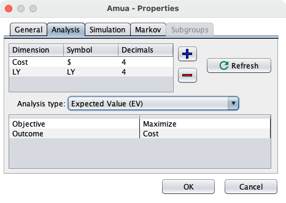
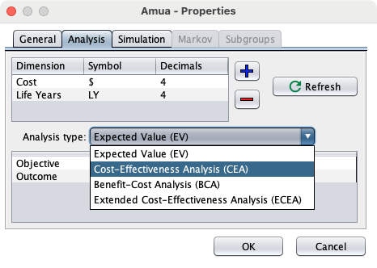
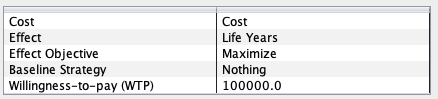

```{=html}
<style>
/* Base: make Quarto callouts behave like full cards */
.callout.fill-box {
  /* Unified background & border for the whole card */
  --box-bg: #eaf6ee;   /* default soft green if no class overrides */
  --edge-color: #1f6f43; /* default darker edge/title color */
  background: var(--box-bg);
  border: 1px solid var(--edge-color);
  border-radius: 8px;
  margin: 1rem 0;
  overflow: hidden; /* keeps rounded corners clean when title is darker */
}

/* Title bar: darker shade; full-width across top */
.callout.fill-box .callout-title {
  background: var(--edge-color);
  color: #fff;
  padding: 0.6rem 0.8rem;
  font-weight: 600;
  border-bottom: 1px solid var(--edge-color);
}

/* Body: same light color as the card, not a separate “stripe” */
.callout.fill-box .callout-body {
  background: transparent; /* let the parent set the background */
  padding: 0.9rem 1rem;
}


/* --- Specific palettes --- */
/* Green: "Why are we doing this?" */
.callout.why-box {
  --box-bg: #eaf6ee;    /* light green fill */
  --edge-color: #1f6f43;/* dark green edge/title */
}

/* Purple: "Your Task" */
.callout.task-box {
  --box-bg: #f3ecfb;    /* light purple fill */
  --edge-color: #7140a6;/* deep purple edge/title */
}

/* Yellow: "Objectives" */
.callout.objectives {
  --box-bg: #f2eee4;    /* light yellow fill */
  --edge-color: #CfAE70; /* deep yellow edge/title */
}

</style>
```

::: {.callout .fill-box .objectives}
# Introduction and Learning Objectives 


By the end of this session, participants will be able to:

1. Calculate incremental costs and effectiveness
2. Apply dominance rules to eliminate both dominated and extendedly dominated strategies
3. Calculate ICERs
4. Apply WTP thresholds to make policy decisions
:::


Now that we have a model, we need to understand how the strategies compare to each other.

::: {.callout .fill-box .why-box}
## Why are we doing this?

In cost-effectiveness analysis, having costs and outcomes is helpful but can be difficult to understand how much difference exists between each strategy. The Incremental Cost-Effectiveness Analysis allows us to understand how these strategies compare to each other taking both cost and quality of life into consideration.
:::

::: {.callout .fill-box .task-box}
## Your Task

Hand calculate an Incremental Cost-Effectiveness Analysis using a WTP = \$100,000/Life Year gained **\[NOTE THIS IS A COUNT SPECIFIC WTP THRESHOLD\]**
:::

In the last exercise you should have gotten:

|                 | Discounted Cost      |  Discounted Life Years     |
|-----------------|-----------|-----------|
| No Screen/Treat | 2,800 | 19.04 |
| Treat all       | 30,000 | 19.484 |
| Screen all      | 4,950 | 19.68 |

: Cost and Life Year Outcomes for Cancer strategies
## Perform a cost-effectiveness analysis of the treatment options using LYs as the measure of health effects.

*Which strategy would you choose and why, if the willingness-to-pay threshold is \$100,000 per life year gained?*

| Strategy | Discounted Costs | Discounted LYs | Incremental Costs | Incremental LYs | ICER (\$/LY) |
|------------|------------|------------|------------|------------|------------|
|  |  |  |  |  |  |
|  |  |  |  |  |  |
|  |  |  |  |  |  |

: Treatment Options

| Strategy | Discounted Costs | Discounted LYs | Incremental Costs | Incremental LYs | ICER (\$/LY) |
|------------|------------|------------|------------|------------|------------|
|  |  |  |  |  |  |
|  |  |  |  |  |  |
|  |  |  |  |  |  |

: ICER Calculation Table 1 {tbl-colwidths="\[20,20,20,20,20,20\]"}

| Strategy | Discounted Costs | Discounted LYs | Incremental Costs | Incremental LYs | ICER (\$/LY) |
|------------|------------|------------|------------|------------|------------|
|  |  |  |  |  |  |
|  |  |  |  |  |  |
|  |  |  |  |  |  |

: ICER Calculation Table 2 {tbl-colwidths="\[20,20,20,20,20,20\]"}

# Verify your results in Amua

Update the properties in Amua to have the model run a cost-effectiveness analysis with LY as the effect.

Note: The basecase is No Screen/Treat

<details>
  
<summary style="color: orange;">
    
More assistance with step
  
</summary>
    
<p style="color: black;">
      
1. Go to Model > Properties > Analysis



2. Under "Analysis Type" choose "Cost-Effectiveness Analysis (CEA)"



3. Set the settings to the following: 



</p>
</details>


::: callout-tip
## Check your answer
<br>
Enter the ICER of the strategy you would choose (to two decimal places)
<br>
<input id="answercea1" type="number" step="0.01" placeholder="e.g., 43.5" />
<button id="checkcea1">Check</button>
<div id="feedbackcea1" style="margin-top: 10px;"></div>
<script>
(function() {
  // Set the correct value and tolerance
  const CORRECT = 3317.90;
  const TOL = 0.01; // accept +/- 0.01
  const input = document.getElementById('answercea1');
  const button = document.getElementById('checkcea1');
  const feedback = document.getElementById('feedbackcea1');
  function setFeedback(msg, status) {
    feedback.textContent = msg;
    feedback.style.fontWeight = '600';
    feedback.style.color = status === 'ok' ? '#1a7f37' : (status === 'warn' ? '#7f6a00' : '#b30000');
  }
  button.addEventListener('click', function() {
    const val = parseFloat(input.value);
    if (isNaN(val)) {
      setFeedback('Please enter a number.', 'warn');
      return;
    }
    const ok = Math.abs(val - CORRECT) <= TOL;
    if (ok) {
      setFeedback('✅ Correct!', 'ok');
    } else {
      setFeedback('❌ Not quite. Try again.', 'bad');
    }
  });
})();
</script>
<br>
:::

# Additional Strategies
Another member of the lab has built a model that looks at screening by risk. They were able to provide you the Cost and Life years for two strategies. Include these in your CEA to determine which of the 5 total strategies is the most cost-effective. 

|  | Discounted Cost | Discounted LYs |
| --- | --- | --- |
| Screen High Risk Only |$28,000 | 19.89 |
| Treat High Risk Only | $29,000 | 19.91 |

Add in those two strategies to your incremental calculations

::: {.callout .fill-box .why-box}
## Why are we doing this?

Hand calculating the Incremental CEA will help you understand the logic behind the calculations that Amua is completing. This will also help you build intuition on if the results seem accurate to what you would expect.
:::

::: {.callout .fill-box .task-box}
## Your Task
Hand calculate an Incremental Cost-Effectiveness Analysis using a WTP = \$100,000/Life Year gained with the additional strategies included
:::

*Which strategy would you choose and why, if the willingness-to-pay threshold is \$100,000 per life year gained?*

| Strategy | Discounted Costs | Discounted LYs | Incremental Costs | Incremental LYs | ICER (\$/LY) |
|------------|------------|------------|------------|------------|------------|
|  |  |  |  |  |  |
|  |  |  |  |  |  |
|  |  |  |  |  |  |
|  |  |  |  |  |  |
|  |  |  |  |  |  |

: Treatment Options

| Strategy | Discounted Costs | Discounted LYs | Incremental Costs | Incremental LYs | ICER (\$/LY) |
|------------|------------|------------|------------|------------|------------|
|  |  |  |  |  |  |
|  |  |  |  |  |  |
|  |  |  |  |  |  |
|  |  |  |  |  |  |
|  |  |  |  |  |  |

: ICER Calculation Table 1 {tbl-colwidths="\[20,20,20,20,20,20\]"}

| Strategy | Discounted Costs | Discounted LYs | Incremental Costs | Incremental LYs | ICER (\$/LY) |
|------------|------------|------------|------------|------------|------------|
|  |  |  |  |  |  |
|  |  |  |  |  |  |
|  |  |  |  |  |  |
|  |  |  |  |  |  |
|  |  |  |  |  |  |

: ICER Calculation Table 2 {tbl-colwidths="\[20,20,20,20,20,20\]"}


::: {.callout-tip}
## Check your answer

**What is the ICER of the strategy you would choose? (to 2 decimal places)**

Enter your result:
<input id="answercea2" type="number" step="0.01" placeholder="e.g., 42.5" />
<button id="checkcea2">Check</button>
<span id="feedbackcea2" style="margin-left:0.5rem;"></span>

<script>
(function() {
  // Set the correct value and tolerance
  const CORRECT = 3359.38;
  const TOL = 0.01; // accept +/- 0.01

  const input = document.getElementById('answercea2');
  const button = document.getElementById('checkcea2');
  const feedback = document.getElementById('feedbackcea2');

  function setFeedback(msg, status) {
    feedback.textContent = msg;
    feedback.style.fontWeight = '600';
    feedback.style.color = status === 'ok' ? '#1a7f37' : (status === 'warn' ? '#7f6a00' : '#b30000');
  }

  button.addEventListener('click', function() {
    const val = parseFloat(input.value);
    if (isNaN(val)) {
      setFeedback('Please enter a number.', 'warn');
      return;
    }
    const ok = Math.abs(val - CORRECT) <= TOL;
    if (ok) {
      setFeedback('✅ Correct!', 'ok');
    } else {
      setFeedback('❌ Not quite. Try again.', 'bad');
    }
  });
})();
</script>
:::


::: {.callout-tip}
## Check your answer

**What is the ICER of the strategy you would choose if the WTP was $200,000/LY? (to 2 decimal places)**

Enter your result:
<input id="answercea3" type="number" step="0.01" placeholder="e.g., 42.5" />
<button id="checkcea3">Check</button>
<span id="feedbackcea3" style="margin-left:0.5rem;"></span>

<script>
(function() {
  // Set the correct value and tolerance
  const CORRECT = 108333.33;
  const TOL = 0.01; // accept +/- 0.01

  const input = document.getElementById('answercea3');
  const button = document.getElementById('checkcea3');
  const feedback = document.getElementById('feedbackcea3');

  function setFeedback(msg, status) {
    feedback.textContent = msg;
    feedback.style.fontWeight = '600';
    feedback.style.color = status === 'ok' ? '#1a7f37' : (status === 'warn' ? '#7f6a00' : '#b30000');
  }

  button.addEventListener('click', function() {
    const val = parseFloat(input.value);
    if (isNaN(val)) {
      setFeedback('Please enter a number.', 'warn');
      return;
    }
    const ok = Math.abs(val - CORRECT) <= TOL;
    if (ok) {
      setFeedback('✅ Correct!', 'ok');
    } else {
      setFeedback('❌ Not quite. Try again.', 'bad');
    }
  });
})();
</script>
:::
