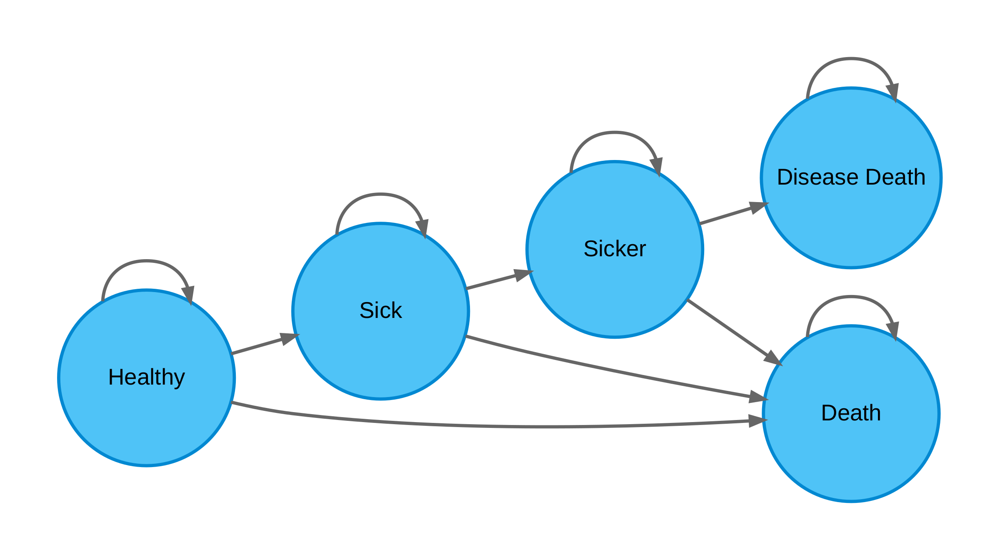
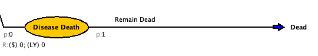
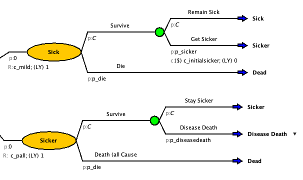

```{=html}
<style>
/* Base: make Quarto callouts behave like full cards */
.callout.fill-box {
  /* Unified background & border for the whole card */
  --box-bg: #eaf6ee;   /* default soft green if no class overrides */
  --edge-color: #1f6f43; /* default darker edge/title color */
  background: var(--box-bg);
  border: 1px solid var(--edge-color);
  border-radius: 8px;
  margin: 1rem 0;
  overflow: hidden; /* keeps rounded corners clean when title is darker */
}

/* Title bar: darker shade; full-width across top */
.callout.fill-box .callout-title {
  background: var(--edge-color);
  color: #fff;
  padding: 0.6rem 0.8rem;
  font-weight: 600;
  border-bottom: 1px solid var(--edge-color);
}

/* Body: same light color as the card, not a separate “stripe” */
.callout.fill-box .callout-body {
  background: transparent; /* let the parent set the background */
  padding: 0.9rem 1rem;
}


/* --- Specific palettes --- */
/* Green: "Why are we doing this?" */
.callout.why-box {
  --box-bg: #eaf6ee;    /* light green fill */
  --edge-color: #1f6f43;/* dark green edge/title */
}

/* Purple: "Your Task" */
.callout.task-box {
  --box-bg: #f3ecfb;    /* light purple fill */
  --edge-color: #7140a6;/* deep purple edge/title */
}

/* Yellow: "Objectives" */
.callout.objectives {
  --box-bg: #f2eee4;    /* light yellow fill */
  --edge-color: #CfAE70; /* deep yellow edge/title */
}
</style>
```

::: {.callout .fill-box .objectives}
# Introduction and Learning Objectives 

By the end of this session, participants will be able to:

1.Expand Markov models building on the simple model to add complexity 2. Model disease-specific mortality by distinguishing disease deaths from all-cause mortality 3. Implement one-time transition costs 4. Evaluate progression's impact on CEA and understand how this complexity changes cost-effectiveness results
:::

To help visualize how this will work, here is a bubble diagram



Adding in progression in our model can help create a more realistic clinical model.

Previously we assumed that everyone with Disease X received palliative care but in clinical reality it is only provided with progressed disease. There is also a one time cost for a higher dose of palliative care when transitioning from mild to progressive disease. While treatment lowers your probability of getting sick again, if you do get sick again, the probability of progression is the same. We will assume that no one starts in progressed disease. Disease death can only happen from the progressed state. The % of deaths from Disease X is minimal in the total death rate so there is no need to remove it from the all cause deaths.

# Additional Parameters

| Name | Value | Description |
|------------------|------------------|-------------------------------------|
| p_sicker | 0.12 | Probability of getting sicker from a mild case of Disease X |
| p_diseasedeath | 0.15 | Probability of dying from disease death |
| c_mild | \$1,000 | Cost of being mildly sick (doctors appointments) |
| c_initialsicker | \$50,000 | One-time cost between mild and progression |

# Add the additional states to your model

## Disease Death

Add a "Disease Death" state

<details>

<summary style="color: orange;">

More assistance with step

</summary>

<p style="color: black;">

1.  Create a "Disease Death" state from the markov node
2.  Set the starting probability to 0
3.  Create a return to "Disease Death" event

</p>

</details>

<details>

<summary style="color: green; font-size: 4vh;">

Check your Model

</summary>

<p style="color: black;">



</p>

</details>

## Sicker

Add a "Sicker" state

<details>

<summary style="color: orange;">

More assistance with step

</summary>

<p style="color: black;">

1.  Add a Sicker state to the "Treat None" markov model
2.  Set the starting probability to 0
3.  Add all cause death event
4.  Add disease death event
5.  Update outcomes and probabilities
6.  Update Sick to go to Sicker
7.  Add one time cost of sick to sicker
8.  Set cost off sick to c_sick

</p>

</details>

<details>

<summary style="color: green; font-size: 4vh;">

Check your Model

</summary>

<p style="color: black;">



</p>

</details>

## Repeat for the markov models on Treat ALL

:::: callout-tip
## Check your answer

<br> Enter the ICER for the strategy you would choose (to 2 deminal places) <br> <input id="answerprog" type="number" step="0.01" placeholder="e.g., 43.5" /> <button id="checkprog">Check</button>

::: {#feedbackprog style="margin-top: 10px;"}
:::

```{=html}
<script>
(function() {
  // Set the correct value and tolerance
  const CORRECT = 21759.59;
  const TOL = 0.01; // accept +/- 0.01
  const input = document.getElementById('answerprog');
  const button = document.getElementById('checkprog');
  const feedback = document.getElementById('feedbackprog');
  function setFeedback(msg, status) {
    feedback.textContent = msg;
    feedback.style.fontWeight = '600';
    feedback.style.color = status === 'ok' ? '#1a7f37' : (status === 'warn' ? '#7f6a00' : '#b30000');
  }
  button.addEventListener('click', function() {
    const val = parseFloat(input.value);
    if (isNaN(val)) {
      setFeedback('Please enter a number.', 'warn');
      return;
    }
    const ok = Math.abs(val - CORRECT) <= TOL;
    if (ok) {
      setFeedback('✅ Correct!', 'ok');
    } else {
      setFeedback('❌ Not quite. Try again.', 'bad');
    }
  });
})();
</script>
```

<br>
::::

<details>

<summary style="color: green; font-size: 4vh;">

Screening Added

</summary>

<p style="color: black;">

[Amua File With Screening Added](/MarkovProgwithScreening.amua)

</p>

</details>
