```{=html}
<style>
/* Base: make Quarto callouts behave like full cards */
.callout.fill-box {
  /* Unified background & border for the whole card */
  --box-bg: #eaf6ee;   /* default soft green if no class overrides */
  --edge-color: #1f6f43; /* default darker edge/title color */
  background: var(--box-bg);
  border: 1px solid var(--edge-color);
  border-radius: 8px;
  margin: 1rem 0;
  overflow: hidden; /* keeps rounded corners clean when title is darker */
}

/* Title bar: darker shade; full-width across top */
.callout.fill-box .callout-title {
  background: var(--edge-color);
  color: #fff;
  padding: 0.6rem 0.8rem;
  font-weight: 600;
  border-bottom: 1px solid var(--edge-color);
}

/* Body: same light color as the card, not a separate “stripe” */
.callout.fill-box .callout-body {
  background: transparent; /* let the parent set the background */
  padding: 0.9rem 1rem;
}


/* --- Specific palettes --- */
/* Green: "Why are we doing this?" */
.callout.why-box {
  --box-bg: #eaf6ee;    /* light green fill */
  --edge-color: #1f6f43;/* dark green edge/title */
}

/* Purple: "Your Task" */
.callout.task-box {
  --box-bg: #f3ecfb;    /* light purple fill */
  --edge-color: #7140a6;/* deep purple edge/title */
}

/* Yellow: "Objectives" */
.callout.objectives {
  --box-bg: #f2eee4;    /* light yellow fill */
  --edge-color: #CfAE70; /* deep yellow edge/title */
}

</style>
```

::: {.callout .fill-box .objectives}
# Introduction and Learning Objectives 

By the end of this session, participants will be able to:

1.  Create a visualization of the model using the Bubble Diagram tool

2.  Build and structure a Markov model in Amua to represent clinical decision problems.

3.  Evaluate model outcomes for alternative clinical strategies.

4.  Add and compare multiple strategies (e.g., diagnostic testing options) in a single decision framework.
:::

The decision trees are enough to answer some research questions. However, a more complicated Markov Model may be needed to represent the health condition accurately.

In our decision tree, we have a one time screening and calculations for if someone gets sick. However, what if:

-   There are a small percentage of people that can get sick again

-   The data does not exist for "Life Years Gained".

A Markov Model will allow us to cleanly integrate this into our model.

**Although we are calling this the "Simple Markov Model", we understand that this is a really long case study, there will also be time to work on it tomorrow but we wanted to make sure that you had all the information for your model**

Anatomy of a Markov Model in Amua: 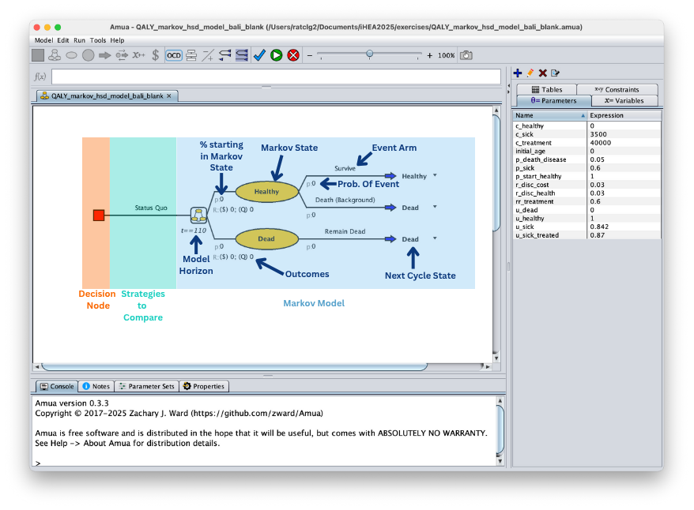

::: {.callout .fill-box .why-box}
## Why are we doing this?

The decision tree allows us to understand the results at one time point. From our tree we can use set metrics of life years to understand how participant’s quality of life is impacted but we do not get a full picture of the long term impacts like the annual effect of being sick or the increase risk of death. A Markov creates a framework to understand impacts over time in a much cleaner and computationally friendly way.
:::

More Background on Disease X: After the initial treatment has happened at 50 years old, it cannot be repeated. The small percentage of individuals that get sick again will just get the palliative care that is currently provided. They will not be able to heal but will remain sick until death. Both all-cause deaths and disease deaths will be in the death state.

**NOTE:** For simplicity, we will be dropping the screening strategy from the exercise. A version with screening will be added for reviewing.

# Use Bubble Diagram Tool

We will keep the decision tree for the one time treatment. The Markov Model will capture individuals healing, getting sick again, and dying.

::: {.callout .fill-box .task-box}
## Your Task

Create a bubble diagram for Disease X using the [Bubble Diagram Tool](https://geratcliff.shinyapps.io/bubble_tool/){target="_blank"}
:::

<details>

<summary style="color: orange;">

More assistance with step

</summary>

<p style="color: black;">

### A: Add the Health States

In the Bubble Diagram tool:

1.  Type the name of the state into the "State Name" text box on the left side bar.
2.  Click "Add State"

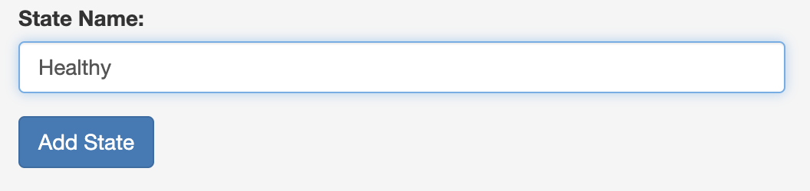 3. Repeat for all the states

You should get:

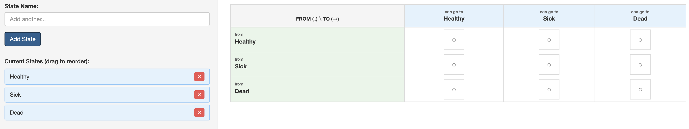

### B: Define the Transitions

You need to select where transitions between states are possible. This also includes the ability to return to a current state.

1.  On the main screen you should see the transition matrix

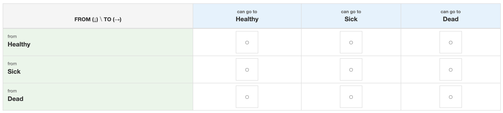

2.  Click on the box () within the cell to allow a transition between the two states

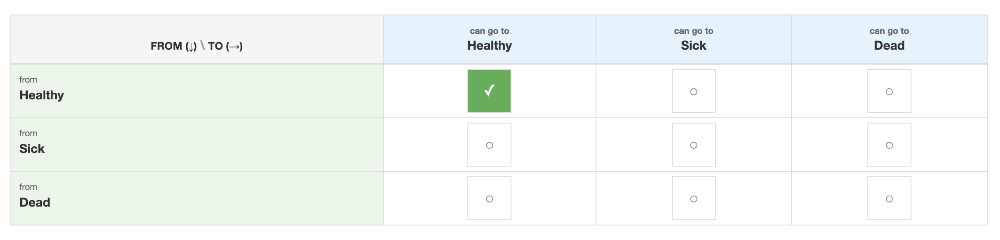 3. Repeat for all possible transitions.

### C: Generate the Model

Once you have added all the possible transitions. Click the "Generate Diagram" Button on the left side bar (you may need to scroll down to see the button).

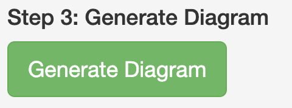

Then click to the "Bubble Diagram" tab to see your diagram

**Note:** You can download your diagram from the "Bubble Diagram" tab. You do not need to for this model but you will for your capstone if you are doing a Markov Model.

</p>

</details>

<details>

<summary style="color: green; font-size: 4vh;">

Check your Bubble Diagram

</summary>

<p style="color: black;">

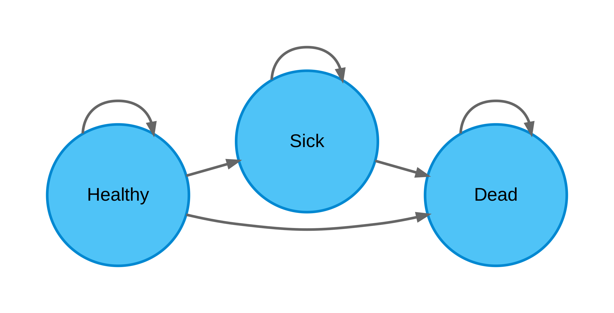

</p>

</details>

# Building the model

In the Disease X model, we will be flowing the tree into the Markov model.

Click Model \> New \> Markov Model

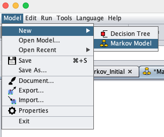

You should get a empty page with a decision node ()

::: {.callout .fill-box .task-box}
## Your Task

Build out the Markov Structure for the "Treat None" arm of the model
:::

<details>

<summary style="color: orange;">

More assistance with step

</summary>

<p style="color: black;">

### A: Add Markov Chain

1.  Add the Markov Chain () for the "Treat None" arm.

    Option 1: Select the decision node. Right click \> Add \> Markov Chain.

    Option 2: Select the decision node and click the Markov Chain button () in the top bar

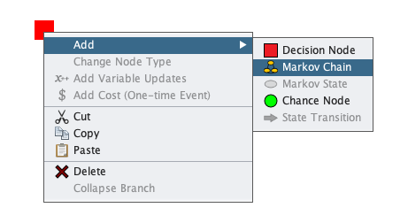

2\. Name that chain "Treat None"

### B: Add the Health States

This model has three health states: Healthy, Sick, and Dead

1.  Select the Markov chain labeled "Treat None" 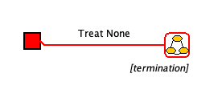

2.  Add the health states

    Option 1: Right click \> Add \> Markov State ().

    Option 2: Click the Markov State button () in the top bar.

    Option 3: Double click on the Markov Chain to get two Markov states added

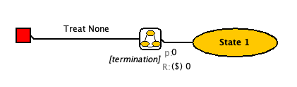

3.  Rename the State to "Health"

4.  Repeat for Sick and Dead

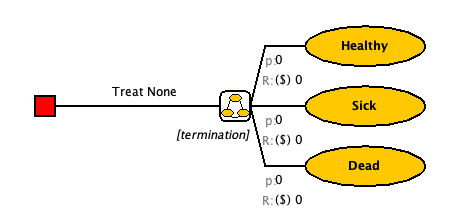\

### C: Add events within each health state

::: {.callout-important appearance="minimal"}
It is common practice in teaching decision modeling to model events sequentially. Suppose, for example, that an individual can experience the following events from a diseased state:

```         
-   Die from disease (Event A)
-   Die from background causes (Event B)
-   Survive
```

The image below shows two alternative approaches to modeling these events. **Panel A** uses a non-sequential approach in which events in a cycle are not conditional on other events not occurring. **Panel B**, by comparison, first considers death from Event A. Conditional on surviving A, it then considers death from Event B.

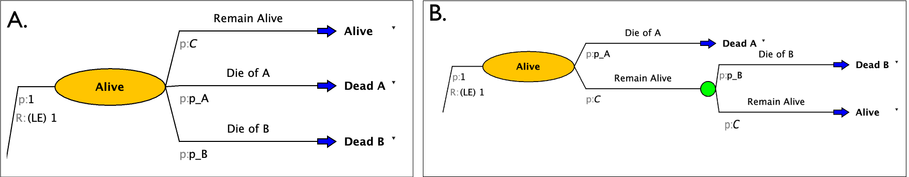

If you are converting rates to probabilities using standard formulas (e.g., $1-\exp(-r)$) you should use a sequential approach where only two events are considered at at time (Panel B). This ensures that the converted probabilities work correctly.

If you are using transition probabilities derived from embedding the transition probabilities from the underlying transition rate matrix, as we covered in lecture, you do not need to undertake the sequential approach: you can use the approach in Panel A, though you will also need to make sure that your model structure captures all non-zero probabilities in your transition probability matrix.

**For the remainder of this case study we will model the disease progression using the sequential approach (e.g., the approach in Panel B).**
:::

1.  Identify the Events in each state
    -   Healthy: Stay Healthy, Get Sick, All-cause death
    -   Sick: Stay sick, Disease Death, All-cause death
    -   Dead: Remain Dead
2.  Select the Markov State labeled "Healthy". It will outline red when selected

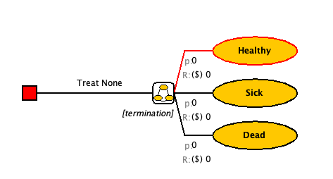

3.  Add a chance node

    Option 1: Right click \> Add \> Chance Node ().

    Option 2: Click the Chance Node button () in the top bar

    Option 3: Double click on the Markov State to get two chance nodes added

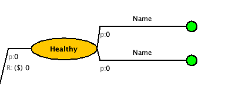

4.  Change the labels to "Survive" and "Die".

5.  Nothing can happen after you die so we will change that to a state transition node. Select the "Die" branch and click the "Change to State Transition" ((.) button on the top bar. You should get something like this. \[It may have auto filled a state or it may also be blank\]

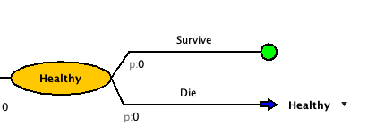

6.  Click on the drop down arrow that is to the right of the state transition blue arrow to set the state transition.

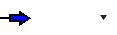

7.  Select the correct state for that decision branch from the drop down. For "Die", it should be "Dead"

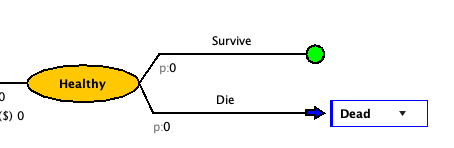

Now let's look back at the "Survive" branch. The proportion of the cohort that survives death, will have the chance of getting sick.

8.  Add a chance node for getting sick.

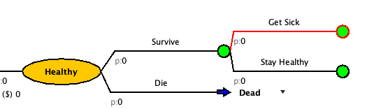

9.  At the end of each branch, change the chance nodes to state transitions.

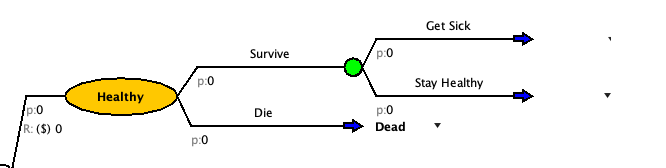

10. Update the state transitions to match the transition for that branch.

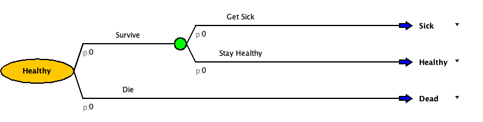

11. Build out the events for the other two health states.

\[Don't worry about the Treat strategy, we will come back to it\]

</p>

</details>

<details>

<summary style="color: green; font-size: 4vh;">

Check your Model

</summary>

<p style="color: black;">

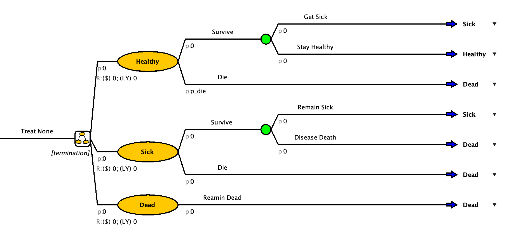

</p>

</details>

# Add Parameters

To help with time, we have created a parameters file you can upload to your model.

**Download this file:** [PARAMETER TABLE](parameters_markovsimp.csv)

1.  On the top bar click Model \> Import

2.  An pop-up should appear to help "Import Objects"

    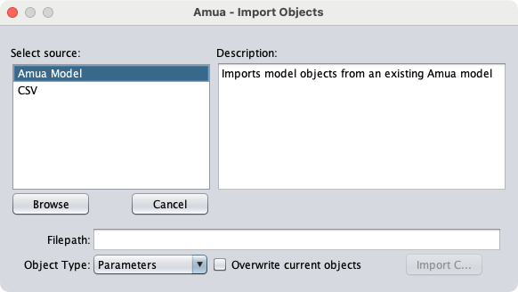\

3.  Select the CSV source

    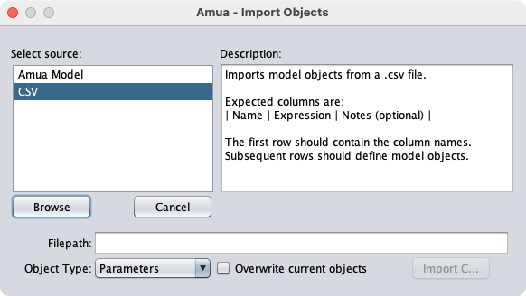

4.  Click the "Browse" button

5.  Select the parameter file and click "Open"

6.  Make sure the "Object Type" is set to "Parameters" and click "Import C..."

You're side bar should now be populated with the model parameters

Here are the parameters if you need to add them manually:

| Name           | Expression | Description                                     |
|------------------|------------------|-------------------------------------|
| prev           | 0.08       | Prevelance of Disease X at age 50               |
| p_sick         | 0.03       | Annual probability of getting Disease X         |
| p_diseasedeath | 0.15       | Annual probability of dying from Disease X      |
| hr_treated     | 0.5        | Hazard ratio of getting Disease X after treated |
| initial_age    | 50         | Initial Age                                     |
| c_treatment    | 30000      | Cost of Treatment                               |
| c_pall         | 15000      | Cost of Palliative Care                         |

# Starting Probabilities

For a Markov Model, you have to determine where people start. Some models everyone starts in the same state and in other models people start spread out across multiple states.

In the "Treat None" branch, we know that some people will start sick and some will be healthy.

The current prevalence of Disease X in 50 year olds is 8%.

::: {.callout .fill-box .task-box}
## Your Task

Update the Markov model with starting probabilities
:::

<details>

<summary style="color: orange;">

More assistance with step

</summary>

<p style="color: black;">

The grey "p" before the bubble is the starting probability

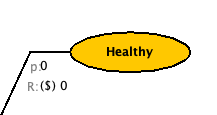

1.  Click the "0" right after the starting probability for the "Sick" state

2.  Set the starting probability to "prev"

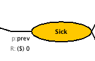

Leave the starting probability of death at 0. And the starting probability of Healthy to be "*C*" \[the complimentary probability to Sick\]

</p>

</details>

<details>

<summary style="color: green; font-size: 4vh;">

Check your Model

</summary>

<p style="color: black;">

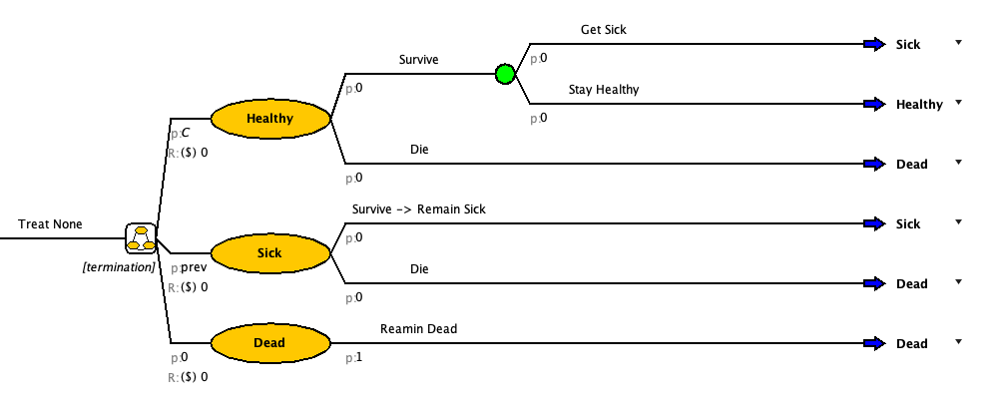

</p>

</details>

# Uploading a Table

You may have noticed that there is no probability of death in the uploaded parameters. Parameters are set values that do not change over time. However, the probability of death increases with age. To accommodate this, we will upload a table and create a p_die variable.

**Table File:** [probability of death by age](tbl_p_die.csv)

::: {.callout .fill-box .task-box}
## Your Task

Add in the life table and p_die variable.
:::

<details>

<summary style="color: orange;">

More assistance with step

</summary>

<p style="color: black;">

### A: Add a table:

1.  Click to the " Tables" tab on the right sidebar

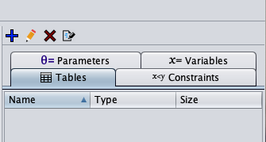

2.  Click on the blue plus sign 

3.  The "Define Table" pop-up will open

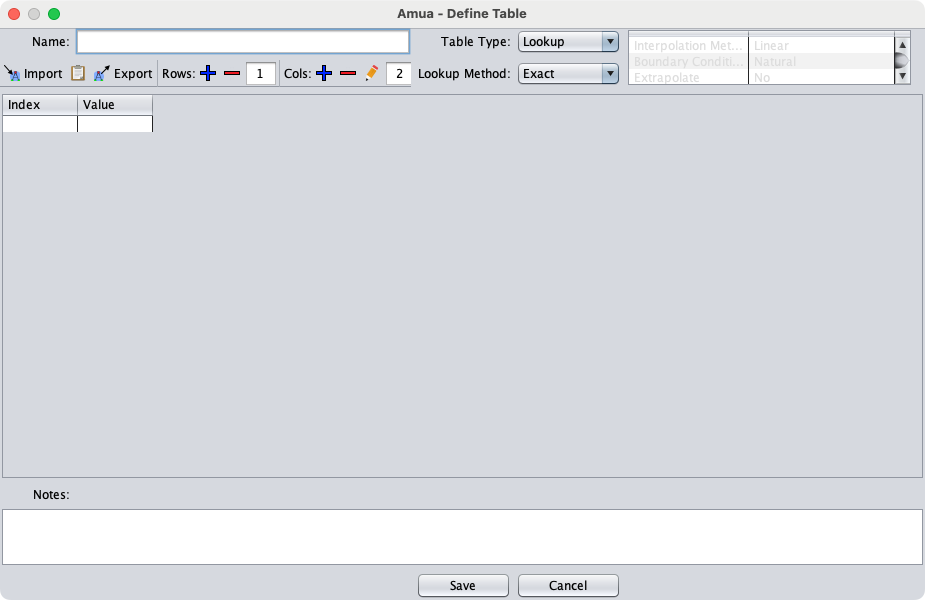

4.  Add a name for your table. (Example: tbl_p_die)

5.  There are two ways to add the table value from the downloaded CSV:

::: panel-tabset
### Import Table

1.  Click the " Import" button on the top bar of the pop-up

2.  Select the downloaded table from where you saved it.

3.  Click Import

### Copy & Paste

1.  Open the downloaded table in a spreadsheet software (Example: Excel)

2.  Select and copy the entire table

3.  Click the paste () button on the top bar of the pop-up
:::

6.  Ensure that your table has no extra columns or rows. If it does, select and delete them with the remove () options on the top bar of the pop-up

7.  Choose the "Table Type" and "Look Up" Method. We will be using Lookup, Interpolate.

    -   This means that for age 1 = 0.013 and age 2 =0.010 but if the model asks for age 1.5, it will return a number between the two

        *More information on table types:* <https://github.com/zward/Amua/wiki/Tables#table-types>

8.  Save your table

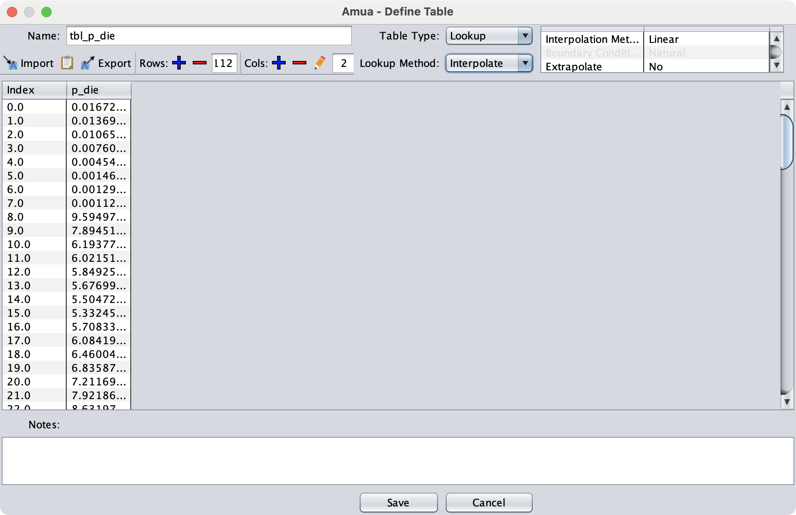

### B: Create a p_die variable

1.  Click to the " Variables" tab on the right sidebar

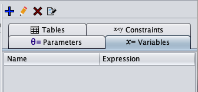

2.  Click on the blue plus sign . The "Define Variable" pop-up will open

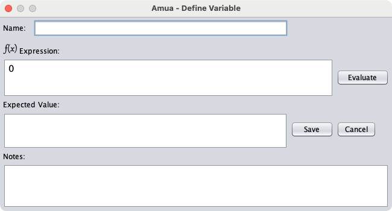

3.  Name the variable "p_die"

4.  Use the following formula to define the variable `tbl_p_die[initial_age + t, 1]`

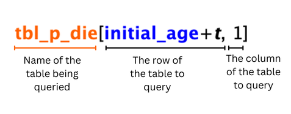

*Note: We use "initial_age +t" for the row value because "t" alone is just the Amua built in variable for the cycle number. If we used just "t" the p_die for cycle 10 would be for 10 year olds not 60 year olds.*

5.  Save the variable

</p>

</details>

# Set Termination Condition

In a Markov model you have to define a horizon for the model to run. In Amua this is the termination condition. Since this is a lifetime model, running it to 110 years old or 60 more years is probably enough.

Remember that "*t*" is a built in cycle variable. Therefore, the termination condition can be set to end when t equals 60.

<details>

<summary style="color: orange;">

More assistance with step

</summary>

<p style="color: black;">

1.  Below the Markov Chain is the termination condition

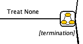

2.  Click on the *\[termination\]* and delete the text. Input `t==60`

</p>

</details>

# Parameterize the Model

::: {.callout .fill-box .task-box}
## Your Task

Input the parameters, outcomes, and variable into the model structure.

1.  Add probabilities and complimentary probabilities to all events
2.  Add in a outcome for LY in Model \> Properties \> Analysis
3.  Add costs and benefits below the starting probabilities on the health state bubble

Hint: LY = 1 when you are alive and 0 when you are dead.
:::

<details>

<summary style="color: green; font-size: 4vh;">

Check your Model

</summary>

<p style="color: black;">

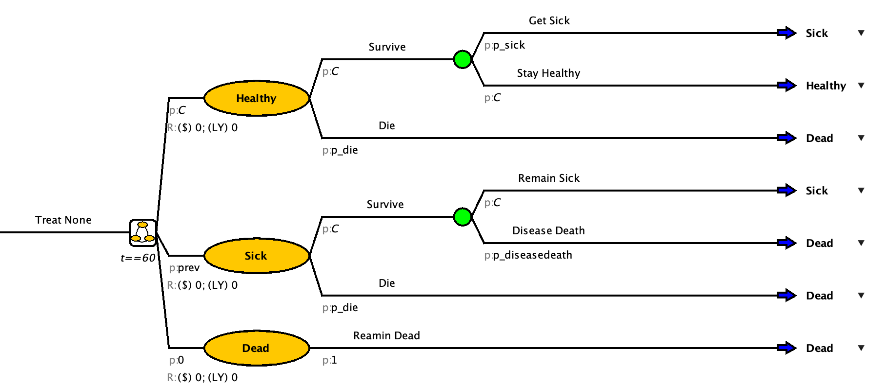

</p>

</details>

# Create the Treat All Branch

Once your model matches the one in the drop-down above, you can move on to the Treat All Branch

1.  Add a "Treat All" branch from the decision node

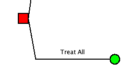

# Copy and Paste in Amua

Copy and paste the "Treat None for the "Sick -\> Treat" and "Not Sick -\> Treat" arm.

1.  Select the item you want to copy. In this case it is the "Treat None" arm of the model.

2.  Right click and copy or use Ctrl + C \[On Mac, CMD + C\]

3.  Select the Treat All Node

4.  Right click and paste or use Ctrl + P \[On Mac, CMD + P\]

5.  Click the "OCD" button to clean up the model

6.  Rename the branch to "Sick -\> Treat"

7.  Repeat for "Not Sick -\> Treat"

<details>

<summary style="color: green; font-size: 4vh;">

Check your Model

</summary>

<p style="color: black;">

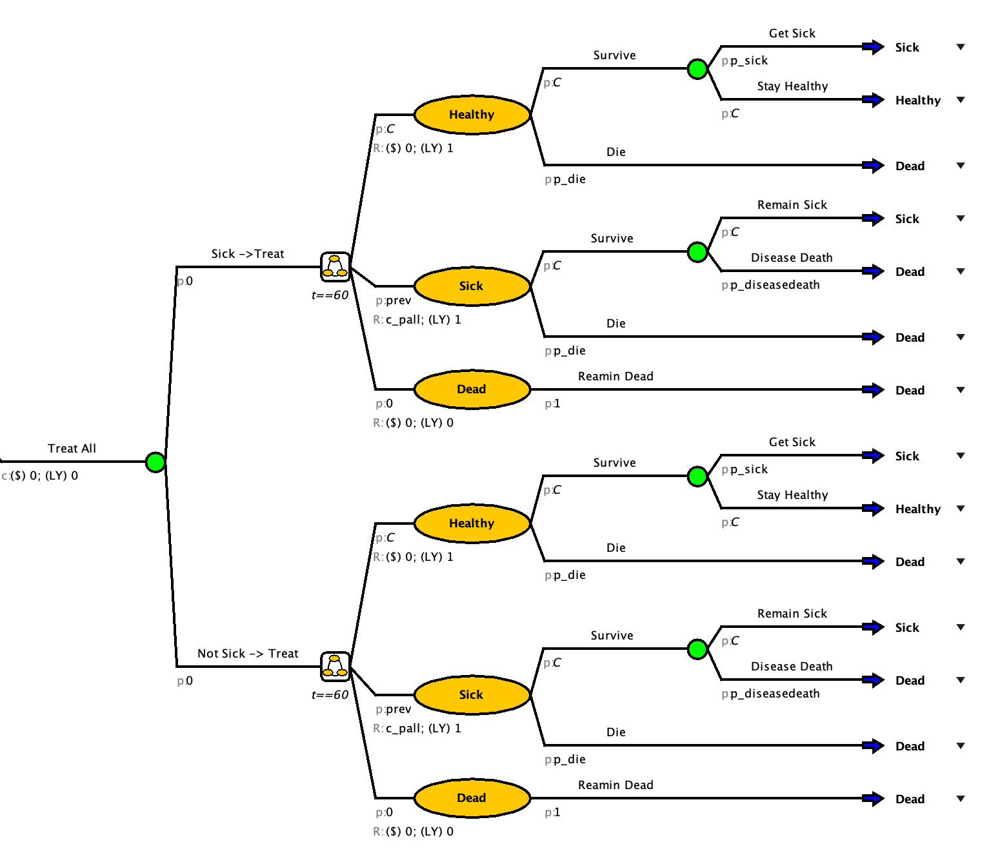

</p>

</details>

# Adjusting to match strategy

Copy and pasting the strategy helped us save time but we need to make sure that the model accurately matches the strategy that it is running for.

Things that need fixed: - Set probability of sick or not sick in the tree part of "Treat All" - Set initial probabilities to match the corresponding branch - Add in treatment costs - Add in a rate reduction of getting sick again and needing palliative care

<details>

<summary style="color: orange;">

More assistance with step

</summary>

<p style="color: black;">

### A: Set probability of sick or not sick

In the tree portion of the "Treat All" branch, set the probability of sick to `prev` and the probability of not sick to "*C*"

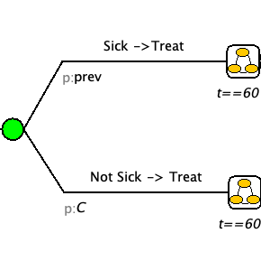

### B: Set initial probabilities

We will assume that after you get treatment that will remain healthy for atleast one cycle before getting sick again. Therefore the initial probabilities for both "Sick -\> Treat" and "Not Sick -\> Treat" are Healthy = 1, Sick = 0, and Dead = 0.

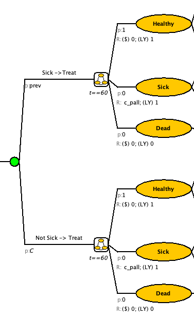

### C: Add Treatment Cost

The needs to be a one-time cost added to the "Treat All" branch.

-   Option 1: Right click the "Treat All" branch and select "\$ Add Cost (One-Time Event)"

-   Option 2: Select the "Treat All" branch and select the \$ on the top banner

Update the cost to have the cost of treatment

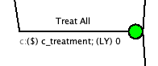

### D: Add reduction in p_sick for those treated

In both the "Sick -\> Treat" and "Not Sick -\> Treat" branches. Change the p_sick to p_sick\*hr_treated.

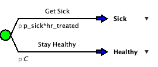

</p>

</details>

<details>

<summary style="color: green; font-size: 4vh;">

Check your Model

</summary>

<p style="color: black;">

| Strategy   | Cost (\$ for 1000 people) | LY (for 1000 people) |
|------------|---------------------------|----------------------|
| Treat None | 52566.0787                | 21.3367              |
| Treat All  | 59822.0336                | 26.2392              |

</p>

</details>

## Define Cycle Adjustments and Discounting

-   Go to Model \> Properties \> select the Markov tab.
-   Select the "Half-Cycle Correction" option.
-   Select the "Discount Rewards" option and enter the discount rates (3%) for cost and LY
-   Click "OK"

## Get individual cost and LY

It is often easier to understand the impact of the different strategies when they are at an individual level.

-   Go to Model \> Properties \> select the Simulation tab.
-   Set Cohort Size to 1

## Check your answer:

Run a CEA on a cohort size of 1 with Treat None as the basecase and a WTP of \$100,000/LY

Enter your result:

:::: callout-tip
## Check your answer

<br> What is the cost (to two decimal places) of the strategy you would choose? <br> <input id="answersimp" type="number" step="0.01" placeholder="e.g., 43.5" /> <button id="checksimp">Check</button>

::: {#feedbacksimp style="margin-top: 10px;"}
:::

```{=html}
<script>
(function() {
  // Set the correct value and tolerance
  const CORRECT = 65517.829;
  const TOL = 0.01; // accept +/- 0.01
  const input = document.getElementById('answersimp');
  const button = document.getElementById('checksimp');
  const feedback = document.getElementById('feedbacksimp');
  function setFeedback(msg, status) {
    feedback.textContent = msg;
    feedback.style.fontWeight = '600';
    feedback.style.color = status === 'ok' ? '#1a7f37' : (status === 'warn' ? '#7f6a00' : '#b30000');
  }
  button.addEventListener('click', function() {
    const val = parseFloat(input.value);
    if (isNaN(val)) {
      setFeedback('Please enter a number.', 'warn');
      return;
    }
    const ok = Math.abs(val - CORRECT) <= TOL;
    if (ok) {
      setFeedback('✅ Correct!', 'ok');
    } else {
      setFeedback('❌ Not quite. Try again.', 'bad');
    }
  });
})();
</script>
```

<br>
::::

<details>

<summary style="color: green; font-size: 4vh;">

Screening Added

</summary>

<p style="color: black;">

[Amua File With Screening Added](/MarkovSimpleWithScreening.amua)

</p>

</details>
