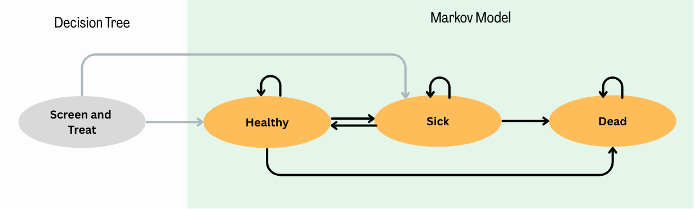

```{=html}
<style>
/* Base: make Quarto callouts behave like full cards */
.callout.fill-box {
  /* Unified background & border for the whole card */
  --box-bg: #eaf6ee;   /* default soft green if no class overrides */
  --edge-color: #1f6f43; /* default darker edge/title color */
  background: var(--box-bg);
  border: 1px solid var(--edge-color);
  border-radius: 8px;
  margin: 1rem 0;
  overflow: hidden; /* keeps rounded corners clean when title is darker */
}

/* Title bar: darker shade; full-width across top */
.callout.fill-box .callout-title {
  background: var(--edge-color);
  color: #fff;
  padding: 0.6rem 0.8rem;
  font-weight: 600;
  border-bottom: 1px solid var(--edge-color);
}

/* Body: same light color as the card, not a separate “stripe” */
.callout.fill-box .callout-body {
  background: transparent; /* let the parent set the background */
  padding: 0.9rem 1rem;
}


/* --- Specific palettes --- */
/* Green: "Why are we doing this?" */
.callout.why-box {
  --box-bg: #eaf6ee;    /* light green fill */
  --edge-color: #1f6f43;/* dark green edge/title */
}

/* Purple: "Your Task" */
.callout.task-box {
  --box-bg: #f3ecfb;    /* light purple fill */
  --edge-color: #7140a6;/* deep purple edge/title */
}

/* Yellow: "Objectives" */
.callout.objectives {
  --box-bg: #FFFAA0;    /* light yellow fill */
  --edge-color: #F4C430; /* deep yellow edge/title */
}

</style>
```

::: {.callout .fill-box .objectives}
# Introduction and Learning Objectives 

By the end of this session, participants will be able to:

1.  
:::

The decision trees are enough to answer some research questions. However, a more complicated Markov Model may be needed to represent the health condition accurately.

In our decision tree, we have a one time screening and calculations for if someone gets sick. However, people will heal at different time points. We can use a Markov Model to capture this.

::: {.callout .fill-box .why-box}
## Why are we doing this?

The decision tree allows us to understand the results at one time point. From our tree we can use set metrics of life years to understand how participant’s quality of life is impacted but we do not get a full picture of the long term impacts like the annual effect of being sick or the increase risk of death. A Markov creates a framework to understand impacts over time in a much cleaner and computationally friendly way.
:::

To help visualize how this will work, here is a bubble diagram



As shown in the bubble diagram, we will keep the decision tree for the one time screening and treat. The Markov Model will capture individuals healing, getting sick again, and dying.

DECIDE WHAT WE WANT TO PROVIDE THEM

# Uploading a Table

# Starting Probabilities

# Adjusting to match strategy

::: {.callout-tip}
## Check your answer

**What is the ICER of the strategy you would choose?**

Enter your result:
<input id="answer3" type="number" step="0.01" placeholder="e.g., 43.5" />
<button id="check3">Check</button>
<span id="feedback3" style="margin-left:0.5rem;"></span>

<script>
(function() {
  // Set the correct value and tolerance
  const CORRECT = 43.5;
  const TOL = 0.01; // accept +/- 0.01

  const input = document.getElementById('answer3');
  const button = document.getElementById('check3');
  const feedback = document.getElementById('feedback3');

  function setFeedback(msg, status) {
    feedback.textContent = msg;
    feedback.style.fontWeight = '600';
    feedback.style.color = status === 'ok' ? '#1a7f37' : (status === 'warn' ? '#7f6a00' : '#b30000');
  }

  button.addEventListener('click', function() {
    const val = parseFloat(input.value);
    if (isNaN(val)) {
      setFeedback('Please enter a number.', 'warn');
      return;
    }
    const ok = Math.abs(val - CORRECT) <= TOL;
    if (ok) {
      setFeedback('✅ Correct!', 'ok');
    } else {
      setFeedback('❌ Not quite. Try again.', 'bad');
    }
  });
})();
</script>
:::
