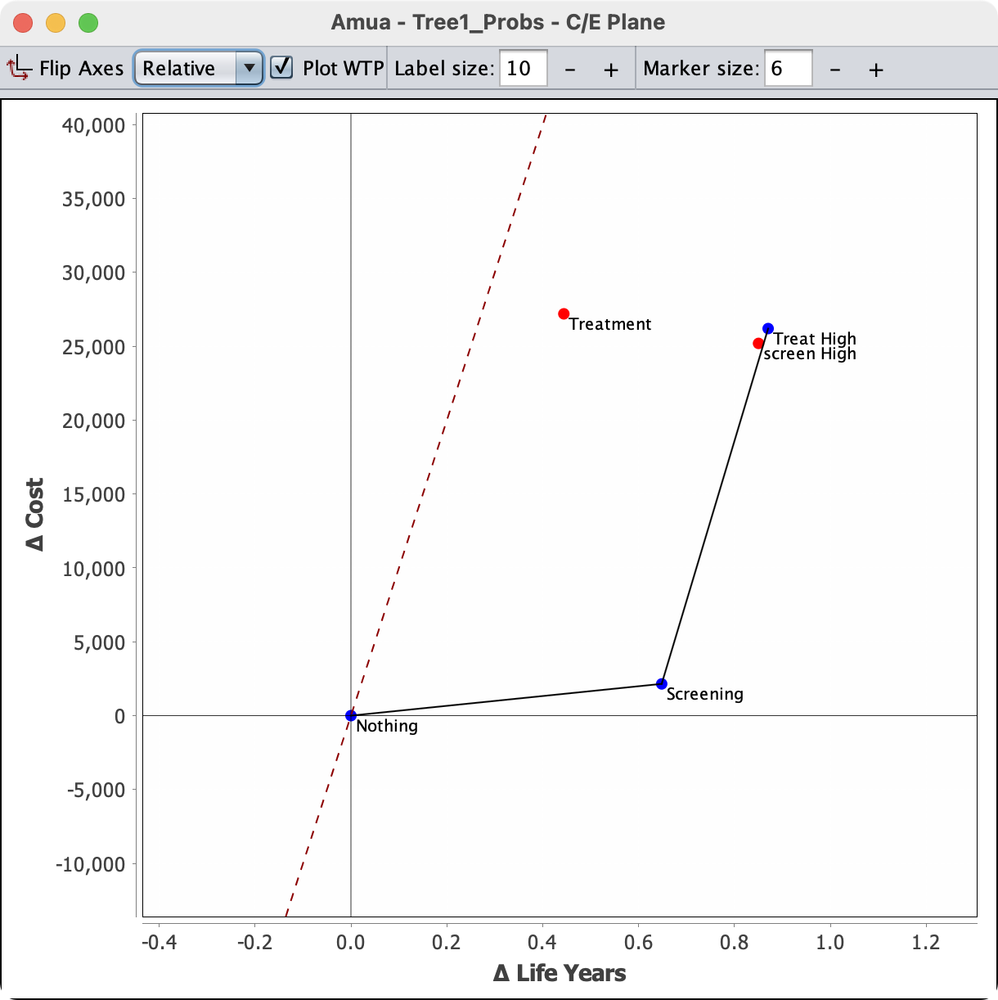
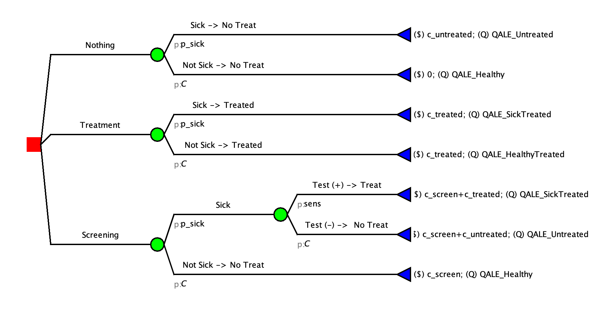
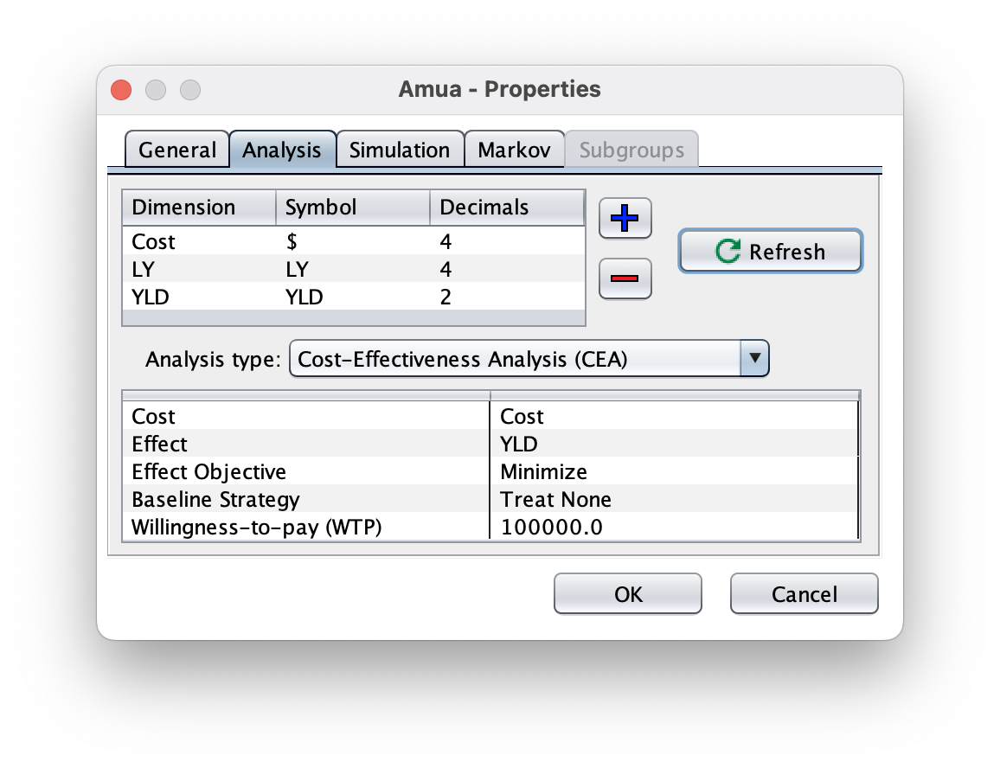
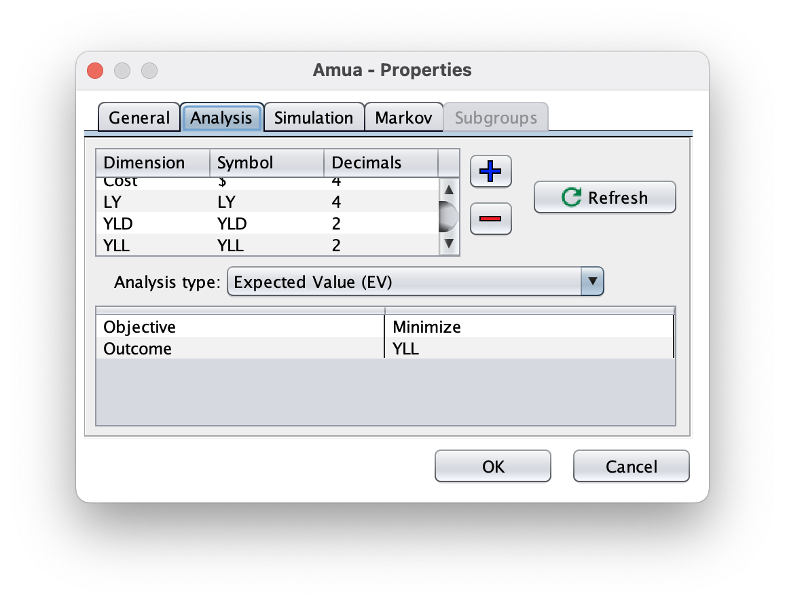
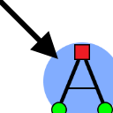
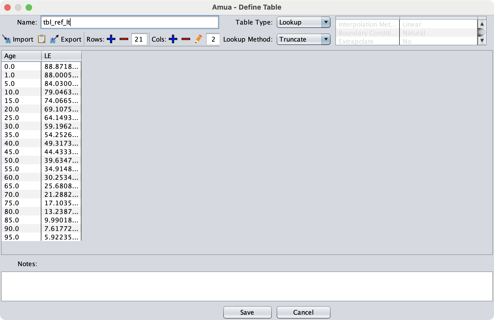
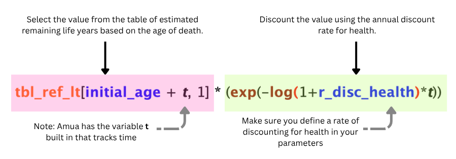
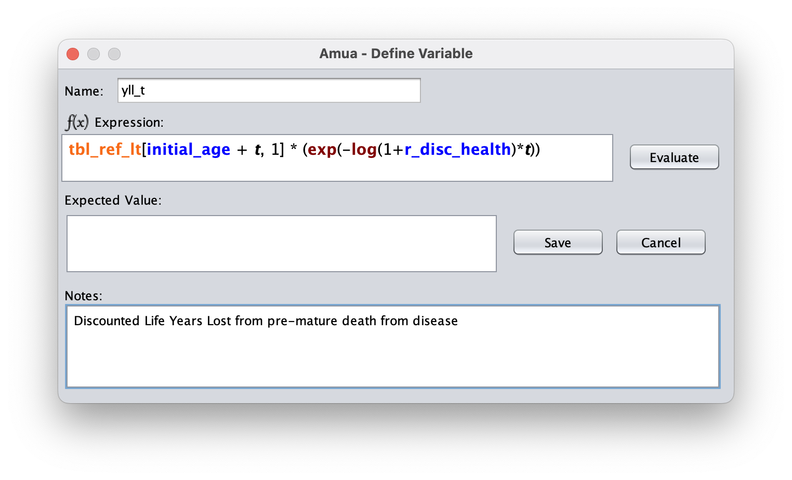

```{=html}
<style>
/* Base: make Quarto callouts behave like full cards */
.callout.fill-box {
  /* Unified background & border for the whole card */
  --box-bg: #eaf6ee;   /* default soft green if no class overrides */
  --edge-color: #1f6f43; /* default darker edge/title color */
  background: var(--box-bg);
  border: 1px solid var(--edge-color);
  border-radius: 8px;
  margin: 1rem 0;
  overflow: hidden; /* keeps rounded corners clean when title is darker */
}

/* Title bar: darker shade; full-width across top */
.callout.fill-box .callout-title {
  background: var(--edge-color);
  color: #fff;
  padding: 0.6rem 0.8rem;
  font-weight: 600;
  border-bottom: 1px solid var(--edge-color);
}

/* Body: same light color as the card, not a separate "stripe" */
.callout.fill-box .callout-body {
  background: transparent; /* let the parent set the background */
  padding: 0.9rem 1rem;
}


/* --- Specific palettes --- */
/* Green: "Why are we doing this?" */
.callout.why-box {
  --box-bg: #eaf6ee;    /* light green fill */
  --edge-color: #1f6f43;/* dark green edge/title */
}

/* Purple: "Your Task" */
.callout.task-box {
  --box-bg: #f3ecfb;    /* light purple fill */
  --edge-color: #7140a6;/* deep purple edge/title */
}

/* Yellow: "Objectives" */
.callout.objectives {
  --box-bg: #f2eee4;    /* light yellow fill */
  --edge-color: #CfAE70; /* deep yellow edge/title */
}

</style>
```

::: {.callout .fill-box .objectives}
# Introduction and Learning Objectives 

By the end of this session, participants will be able to:

1. Define and parameterize key inputs (e.g., probabilities, outcomes, and costs) within the Amua software.

2. Evaluate model outcomes, such as expected quality-adjusted life expectancy (QALE), for alternative clinical strategies.
:::

# Decision Trees

## Add QALY Dimension

We now want to add a new outcome dimension: **QALYs (Quality-Adjusted Life Years)**. QALYs are a measure of disease burden, where **1 = perfect health** and **0 = death**. 

```{r, echo = FALSE}
library(downloadthis)
## Link in Github repo
download_link(
  link = "https://geratcliff.github.io/vital-2026-Cebu/case-studies/cs_decision_tree_diseaseX_ANS.amua",
  button_label = "Download Completed Decision Tree",
  button_type = "primary",
  has_icon = TRUE,
  icon = "fa fa-save",
  self_contained = FALSE
)
```

#### **Instructions:**

1.  In Amua, go to **Model → Properties → Analysis tab**.

2.  Add a new dimension:

    -   **Dimension**: QALE

    -   **Symbol**: Q

    -   **Decimals:** 2

3.  Click {width="25" height="18"}**Refresh**

4.  For QALYs make sure the objective is **maximizing**

    {width="555"}

5.  We can now return to the tree and enter QALE values at each terminal node

| **Clinical State** | **QALE** | **Notes** |
|------------------------|------------------------|------------------------|
| QALE_Untreated | 3.21 |  Large amounts of time at low quality of life |
| QALE_SickTreated | 14.54 | Short amounts of time sick and in treatment |
| QALE_Healthy | 20 | Full Health |
| QALE_HealthyTreated | 19.432 | Very short amount of time in treatment|

You can apply these QALE values to **terminal nodes** in Amua accordingly. Your tree should like this:



Now, you're ready to perform a cost-effectiveness analysis with QALYs as the outcome!

Click  Run Model and check out the CEA Results report.

# Markov Models

## Add a DALY Dimension

We now want to add a new outcome dimension: **DALYs (Disability-Adjusted Life Years)**. DALYs are a measure of disease burden, where **0 = perfect health** and **1 = death** per year lost. For this model, we will add Years of Life Lost. To discount these from the start of time and the time of occurrence we will use the built in discounting (from start time) and add discounting from the time of death.

Before we jump into DALYs, we will add each inidivudal part to understand how they work.

```{r, echo = FALSE}
library(downloadthis)
## Link in Github repo
download_link(
  link = "https://geratcliff.github.io/vital-2026-Cebu/case-studies/cs_markov_diseaseX_ANS.amua",
  button_label = "Download Completed Markov Model",
  button_type = "primary",
  has_icon = TRUE,
  icon = "fa fa-save",
  self_contained = FALSE
)
```

**To save time, we will go through the No Treat branch. A full answer key will be included at the end**

### A: Important Parameters

#### Disability Weights

::: callout-important
Since we are using DALYs, we use disability weights.
:::

| Name         | Value | Description                                |
|--------------|-------|--------------------------------------------|
| dw_treatment | 0.05  | Disability weight for Treatment.           |
| dw_sick      | 0.16  | Disability weight for Sick health state.   |
| dw_sicker    | 0.48  | Disability weight for Sicker health state. |

#### Life Expectancy by Age

| Age | LE          |
|-----|-------------|
| 0   | 88.8718951  |
| 1   | 88.00051053 |
| 5   | 84.03008056 |
| 10  | 79.04633476 |
| 15  | 74.0665492  |
| 20  | 69.10756792 |
| 25  | 64.14930031 |
| 30  | 59.1962771  |
| 35  | 54.25261364 |
| 40  | 49.31739311 |
| 45  | 44.43332057 |
| 50  | 39.63473787 |
| 55  | 34.91488095 |
| 60  | 30.25343822 |
| 65  | 25.68089534 |
| 70  | 21.28820012 |
| 75  | 17.10351469 |
| 80  | 13.23872477 |
| 85  | 9.990181244 |
| 90  | 7.617724915 |
| 95  | 5.922359078 |

### B: Add YLDs

#### Create A New Outcome

::: {.callout-note appearance="minimal"}
**Add in the years of life lost to the model. You will need to create a new outcome and add the disability weights to each health state.**
:::

-   Go to Model \> Properties \> select the Analysis tab.

-   Use the blue plus sign ({alt="Custom Icon" width="15"})to add Years Lived with Disability (YLD). You can use YLD as the symbol and round on 4 decimals.

-   Click {width="25" height="18"}**Refresh** to apply.

-   Set the "Analysis Type" to Expected Value (EV)

-   We want to reset the objective to **minimize**. In DALYs, we want to decrease the YLDs and YLLs.

-   Go to the Markov tab and add in the discount rate for YLDs. (3.0)

{width="500"}

## Add Disability Weights to Model

First you will need to define the disability weights as new parameters. To add a parameter, use the plus sign above the parameter menu ({alt="Custom Icon" width="15"}). Each parameter needs a name and an expression. Use the defined values from \[Model Parameters\].

Now set YLD outcomes equal to the parameters in both strategies. *Remember that for YLD, 0 is healthy.*

Check your Model

</summary>

<p style="color: black;">


</p>

</details>

::: callout-note
**Now check ({alt="Custom Icon" width="15"}) and run ({alt="Custom Icon" width="15"})** **the model to verify that it calculates expected YLD!**

| Strategy   | YLD  | YLD (Dis) |
|------------|------|-----------|
| Status Quo | 1.97 | 1.14      |
| Treatment  | 1.19 | 0.66      |
:::

# Add YLLs

## Create A New Outcome

::: {.callout-note appearance="minimal"}
**Add in the years of life lost to the model. You will need to create a new outcome and add a one time cost to the transition from sick to death when the individual dies of the disease.**
:::

-   Go to Model  Properties  select the Analysis tab.

-   Click the blue plus sign ({alt="Custom Icon" width="15"}) to add a new outcome. Add YLL.

-   Click the refresh button

-   The "Analysis Type" should be still be set to Expected Value (EV) with the objective of minimize.

-   Change outcome to YLLs

-   Go to the Markov tab and add in the discount rate for YLLs. (3.0)

{width="500"}

-   Next, we will define cycle-specific payoffs in the model itself based on the values in the tables above. We need to add YLLs for people transitioning from the sick to the dead state.

## Add Life Expectancy Table

-   We need to add a table to pull the estimated remaining life expectancy by age so that we can properly calculate the YLLs.

```{r, echo = FALSE}
library(downloadthis)
## Link in Github repo
download_link(
  link = "tbl_ref_lt.csv",
  button_label = "Download Table Data",
  button_type = "primary",
  has_icon = TRUE,
  icon = "fa fa-save",
  self_contained = FALSE
)
```

-   Select the tables tab and then click the blue plus sign ({alt="Custom Icon" width="15"}) to add a new table.

-   Click Import ({alt="Custom Icon" width="18"} ) and select the downloaded document

    ::: callout-tip
    If you cannot get the import to work, you can copy the table from above and use the paste button

    ( {alt="Custom Icon" width="18"})to add the data.
    :::

-   Verify that there are no blank rows at the bottom of the table

-   Name the table `tbl_ref_lt`

-   Change the lookup method to "Truncate"

-   The table window should look like this:

{fig-align="center"} \## Add Discounting Rate

| Name          | Value | Description                           |
|---------------|-------|---------------------------------------|
| r_disc_health | 0.03  | Annual discount rate: health outcomes |

*For most things in Amua, we can just add the discount rate in the properties but for YLD we will need them for our formula*

## Add Variable

-   You will need to define `yll_t` as a parameter.

    -   This will reference the table we just added (**tbl_ref_lt**)

    -   To properly add YLLs with discounting from the time of death, we will use the following formula:

    

-   Select the variables tab and then click the blue plus sign ({alt="Custom Icon" width="15"}) to add a new variable.

-   Set the name of the variable to `yll_t`

-   Using the formula above to set the expression: `tbl_ref_lt[initial_age + t, 1] * (exp(-log(1+r_disc_health)*t))`

    

## Add YLL to the Model

-   Add the YLL outcome as a one time outcome on the Die (Disease) arm.

    -   ::: {.callout-important appearance="minimal"}
        **To define a one time treatment:** We will add this cost by assigning a one-time cost at the time an individual transitions to the Death (Disease) state from the Sick state. You can add this one-time cost by *right-clicking* on the transition node {alt="Custom Icon" width="20" height="20"} after "Dead (Disease)" in the Sick health state, and then clicking on {alt="Custom Icon" width="20" height="20"} Add Cost.
        :::

After inputting the outcomes, your Markov model should look like this:


::: {.callout-note appearance="minimal"}
**Now check ({alt="Custom Icon" width="15"}) and run ({alt="Custom Icon" width="15"})** **the model to verify that it calculates expected YLL!**

| Strategy   | YLL  | YLL (Dis) |
|------------|------|-----------|
| Status Quo | 5.88 | 3.85      |
| Treatment  | 2.8  | 1.7       |
:::

# Add DALYs

Our final objective is to add DALYs to the markov model. We have seen how to add all the elements but we want to combine them for DALYs.

### A: Add A DALY Outcome

1.  In Amua, go to **Model → Properties → Analysis tab**.

2.  Add a new dimension:

    -   **Dimension**: DALYs

    -   **Symbol**: D

    -   **Decimals:** 2

3.  Click {width="25" height="18"}**Refresh**

4.  Because DALY is a gap measure, change the objective to **minimize DALYs (analogous to maximizing QALYs)**

    {width="555"}

### Add Outcome

-   Go to Model  Properties  select the Analysis tab.

-   Click the blue plus sign ({alt="Custom Icon" width="15"}) to add a new outcome. Add DALYs.

-   Click the refresh button

-   Change the "Analysis Type" to Cost-Effectiveness Analysis (CEA).

-   Set the Cost, Effect, Baseline Strategy and Willingness-to-pay (WTP). Ensure that the Effect Objective is still set to minimize.

-   Go to the Markov tab and add in the discount rate for DALYs. (3.0)

    

<!-- -->

-   Next, in the model itself, define the cycle-specific payoffs based on the values in the tables above.

    -   Every place in the model where there is a value for YLD or YLL, we will put that in DALYs so that it sums them all together.
        -   For Example: Under sick where it now has(\$) c_sick; (YLD) dw_sick ; (YLL) 0, we will have (\$) c_sick; (YLD) dw_sick ; (YLL) 0 ; (DALY) dw_sick

::: {.callout-note appearance="minimal"}
Check and run the model to get the CEA for DALYs

| Strategy   | Cost      | DALY | ICER      | Note     |
|------------|-----------|------|-----------|----------|
| Treat None | 40,286.24 | 4.98 |           | Baseline |
| Treat All  | 51,548.10 | 2.78 | 5121.1089 |          |
:::

Solution File: ADD FILE
