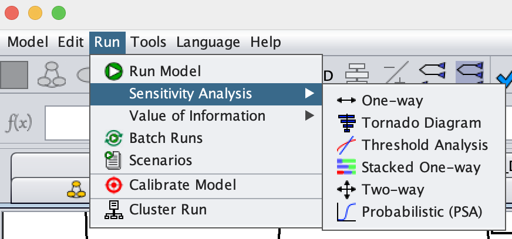

```{=html}
<style>
/* Base: make Quarto callouts behave like full cards */
.callout.fill-box {
  /* Unified background & border for the whole card */
  --box-bg: #eaf6ee;   /* default soft green if no class overrides */
  --edge-color: #1f6f43; /* default darker edge/title color */
  background: var(--box-bg);
  border: 1px solid var(--edge-color);
  border-radius: 8px;
  margin: 1rem 0;
  overflow: hidden; /* keeps rounded corners clean when title is darker */
}

/* Title bar: darker shade; full-width across top */
.callout.fill-box .callout-title {
  background: var(--edge-color);
  color: #fff;
  padding: 0.6rem 0.8rem;
  font-weight: 600;
  border-bottom: 1px solid var(--edge-color);
}

/* Body: same light color as the card, not a separate “stripe” */
.callout.fill-box .callout-body {
  background: transparent; /* let the parent set the background */
  padding: 0.9rem 1rem;
}


/* --- Specific palettes --- */
/* Green: "Why are we doing this?" */
.callout.why-box {
  --box-bg: #eaf6ee;    /* light green fill */
  --edge-color: #1f6f43;/* dark green edge/title */
}

/* Purple: "Your Task" */
.callout.task-box {
  --box-bg: #f3ecfb;    /* light purple fill */
  --edge-color: #7140a6;/* deep purple edge/title */
}

/* Yellow: "Objectives" */
.callout.objectives {
  --box-bg: #f2eee4;    /* light yellow fill */
  --edge-color: #CfAE70; /* deep yellow edge/title */
}

</style>
```

::: {.callout .fill-box .objectives}
# Introduction and Learning Objectives 

Now that we have identified the strategies and downloaded Amua on your
computer. You are ready to start build a decision tree for the research
question.

By the end of this session, participants will be able to:

1.  Build and structure a decision tree model in Amua to represent
    clinical decision problems.

2.  Define and parameterize key inputs (e.g., probabilities, outcomes,
    and costs) within the Amua software.

3.  Evaluate model outcomes for alternative clinical strategies.

4.  Add and compare multiple strategies (e.g., diagnostic testing
    options) in a single decision framework.
:::

::: {.callout .fill-box .why-box}
## Why are we doing this?

No variable is 100% accurate and therefore it is important to understand
how the model would change if a variable was not the entered value. A
One-Way Sensitivity Analysis (OWSA) allows us to understand which
parameters have the most impact by varying one at a time. The
Probabilistic Sensitivity Analysis (PSA) accounts for the fact that in
reality variables are not all linear. The PSA tells us how often our
decision would be made if variables were different in tandem.
:::

Before we get building, we recommend reviewing the sensitivty options
that are offered in Amua

<https://github.com/zward/Amua/wiki/Sensitivity-Analysis>



# Step 1: Complete the model

Congrats, you have already completed step 1 if you have worked through
the case study sequence

# Step 2: Identify the variance ranges

For every variable that you want to test, you need determine the range
of values that it should be tested on. Typically this is a confidence
interval for values from clinical trials. For other variables you can
use things like common ranges, expert opinions, and assumptions

Below are the ranges we will use:

| Variable        | Value | Range |
|-----------------|-------|-------|
| p_sick          | 0.03  |       |
| p_sicker        | 0.12  |       |
| p_diseasedeath  | 0.15  |       |
| sens            | 0.9   |       |
| prev            | 0.08  |       |
| hr_treated      | 0.5   |       |
| initial_age     | 50    | --    |
| c_treatment     | 0.08  |       |
| c_pall          | 0.08  |       |
| c_mild          | 0.15  |       |
| c_initialsicker | 0.15  |       |

Note: We do not need to vary initial age

::: {.callout .fill-box .task-box}
## Your Task

Run a OWSA
:::

# Step 3: Run a OWSA

## A: Setup the Run

1.  Go to Run \> Sensitivity Analysis \> Tornado Diagram
    -   We will be using a tornado diagram as it is the most common
        method for presenting OWSA results


2.  Add in all the Low and High values. This is the determine lower and
    upper bound for each value.
3.  Set the Outcome to "ICER (Cost/LY)"
4.  Highlight the "Treat All" Strategy

## B: Run The Analysis

1.  Click "Run"
2.  Click "Update Plot"

The plot should now display a bar for each variable with inputs

## C: Check The Plot

1.  Verify that the plot makes sense
    -   Is the directionality correct?
    -   Are the most impactful variables logical?

## D: Common Issues

-   If your strategy is dominated or dominant, ICERs will not show. This
    would render the tornado useless.

    -   However, in the benefits lecture we talked about the
        alternatives (NMB or NHB). You can get this by setting the
        analysis type to "Benefit-Cost Analysis (BCA)" in Model \>
        Properties \> Analysis

        -   <https://github.com/zward/Amua/wiki/Model-Properties#analysis-type>

-   You have more than two strategies.

    -   A tornado diagram cannot provide clear information when more
        than two strategies are involved. We recommend using the Stacked
        One-Way sensitivity Analysis

::: {.callout .fill-box .task-box}
## Your Task

Run a TWSA
:::

# Step 4: Run a TWSA

## A: Setup the Run

1.  Go to Run \> Sensitivity Analysis \> Two-way


2.  Add in the Low and High values for the *two variables you want to
    compare*. This is the determine lower and upper bound for each
    value.
3.  Set Parameter 1 to
4.  Set Parameter 2 to
5.  Set Outcome to ICER (Cost/LY)

## B: Run The Analysis

1.  Click "Run"
2.  Click "Update Plot"

The plot should now display a matrix grid with a decision for each value
intersection as well as a mark for the base values.

## C: Check The Plot

1.  Verify that the plot makes sense
    -   Look at the four corners and make sure the decision is
        clinically realistic
        -   Parameter 1 high, Parameter 2 low

        -   Parameter 1 high, Parameter 2 high

        -   Parameter 1 low, Parameter 2 high

        -   Parameter 1 low, Parameter 2 low

## D: Common Issues

-   If your strategy is dominated or dominant, ICERs will not show and
    therefore no graph will be created.

    -   However, in the benefits lecture we talked about the
        alternatives (NMB or NHB). You can get this by setting the
        analysis type to "Benefit-Cost Analysis (BCA)" in Model \>
        Properties \> Analysis

        -   <https://github.com/zward/Amua/wiki/Model-Properties#analysis-type>

# Step 5: Run a PSA

## A: Determine variable distributions 

Remember from the lecture that:

ADD MOST COMMON TABLE

For each variable you will need to determine the necessary Amua inputs

ZACH GUIDE?

TOOL

## B: Update the model

We recommend that you create a copy of your model to use for PSA as you
will override your variables.

1.  Save your model (Model \> Save)
2.  Then use Model \> Save As to create a duplicate (Example:
    model_psa.amua)
3.  Edit the parameters to match the inputs
    -   Beta:
    -   Gamma:
    -   

## C: Setup the Run

1.  Go to Run \> Sensitivity Analysis \> Probabilistic (PSA)


2.  Verify that all the parameters look correct

## B: Run The Analysis

1.  Set the "\# Iterations"
2.  Click "Run"

## C: The Plots

ZACH HELP?

Most commonly the CEAC is presented in results.
