```{=html}
<style>
/* Base: make Quarto callouts behave like full cards */
.callout.fill-box {
  /* Unified background & border for the whole card */
  --box-bg: #eaf6ee;   /* default soft green if no class overrides */
  --edge-color: #1f6f43; /* default darker edge/title color */
  background: var(--box-bg);
  border: 1px solid var(--edge-color);
  border-radius: 8px;
  margin: 1rem 0;
  overflow: hidden; /* keeps rounded corners clean when title is darker */
}

/* Title bar: darker shade; full-width across top */
.callout.fill-box .callout-title {
  background: var(--edge-color);
  color: #fff;
  padding: 0.6rem 0.8rem;
  font-weight: 600;
  border-bottom: 1px solid var(--edge-color);
}

/* Body: same light color as the card, not a separate “stripe” */
.callout.fill-box .callout-body {
  background: transparent; /* let the parent set the background */
  padding: 0.9rem 1rem;
}


/* --- Specific palettes --- */
/* Green: "Why are we doing this?" */
.callout.why-box {
  --box-bg: #eaf6ee;    /* light green fill */
  --edge-color: #1f6f43;/* dark green edge/title */
}

/* Purple: "Your Task" */
.callout.task-box {
  --box-bg: #f3ecfb;    /* light purple fill */
  --edge-color: #7140a6;/* deep purple edge/title */
}

/* Yellow: "Objectives" */
.callout.objectives {
  --box-bg: #f2eee4;    /* light yellow fill */
  --edge-color: #CfAE70; /* deep yellow edge/title */
}

</style>
```

::: {.callout .fill-box .objectives}
# Introduction and Learning Objectives 

Now that we have identified the strategies and downloaded Amua on your
computer. You are ready to start build a decision tree for the research
question.

By the end of this session, participants will be able to:

1.  Build and structure a decision tree model in Amua to represent
    clinical decision problems.

2.  Define and parameterize key inputs (e.g., probabilities, outcomes,
    and costs) within the Amua software.

3.  Evaluate model outcomes for alternative clinical strategies.

4.  Add and compare multiple strategies (e.g., diagnostic testing
    options) in a single decision framework.
:::

Another member of the lab has completed the data collection for you
already, you just need to build the model in Amua.

::: {.callout .fill-box .why-box}
## Why are we doing this?

A decision tree will allow us to determine how the life years gained
varies by each strategy. This will be important data to provide in a
policy brief on why one decision should be considered over another.
:::

::: {.callout .fill-box .task-box}
## Your Task

Create the model structure for the three strategies.
:::

# Reminder of Decision Problem

There has been an increase in cases of Disease X within your country and
you've been assigned to look into methods other countries near by have
implemented.

Disease X is a non-communicable disease that mostly effects people in
their 50s. There is currently palliative care to help reduce the disease
burden for Disease X. You can assume that everyone with Disease X
receives this palliative care.

A new out-patient procedure that can treat the disease has started to
become popular in surrounding regions. It has a high rate of success.
Researchers have also developed a screening method to determine who
qualifies for the care. The screening has 100% specificity but only a
90% sensitivity.

You find that one neighboring country has implemented **screening for
all (50 year olds)** and provides treatment only for those that test
positive. Another country has launched a campaign to **treat everyone
(50 years old)** regardless of having the disease. The Ministry of
Health has asked us to **determine the cost effectiveness of the
different strategies.**

1.  No Screen, No Treat

2.  Screen All, then Treat

3.  No Screen, Treat All

# Step 1: Download the Tree File

To assist you with the limited time for the case study, we have created
the initial layout of the decision tree for you.

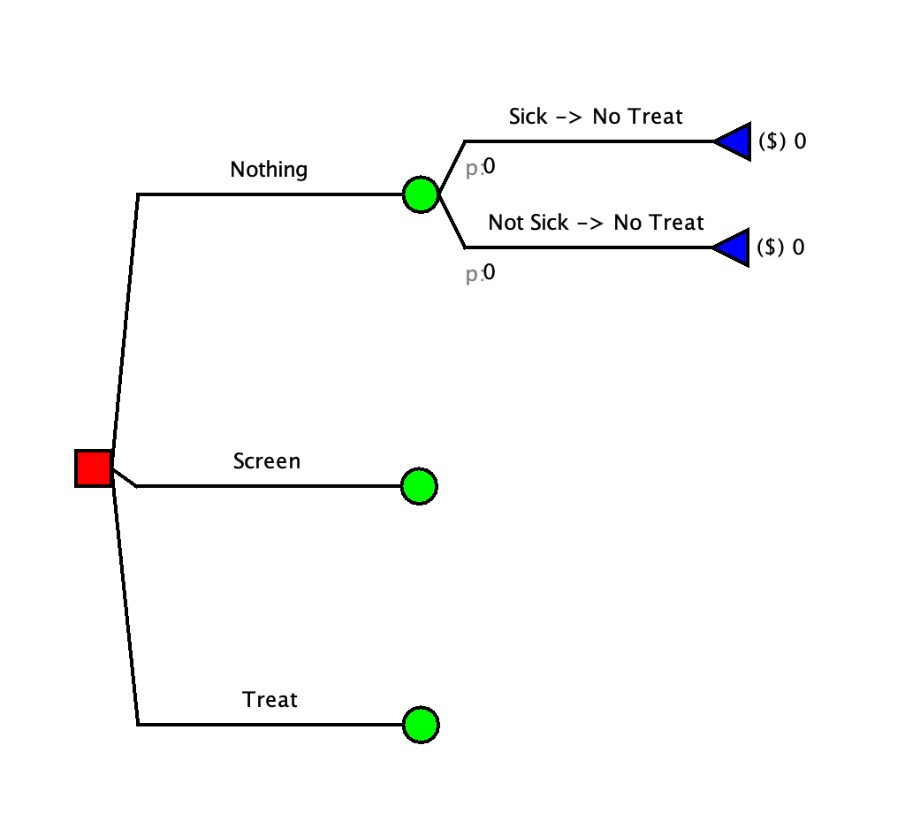

# Step 2: Build Out the Strategies

## Treat all strategy

Things to remember when building the strategy out:

-   Everyone that is sick will get treatment immediately

<details>

<summary style="color: orange;">

More assistance with step

</summary>

<p style="color: black;">

### A: Map out the Branches

In the Treatment scenario there are two things that can happen:

1.  You are sick and get treated

2.  You are not sick and get treated

### B: Add the Branches

You need to build a branch for each of these

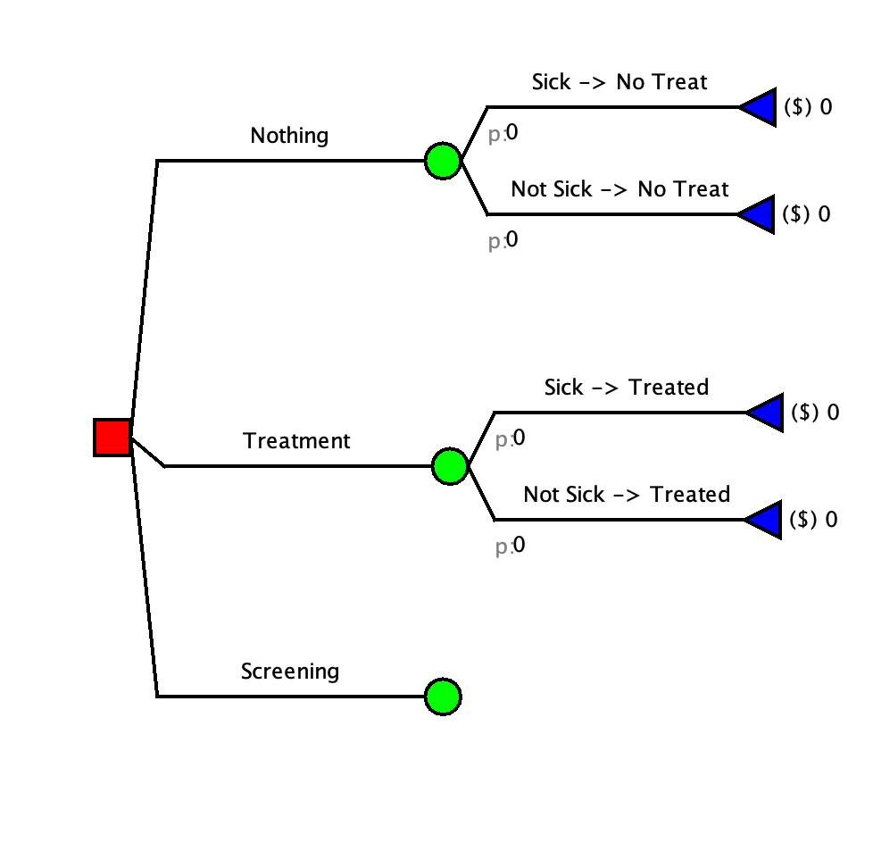

</p>

</details>

## Screen all strategy

Things to remember when building the strategy out:

-   The specificity is 100% (the test is 100% accurate for individuals
    that are not sick)

-   The sensitivity is **NOT** 100%. Some sick people will get a
    negative test result.

-   Only individuals that have a positive screening will get treated

<details>

<summary style="color: orange;">

More assistance with step

</summary>

<p style="color: black;">

### A: Map out the Branches

In the Screening scenario there are multiple things that can happen:

1.  You get screened, test positive, and ARE sick

2.  You get screened, test negative, and ARE sick

3.  You get screened, test negative, and are NOT sick

4.  ~~*You get screened, test positive, and are NOT sick*~~ *(this is
    typically an option but in our model the specificity is 100% so this
    never occurs)*

### B: Add the Branches

You need to build a branch for each of these. Although the screening
happens first, it is typically easier to model the illness status first.
The decision tree does not need to be in chronological order (aka it
does not need to follow the order that things take place in real life).

We will start by adding the illness status branches.

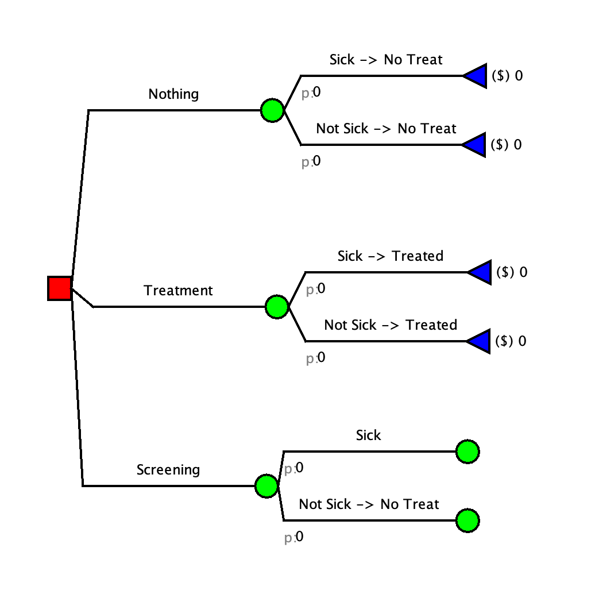

Now we can add in the test results.

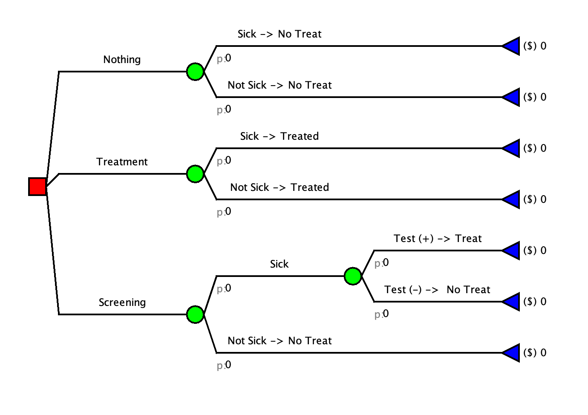

</p>

</details>

<details>

<summary style="color: green; font-size: 4vh;">

Check your Model

</summary>

<p style="color: black;">


</p>

</details>

# Step 3: Add Probabilities

| Label  | Value | Description                              |
|--------|-------|------------------------------------------|
| p_sick | 0.08  | Probability of getting sick (Prevelance) |
| sens   | 0.9   | Sensitivity of Screening Test            |
| spec   | 1     | Spesificity of Screening Test            |

<details>

<summary style="color: orange;">

More assistance with step

</summary>

<p style="color: black;">

### A: Add the Probabilities To Amua

You will need to create new parameters for each probability in the table
above.

1.  Make sure that you are on the "Parameter" tab of the right side bar

    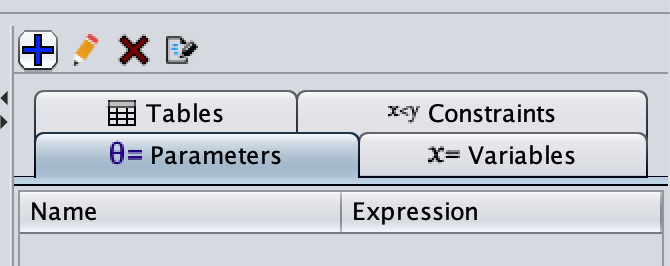

2.  Click on the blue plus sign 

3.  In the pop-up window, enter a parameter name and the parameter
    value. The description is optional but useful if the model is being
    shared with others.

    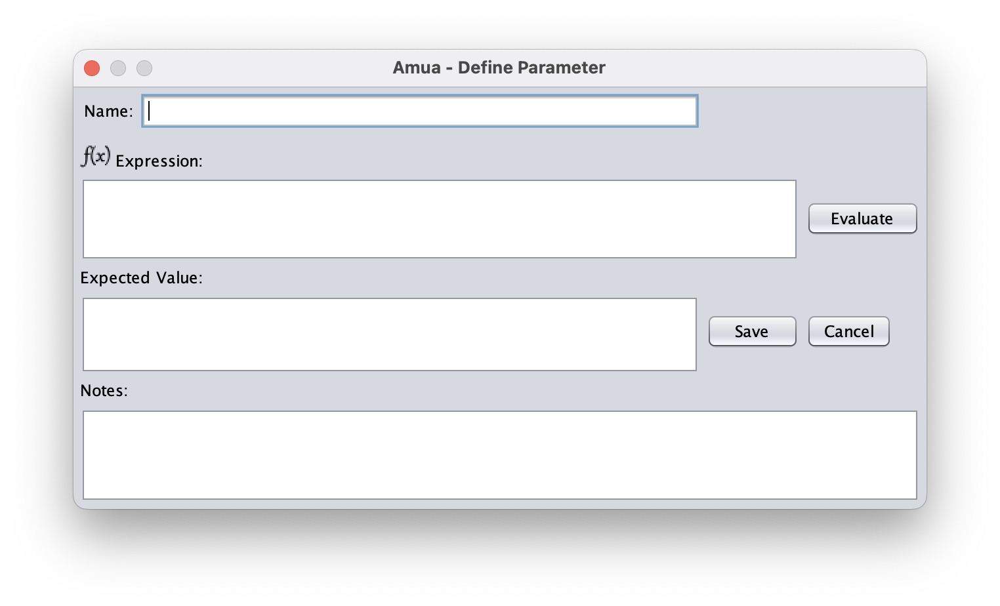

4.  Click save and repeat for all parameters.

You should end up with this: 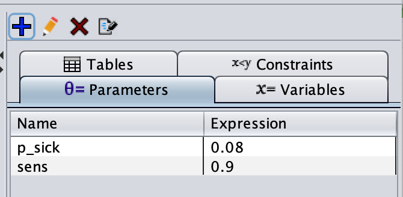

### B: Add The Parameters to the branches

The probabilities that we have are:

p_sick: which will go on any branch where someone gets sick sens: which
will go on any branch where someone is sick AND tests positive

To add a probability: 1. Click next to the grey "p:" under the branch
that you want to edit

```         
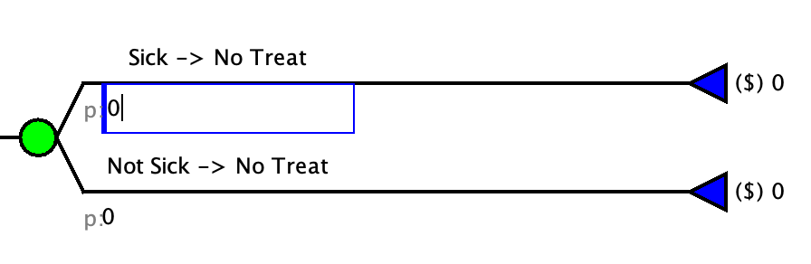
```

2.  Type the NAME of the parameter you want to add

    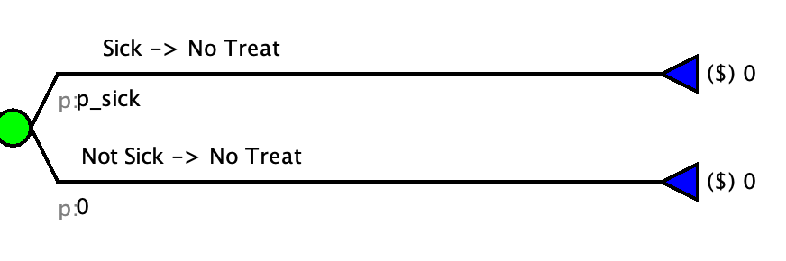

NOTE: You never want to add the value as it will make the model harder
to update later and you will not be able to do sensitivity analysis.

3.  Repeat for all parameters.

    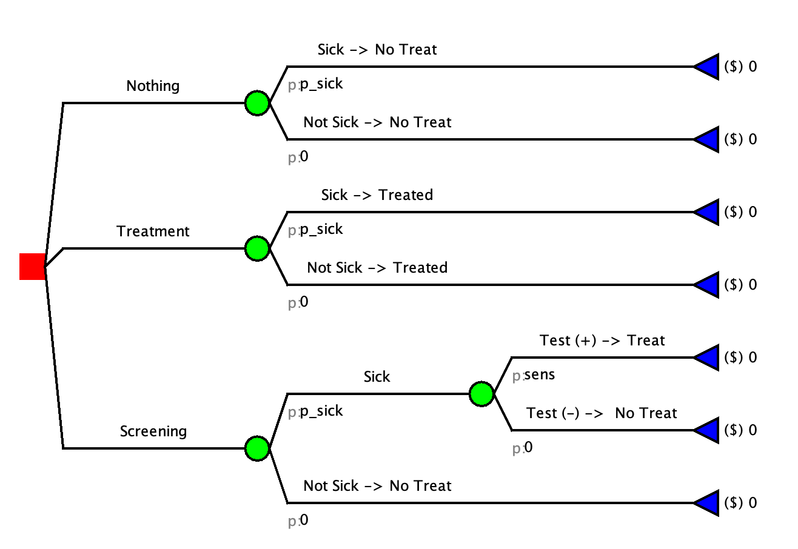

### C: Add The Complimentary Probabilities

In Amua, there is a built in variable "*C*" that will calculate the
complementary probability (1-\[p of the opposing branch\]). You need to
add this to all the remaining branches.

</p>

</details>

<details>

<summary style="color: green; font-size: 4vh;">

Check your Model

</summary>

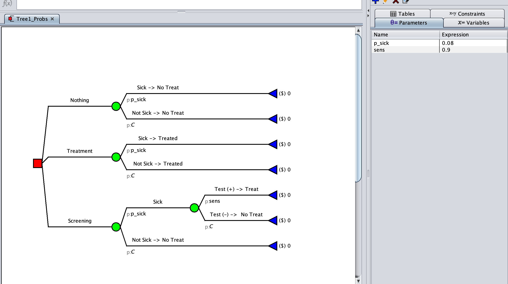

</details>

# Step 4: Add outcomes

::: panel-tabset
### Costs

| Label       | Value     | Description                      |
|-------------|-----------|----------------------------------|
| c_untreated | \$300,000 | Cost of being sick and untreated |
| c_treated   | \$900,000 | Cost of being sick and treated   |
| c_screen    | \$6,000   | Cost of screening                |

### Life Years

| Label              | Value | Description                      |
|--------------------|-------|----------------------------------|
| LY_untreated       | 8     | Cost of being sick and untreated |
| LY_treated         | 16    | Cost of being sick and treated   |
| LY_healthy         | 20    | Cost of screening                |
| LY_healthy_treated | 19.7  | Cost to implement screening      |
:::

<details>

<summary style="color: orange;">

More assistance with step

</summary>

<p style="color: black;">

### A: Add the parameters to Amua

You will need to create new parameters for each cost and life years
variable in the table above.

1.  Make sure that you are on the "Parameter" tab of the right side bar

    

2.  Click on the blue plus sign 

3.  In the pop-up window, enter a parameter name and the parameter
    value. The description is optional but useful if the model is being
    shared with others.

    

4.  Click save and repeat for all parameters.

You should end up with this: 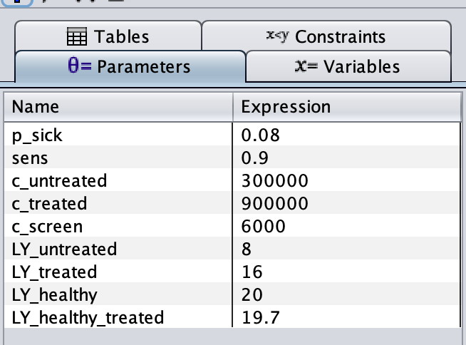

### B: Update the model properties to have both outcomes

1.  On the top menu select "Model" \> "Properties"

    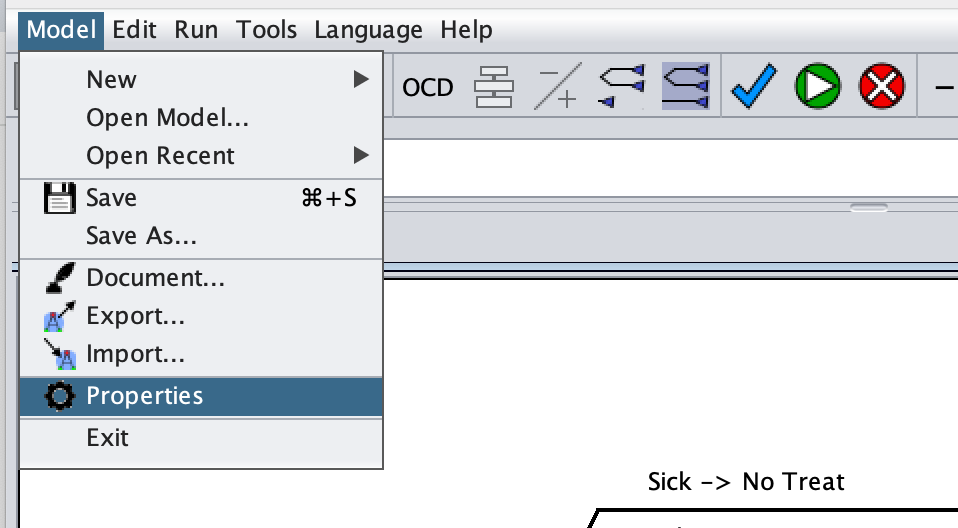

2.  Click to the analysis tab

    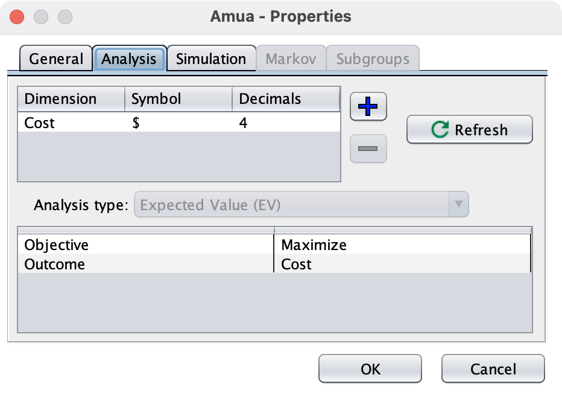

3. The "Cost" outcome is likely already added. If not, click the blue plus sign
     . This will add a new row to the
    outcomes table

    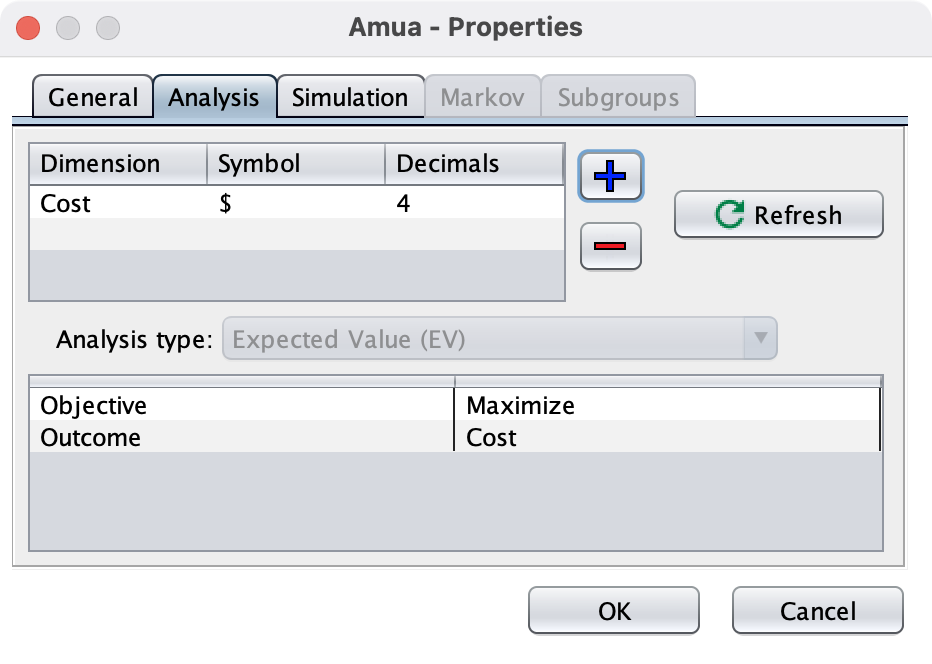

4.  Add a "Dimension" \[the name of the variable\], a "Symbol" \[how you
    want it to show in the model\], and the "Decimals" \[number of
    decimal places you want to show\].

5.  Repeat for the "Life Years outcome. You should end up with this:


    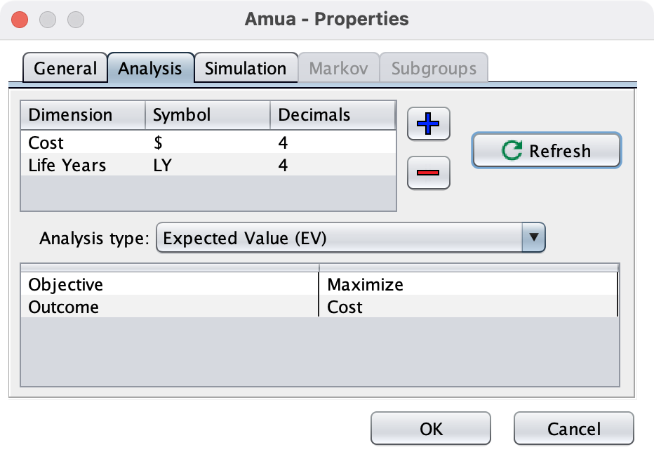


6.  Click the "Refresh Button to update your model

    

### C: Add The Parameters to the branches

At the end of each branch you will need to add the corresponding cost
and LY gained outcomes.

To add a probability: 

1.  Click on the outcome at the branch that you want to edit
       
    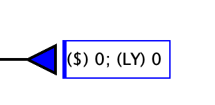


2.  Type the NAME of the parameter you want to add. This can be typed
    within the model view or at the top in the formula bar

    Formula Bar: 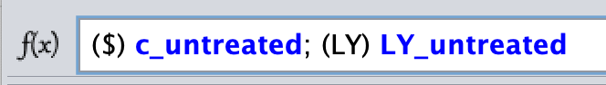

     
    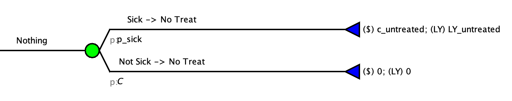


NOTE: You never want to add the value as it will make the model harder
to update later and you will not be able to do sensitivity analysis.

3.  Repeat for all parameters. Hint: Some branches may have multiple
    costs that need to be summed

</p>

</details>


<details>

<summary style="color: green; font-size: 4vh;">

Check Your Model 

</summary>

        
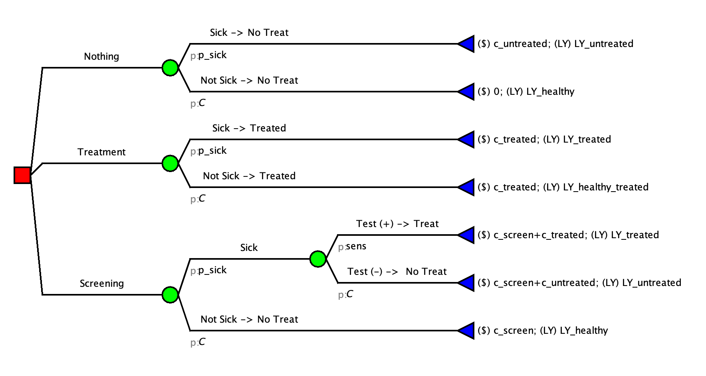

</details>

# Step 5: Run the Tree

Run the tree () to check your results


::: callout-tip
## Check your answer
<br>
Enter your EV($) for the Screening:
<br>
<input id="answertree" type="number" step="0.01" placeholder="e.g., 43.5" />
<button id="checktree">Check</button>
<div id="feedbacktree" style="margin-top: 10px;"></div>
<script>
(function() {
  // Set the correct value and tolerance
  const CORRECT = 73200.0;
  const TOL = 0.01; // accept +/- 0.01
  const input = document.getElementById('answertree');
  const button = document.getElementById('checktree');
  const feedback = document.getElementById('feedbacktree');
  function setFeedback(msg, status) {
    feedback.textContent = msg;
    feedback.style.fontWeight = '600';
    feedback.style.color = status === 'ok' ? '#1a7f37' : (status === 'warn' ? '#7f6a00' : '#b30000');
  }
  button.addEventListener('click', function() {
    const val = parseFloat(input.value);
    if (isNaN(val)) {
      setFeedback('Please enter a number.', 'warn');
      return;
    }
    const ok = Math.abs(val - CORRECT) <= TOL;
    if (ok) {
      setFeedback('✅ Correct!', 'ok');
    } else {
      setFeedback('❌ Not quite. Try again.', 'bad');
    }
  });
})();
</script>
<br>
:::