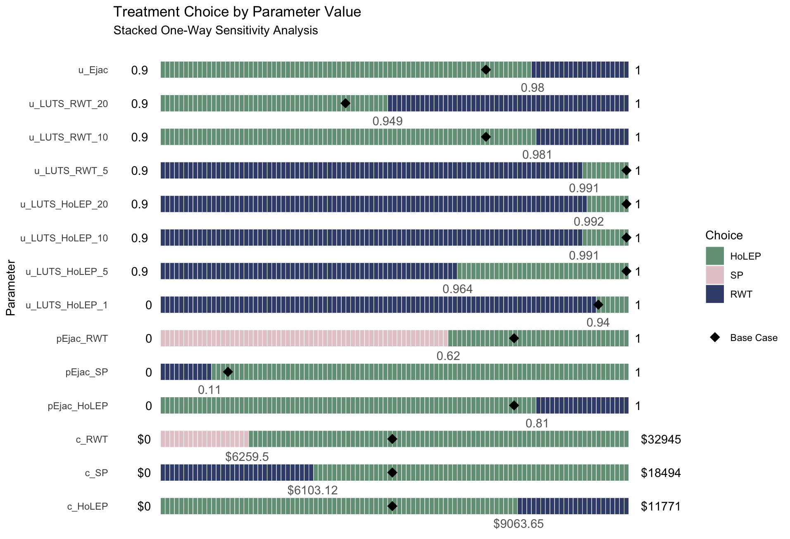
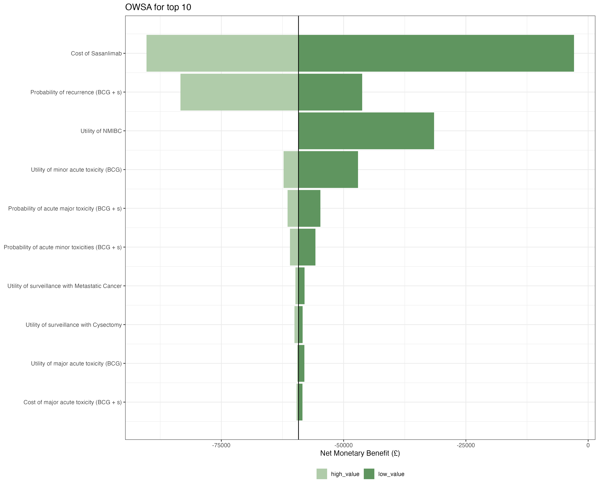
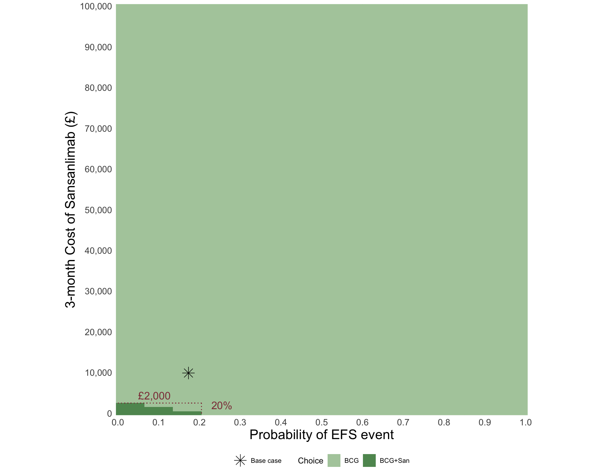
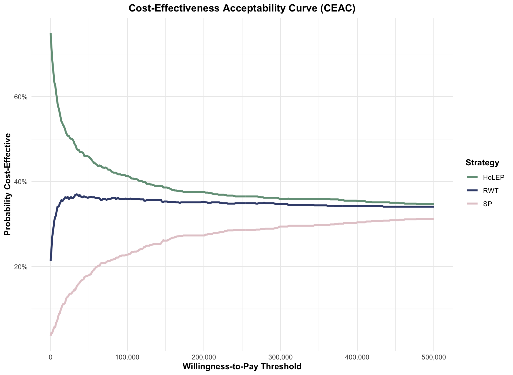

##  {.numbered-list-slide}

<h2> (1) Numbered Overview Template </h2>

::::::::::::::: number-list
::: {.list-item} 

01

First topic 
 
:::
::: {.list-item} 

02

Second topic 
 
:::
::: {.list-item} 

03

Third topic 
 
:::
::: {.list-item} 

04

Fourth topic 
 
:::
:::::::::::::::

## (2) Section Divider Template {.section-slide}

::: section-number
01
:::

## (3) Info Cards Template

::::: info-cards
::: card
**Health State Definition**

A health state represents a specific condition. Should be:

-   Mutually exclusive
-   Collectively exhaustive
-   Clinically meaningful
:::

::: card
**Key Considerations**

When defining states:

-   Disease progression
-   Treatment response
-   Quality of life
-   Cost implications
:::
:::::

## (4) Stats Grid Template

::::::::::::::::::: stats-grid
:::::: stat-box
::: stat-value
4
:::

::: stat-label
Health States
:::

::: stat-description
Including absorbing state
:::
::::::

:::::: stat-box
::: stat-value
12
:::

::: stat-label
Transitions
:::

::: stat-description
Possible state changes
:::
::::::

:::::: stat-box
::: stat-value
1 yr
:::

::: stat-label
Cycle Length
:::

::: stat-description
Annual transitions
:::
::::::

:::::: stat-box
::: stat-value
20
:::

::: stat-label
Time Horizon
:::

::: stat-description
Years modeled
:::
::::::
:::::::::::::::::::

## (5) Icon Bullets Template

::: icon-bullets
-   Health states are mutually exclusive
-   Transitions must sum to 1.0
-   Time cycle must be specified
-   Clinical validation required
:::

## (6) Concept Grid Template

::::::: concept-grid
::: concept-box
Disease-Free
:::

::: concept-box
Early Disease
:::

::: concept-box
Advanced Disease
:::

::: concept-box
Death
:::
:::::::

## (7) Split Content Template {.split-wrapper}

::::: split-content
::: content-text
**Patient Journey**

-   Initial diagnosis
-   Treatment initiation
-   Disease progression
-   End-of-life care
:::

::: content-visual

*Patient journey flowchart*
:::
:::::

## (8) Simple Two Column Comparison Template

::: {.simple-comparison}
::: {.comparison-column}

Markov models offer several benefits for health economic evaluation:

-   Capture disease progression
-   Handle uncertainty explicitly
-   Allow probabilistic sensitivity analysis
-   Incorporate time-dependent effects

:::

::: {.comparison-column}

However, they also have limitations:

-   Memoryless assumption
-   Computational complexity
-   Data requirements
-   Validation difficulties

:::
:::

## (9) Comparison Table Template

:::::::::::: comparison-table
::::: comparison-column
::: column-header
Standard Care
:::

::: column-content
-   Lower upfront cost
-   Established protocols
-   Widely available
-   Known side effects
:::
:::::

::::: comparison-column
::: column-header
New Treatment
:::

::: column-content
-   Higher efficacy
-   Fewer side effects
-   Better QoL outcomes
-   Higher cost
:::
:::::

::::: comparison-column
::: column-header
Combination
:::

::: column-content
-   Best outcomes
-   Complex protocol
-   Highest cost
-   Specialized care needed
:::
:::::
::::::::::::

## (10) Definition Template

:::::::: definition-box
::: term
Markov Model
:::

::: definition
A mathematical model that represents a system where transitions between states occur with fixed probabilities, independent of the path taken to reach the current state (memoryless property).
:::

::::: example
::: example-label
Example:
:::

::: example-text
A patient in the "Early Disease" state has a 0.15 probability of progressing to "Advanced Disease" each year, regardless of how long they've been in the early stage.
:::
:::::
::::::::

## (11) Highlight Box Template

:::: highlight-box
::: box-title
Key Takeaway
:::

Markov models assume memoryless transitions - the probability of moving to the next state depends only on the current state, not on the history of previous states.
::::

## (11) Continued .... With Different Colors

:::: {.highlight-box .primary}
::: box-title
Primary Highlight
:::

This uses the primary blue color.
::::

:::: {.highlight-box .secondary}
::: box-title
Secondary Highlight
:::

This uses the secondary teal color.
::::

## (12) Image Grid Template [2x2]

::::::::::: {.image-grid .grid-2x2}

:::: image-item

::: image-caption
Staked OWSA
:::
::::

:::: image-item

::: image-caption
Tornado Diagram (OWSA)
:::
::::

:::: image-item

::: image-caption
Two-Way Sensitvity
:::
::::

:::: image-item

::: image-caption
CEA from PSA
:::
::::

:::::::::::

## (12) Image Grid Template [3x3]

::::::: {.image-grid .grid-3x3}

:::: image-item

::: image-caption
Healthy
:::
::::

:::: image-item

::: image-caption
Screening
:::
::::

:::: image-item

::: image-caption
Infected
:::
::::

:::: image-item

::: image-caption
Vaccinated
:::
::::

:::: image-item

::: image-caption
Symptomatic
:::
::::

:::: image-item

::: image-caption
Doctor vists
:::
::::

:::: image-item

::: image-caption
Treatment
:::
::::

:::: image-item

::: image-caption
Hospital
:::
::::

:::: image-item

::: image-caption
Die
:::
::::
:::::::

## (13) Process Flow Template

::::::::::::::: process-flow
:::::: step
::: step-number
1
:::

::: step-title
Literature Review
:::

::: step-content
Review guidelines and models
:::
::::::

:::::: step
::: step-number
2
:::

::: step-title
Expert Consultation
:::

::: step-content
Engage clinicians
:::
::::::

:::::: step
::: step-number
3
:::

::: step-title
Data Validation
:::

::: step-content
Ensure data alignment
:::
::::::
:::::::::::::::

## (14) Timeline Template

:::::::::::::::::::::::: timeline
::::::::::::::::::::::: timeline-items
::::::: timeline-item
::: timeline-marker
1
:::

::::: timeline-content
::: timeline-title
Define States
:::

::: timeline-description
Identify health states
:::
:::::
:::::::

::::::: timeline-item
::: timeline-marker
2
:::

::::: timeline-content
::: timeline-title
Create Diagram
:::

::: timeline-description
Draw bubble diagram
:::
:::::
:::::::

::::::: timeline-item
::: timeline-marker
3
:::

::::: timeline-content
::: timeline-title
Add Transitions
:::

::: timeline-description
Define probabilities
:::
:::::
:::::::

::::::: timeline-item
::: timeline-marker
4
:::

::::: timeline-content
::: timeline-title
Validate
:::

::: timeline-description
Expert review
:::
:::::
:::::::
:::::::::::::::::::::::
::::::::::::::::::::::::

## (15) Pros & Cons
::: {.pros-cons-new}
::: {.pros-column}

Advantages

- Clinically proven efficacy
- Well-tolerated by patients
- Lower cost per dose
- Easy administration
- Wide availability
:::

::: {.cons-column}

Disadvantages

- Requires frequent dosing
- Some drug interactions
- Not suitable for all patients
- Long-term safety uncertain
- Limited durability
:::
:::

##  {.quote-slide}

::: quote-text
The goal of health economic modeling is not to predict the future, but to inform better decisions in the present.
:::

::: quote-author
Milton Weinstein
:::

::: quote-context
Harvard School of Public Health
:::

##  {.big-number-slide}

::: big-number
17
:::

::: big-number-label
Big Number Template
:::

::: big-number-context
Commonly used willingness-to-pay threshold per quality-adjusted life year (QALY) in the United States
:::

## (18) Checklist Template

::: checklist
### Before Running Analysis

-   All health states defined

-   Transition probabilities validated

-   Cycle length specified

-   Time horizon determined

-   Discount rate selected
:::

## {.summary-end-slide}
::: {.summary-circle}

 Key Takeaways 

 Subtitle 

 
-   Memoryless transitions
-   Probabilistic modeling
-   Time-based cycles
-   Clinical validation

:::

## Questions? {.questions-slide}

::: next-info
Next Lecture: <strong>(20) Lecture Divider Slide</strong>
:::

## More Options {data-background-class="triangle-accent"}

These aren't working so please let me know if you fix them

-   `chevron-accent` - Double chevrons (top right)
-   `circle-accent` - Large circle (bottom right)
-   `triangle-accent` - Triangle (top left)
-   `rounded-rect-accent` - Rounded rectangle (right side)
-   `quarter-circle-accent` - Quarter circle (top right corner)
-   `half-circle-accent` - Half circle (left side)
-   `diagonal-stripe-accent` - Diagonal stripe pattern
