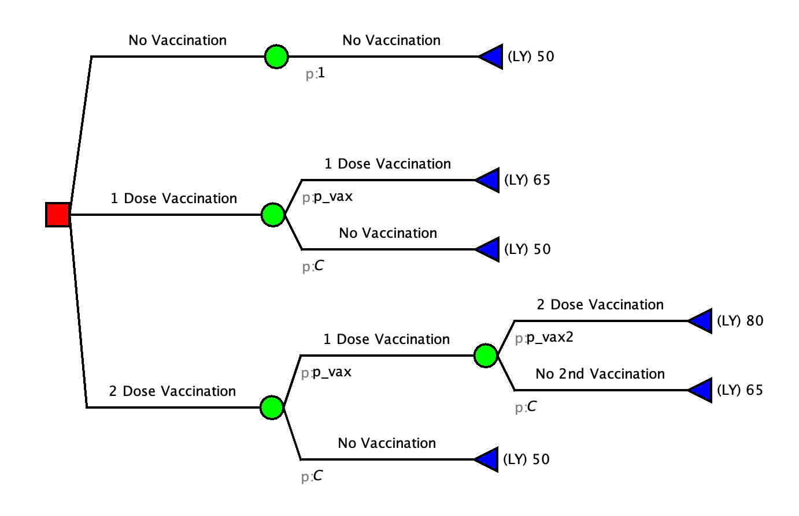
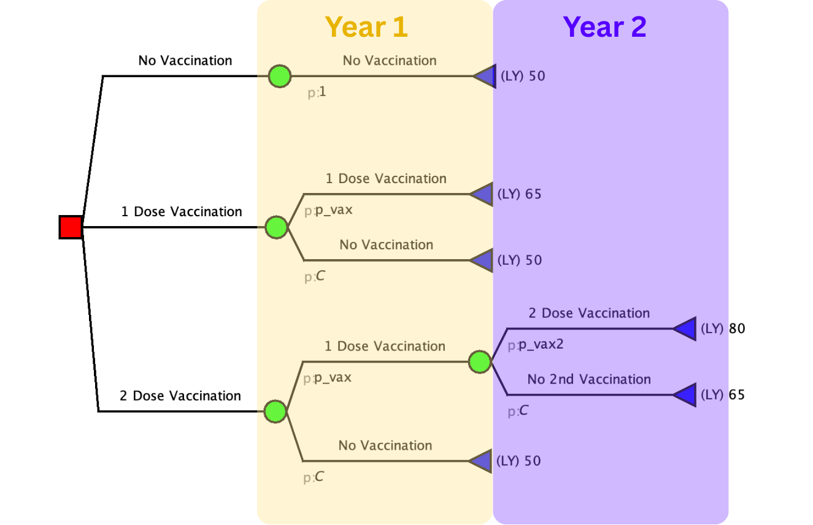
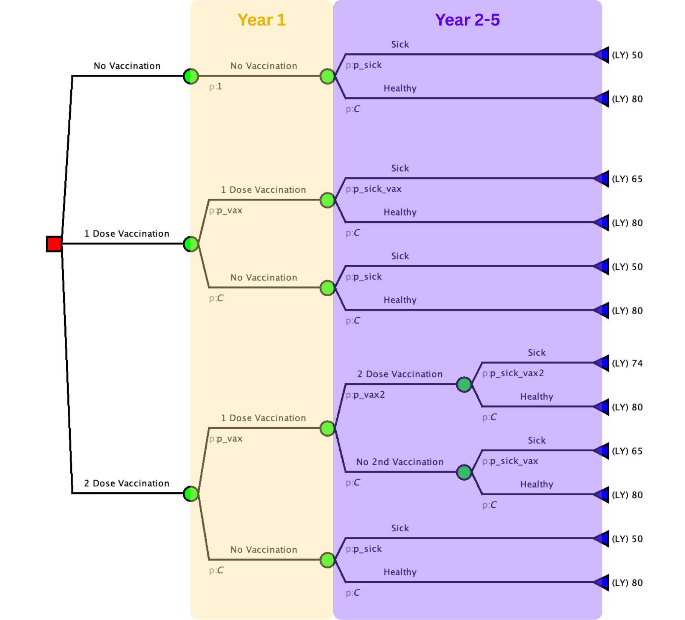
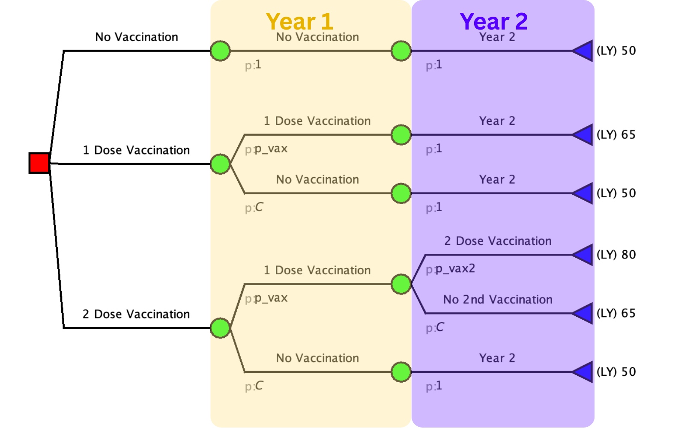

Below are some common "tricky" situations that were not covered in this Case Study but may arise in your capstone.

## **1. What if my model has mismatching timelines for strategies?**

Sometimes there will be a strategy that has a delayed component. It is important that all branches of the tree are the same time length. Therefore, this time delay must be accounted for.

For example, with the following strategies you have mismatched time lines.

|                      | Year 1 | Year 2 |
|----------------------|--------|--------|
| No Vaccination       | ❌     | ❌     |
| One Dose Vaccination | ✅     | ❌     |
| Two Dose Vaccination | ✅     | ✅     |

To account for this, additional branches are needed on the decision tree.

1.  Create your base decision tree. The one below has been simplified for ease of demonstration.

    

2.  Look at the timeline of the tree. In our example, you can see that the end points of the tree are not the same.

3.  Update the timeframes to match
    a.  Use a longer time frame. By using a 5 year time frame in our example, this captures all the events that can happen within those 5 years.

        

    b.  Add branches to have a matching time frame. Add branches where nothing happens to make the model end at the same point. This is not a great approach if there is common events in the other branches.

        

::: callout-tip
## We do this because...
:::

## **2. What if my model needs to be over a long period of time with repetitive events?**

Great question, you will need a Markov model. Do your best to work on a decision tree now for one portion of the model and then when we get further in the workshop we will learn Markov Models.

Somethings you might be able to make in the tree include:

-   The first year

-   One time screening

-   One time Vaccination

-   The events that happen while sick

## **3. What are other common outcomes to measure besides life years?**

This varies greatly based on your research question. Think about why you chose your strategies. What in particular are you trying to improve for the patient? or what does the health department care about improving? That is what you should count.

Examples:

-   Deaths adverted

-   cases of illness adverted / injuries adverted

-   healthy births/pregnancies

-   cases of progression adverted

-   complications adverted
