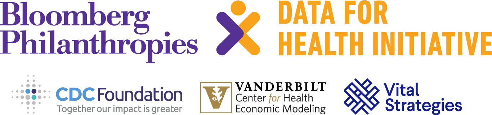
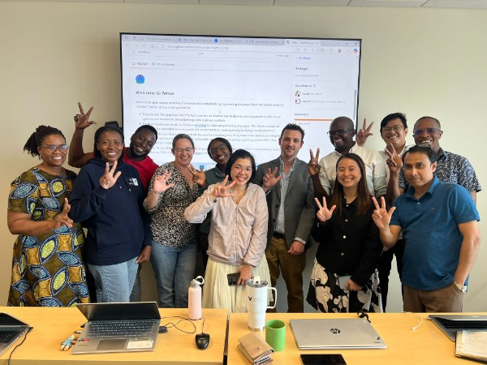
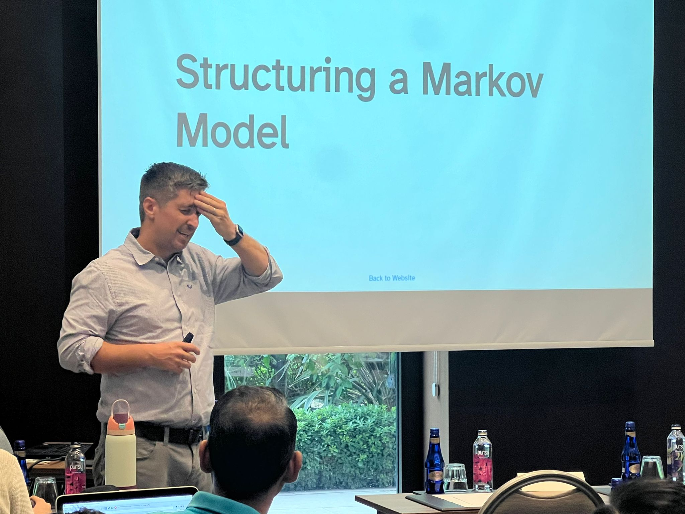

```{r, include = FALSE}
#install.packages("kableExtra")

library(kableExtra)
library(dplyr)
library(tidyr)

```

{fig-align="center"}

# Before you Arrive

Due to the workshop only being 5 days, we kindly ask that you do some pre-work before arriving to the workshop to ensure that you are able to make ample progress on your capstone.

[Get Started](prework.html)

# Schedule

<!-- ### [Download All Lecture Slides as a ZIP file](https://graveja0.github.io/vital-istanbul-2024/vital-istanbul-2024-workshop-lectures.zip) \[NEEDS UPDATED\] -->

## 26/01/2026 (Monday)

| Time | Type | Topic |
|------------------------|------------------------|------------------------|
| 08:00 - 8:45 | Check-Ins | Registration and Introductions |
| 08:45 - 9:30 | [Lecture]{.lecture} | [Conceptual and Theoretical Foundations for Decision Analysis and Cost Effectiveness Analysis](lectures/lec_1a.introduction-to-decision-analysis.html) |
| 10:00 - 10:30 | [Case Study]{.casestudy} | [Identifying Strategy Differences](case-studies/CaseStudy_Intro.html) |
| 10:30 - 10:50 | Break | Coffee/Tea |
| 10:50 - 12:00 | [Lecture]{.lecture} | [Decision Trees](lectures/lec_2.decision-trees-and-probabilities.html) |
| 12:30 - 13:40 | Break | Lunch |
| 13:40 - 13:55 | [Capstone]{.capstone} | [Example Presentation](capstone/completed_capstone_mike.pdf) |
| 13:55 - 14:55 | [Capstone]{.capstone} | [Discuss Decision Problem \[Small Groups\]](capstone/01_smallgroups.html) |
| 14:55 -15:40 | [Case Study]{.casestudy} | [Introduction to AMUA](case-studies/CaseStudy_AMUA.html) |
| 15:40-16:30 | [Lecture]{.lecture} | [CEA Fundamentals 1: Costs](lectures/lec_5a.cea-fundamentals1.html) |
| 16:30 | Check-Ins | Daily Recap & Discussion |

: {tbl-colwidths="\[20,10,50\]"}



## 27/01/2026 (Tuesday)

| Time | Type | Topic |
|------------------------|------------------------|------------------------|
| 08:00 - 08:30 | [Lecture]{.lecture} | [CEA Fundamentals 1: Costs (Cont.)](https://geratcliff.github.io/vital-2026-Cebu/lectures/lec_5a.cea-fundamentals1.html#/we-can-identify-different-types-of-healthcare-costs) |
| 08:30 - 09:30 | [Case Study]{.casestudy} | [Decision Trees in Amua](case-studies/CaseStudy_Tree.html) |
| 09:30 - 10:30 | [Capstone]{.capstone} | [Make a Decision Tree](capstone/02_decision-tree.html) |
| 10:30 - 11:00 | Break | Coffee/Tea |
| 11:00 - 12:00 | [Lecture]{.lecture} | [CEA Fundamentals 2:Benefits](lectures/lec_5b.cea-fundamentals2.html) |
| 12:00 - 12:30 | [Lecture]{.lecture} | [CEA Fundamentals 2: Benefits-DALYs](lectures/lec_dalys_2026-cebu.html) |
| 12:30 - 13:40 | Break | Lunch |
| 13:40 - 15:30 | [Lecture]{.lecture} | [CEA Fundamentals 3: Incremental CEA](lectures/lec_6.ICERs.html) |
| 15:30 - 16:30 | [Capstone]{.capstone} | [Add Outcomes to your decision tree](capstone/02_decision-tree.html) |
| 16:30 | Check-Ins | Daily Recap |

: {tbl-colwidths="\[20,10,50\]"}

### [Group dinner at Ettas Cucina + Bar - Mandani Bay will be provided. Please meet in the lobby for one of the two provided transports: 5:00pm and 5:30pm.]{style="color:#0083a9;"}

## 28/01/2026 (Wednesday)

| Time | Type | Topic |
|------------------------|------------------------|------------------------|
| 08:00 - 09:00 | [Case Study]{.casestudy} | [Incremental CEA](case-studies/CaseStudy_CEA.html) |
| 09:00-10:00 | [Lecture]{.lecture} | [Markov Models](lectures/lec_7.MarkovModels1.html) |
| 10:45 - 11:15 | Break | Coffee/Tea |
| 11:15 - 12:30 | [Lecture]{.lecture} | [Rates, Probabilities & More](lectures/lec_rates-probabilities.html) |
| 12:30 - 13:40 | Break | Lunch |
| 13:40 - 14:45 | [Case Study]{.casestudy} | [Simple Markov Model in Amua](case-studies/CaseStudy_MarkovSimple.html) |
| 14:45 - 16:30 | [Capstone]{.capstone} | [Design Markov Model](capstone/03_design-markov.html) |
| 16:30 | Check-Ins | Daily Recap and Group Discussion |

: {tbl-colwidths="\[20,10,50\]"}

## 29/01/2026 (Thursday)



| Time | Type | Topic |
|------------------------|------------------------|------------------------|
| 08:00 - 09:00 | [Lecture]{.lecture} | [Lecture: Structuring the Markov Model](lectures/lec_structure.html) \[JG\] |
| 09:00 - 10:15 | [Case Study]{.casestudy} | [Progressive Disease Model in Amua](case-studies/CaseStudy_MarkovProg.html) |
| 10:15 - 10:30 | Break | Coffee/Tea |
| 10:30- 12:30 | [Lecture]{.lecture} | [Determinisitic, Threshold and Scenario Analyses](lectures/lec_sensitivity.html) |
| 12:30 - 13:40 | Break | Lunch |
| 13:40 - 14:00 | [Capstone]{.capstone} | [Example Presentation](capstone/completed_capstone_andrea.pptx) |
| 14:00 - 14:45 | [Capstone]{.capstone} | [Run CEA and Stop work on Model to complete slides](capstone/04_build-markov.html) |
| 14:45 - 16:00 | [Case Study]{.casestudy} | [Common CEA Errors](case-studies/CommonErrors.html) |
| 16:00 | Check-Ins | Daily Recap |

: {tbl-colwidths="\[20,10,50\]"}

## 30/01/2026 (Friday)

| Time | Type | Topic |
|-------------------|-------------------|----------------------------------|
| 08:00 - 09:00 | [Case Study]{.casestudy} | [DALYs in AMUA](case-studies/CaseStudy_DALYs.html) \[Guided\] |
| 09:30 - 10:15 | [Case Study]{.casestudy} | [Common CEA Errors](case-studies/CommonErrors.html) |
| 10:15 - 10:45 | Break | Coffee/Tea |
| 10:45 - 12:45 | Presentations | Capstone Presentations (Small Groups) |
| 12:45 - 13:15 | Break | Lunch |
| 13:15 - 14:00 | Farewell | Certificate Ceremony and Closing Discussion |

: {tbl-colwidths="\[20,10,50\]"}

<!-- ### Function Room A (6 teams) -->

<!-- 1.  **Thailand - Malaria** (2-person team) -->

<!-- 2.  **Senegal - Kidney Transplant** (2-person team) -->

<!-- 3.  **China-Shan - Gastric Cancer** (1-person team) -->

<!-- 4.  **Tanzania - Maternal Health** (1-person team) -->

<!-- 5.  **China-Huizing - Assisted Reproductive Technology** (1-person team) -->

<!-- 6.  **Mozambique - Hypertension** (3-person team) -->

<!-- ### Function Room B (6 teams) -->

<!-- 1.  **South Africa - Rabies** (2-person team) -->

<!-- 2.  **Indonesia - Cervical Cancer** (2-person team) -->

<!-- 3.  **Morocco - Breast Cancer Screening** (1-person team) -->

<!-- 4.  **Ethiopia - HPV Vaccines** (2-person team) -->

<!-- 5.  **Vietnam - Thalassemia Screening** (2-person team) -->

<!-- 6.  **Bangladesh - Cervical Cancer** (2-person team) -->

<!-- ### Meeting Room 1 (5 teams) -->

<!-- 1.  **Uganda - TB** (2-person team) -->

<!-- 2.  **Philippines - HPV Vaccination** (2-person team) -->

<!-- 3.  **Zimbabwe - Major Depressive Disorders** (2-person team) -->

<!-- 4.  **Zambia - Alcohol Abuse** (2-person team) -->

<!-- 5.  **India-Archana - Cardiovascular Disease** (1-person team) -->

<!-- ### Meeting Room 2 (5 teams) -->

<!-- 1.  **Lebanon - Colorectal Cancer** (1-person team) -->

<!-- 2.  **India-Diksha - Neonatal mortality** (1-person team) -->

<!-- 3.  **Bangladesh - Malnutrition/Maternal Health** (1-person team) -->

<!-- 4.  **Rwanda - Road Accidents** (2-person team) -->

<!-- 5.  **Cambodia - Cervical Cancer** (2-person team) -->

## Optional Content

| Time         | Type       | Topic                                         |
|--------------|------------|-----------------------------------------------|
| Asynchronous | Case Study | [QALYS](case-studies/CaseStudy_QALYs.html)    |
| Asynchronous | Lecture    | [PSA Analysis & VOI](lectures/lec_psa.html)   |
| Asynchronous | Guide      | [Quick Start Guide](V4_Quick_Start_Guide.pdf) |

: {tbl-colwidths="\[20,10,50\]"}
