## Quick Sensitivity Review

When we run a sensitivity analysis, the goal is to **understand how the outcomes and decision would differ**. For this example, we will focus on one-way sensitivity analysis (OWSA) as it is easiest to show visually. However, this concept applies to all sensitivity.

For a **OWSA, one parameter at a time is adjusted.** The value should be adjusted up and down to match clinical trials, clinical observation, or a reasonable estimate. This new value is put back into the model and the model is run again. The new values from the model can tell how much a variable impacts the model.

## The Logic of the Issue

In a one‑way sensitivity analysis (OWSA), we change one probability at a time. We set it either to its maximum value or to its minimum value.

Remember: the probabilities coming from the same chance node must sum to 1 (100%).

Because of this, when one probability is changed, the model must automatically adjust the other probabilities to make sure the total is still 1.

In other words, the model needs a rule for how to handle the difference between the original probability and the new sensitivity value.

## A conceptual example

::::: split-content
::: content-text
Let's look at one health state within a model.

Individuals who start the cycle in Health State 1 can end the cycle in Health State 1, Health State 2, Health State 3, or Health State 4.
:::

::: content-visual
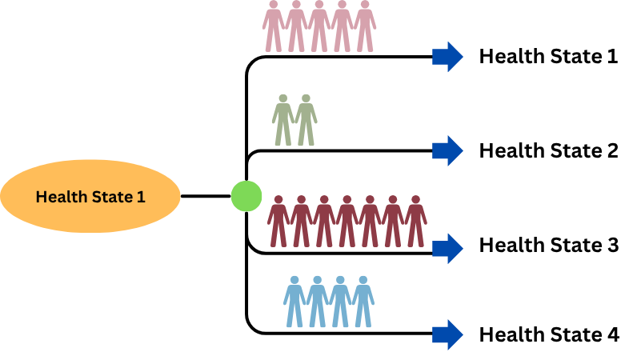
:::
:::::

## Running the OWSA

::::: split-content
::: content-text
To run the OWSA, the probability of going from "Health State 1" to "Health State 3" is decreased.
:::

::: content-visual
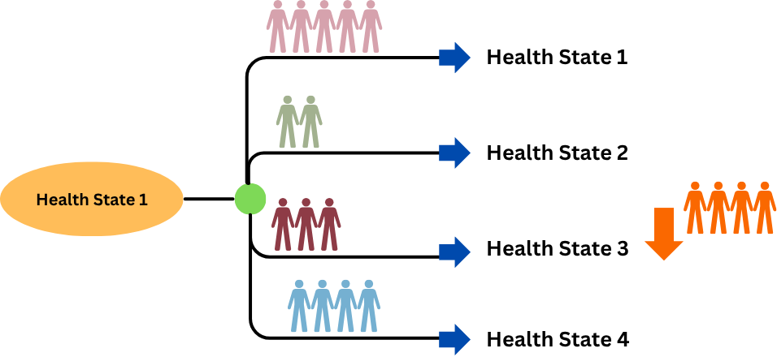
:::
:::::

## "Left-overs"

::::: split-content
::: content-text
For lack of a better term we will call the people that no longer go from "Health State 1" to "Health State 3" the ["left-overs"]{style="color: #fa6800;"}.

The model has to know where these individuals should go.
:::

::: content-visual
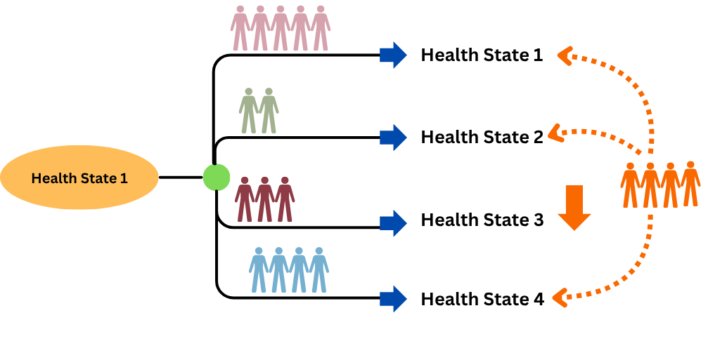
:::
:::::

## Placing the "left-overs"

In some scenarios, the "left-over" individuals can all be shifted to one other probability. But there are also scenarios where individuals should be distributed.

::::: split-content
::: content-visual
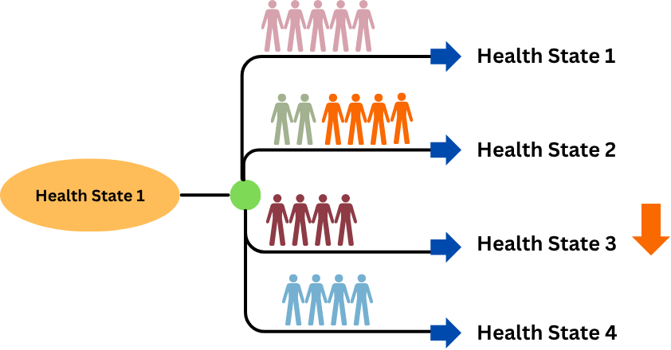
:::

::: content-visual
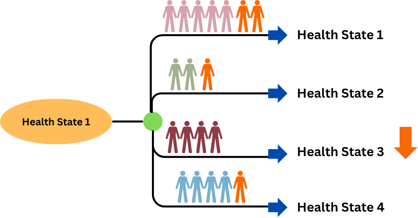
:::
:::::

## Lets walk through an example in Amua

## The Model

This is modeled using a Markov model based on the following bubble diagram. All individuals will start in Healthy.

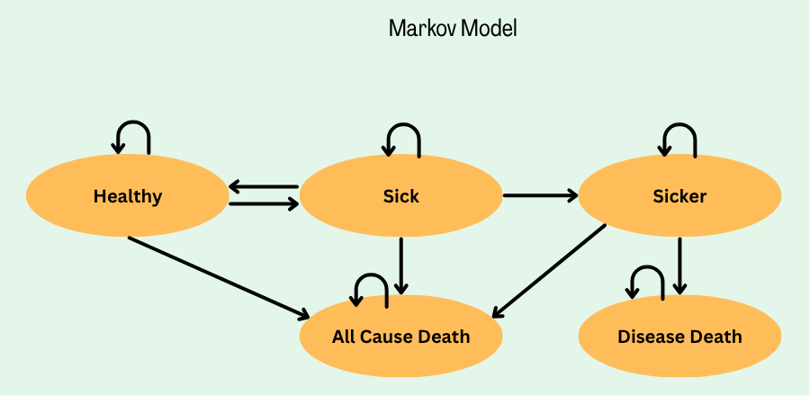{fig-align="center"}

## Let's focus on Sick

::::: split-content
::: content-text
Based on the bubble diagram, individuals that are sick can:

-   heal

-   remain sick

-   get sicker

-   die of all-cause death
:::

::: content-visual
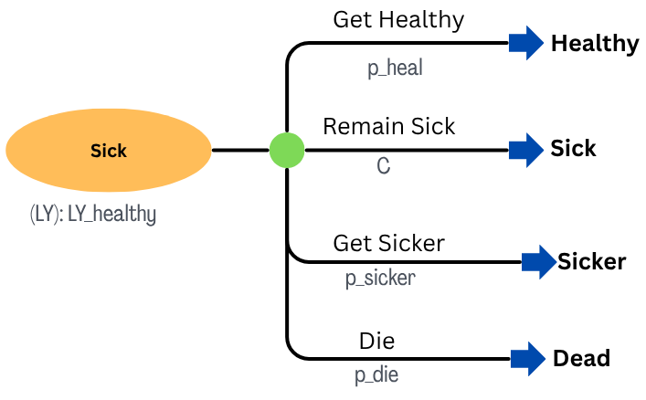
:::
:::::

## Running the OWSA

:::::: split-content
:::: content-text
The model ran great and now it is time for the OWSA.

::: bold
Based on (fake) data we learn that p_die can be wrong by up to 4%
:::
::::

::: content-visual
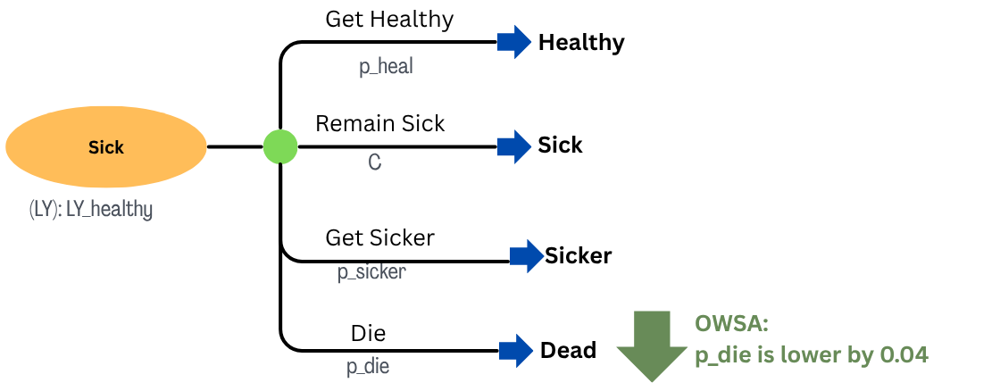
:::
::::::

## What we expect

::::: split-content
::: content-text
We expect that if less people are dying then there are more individuals that are sorted between healthy, remain sick, and getting sicker.
:::

::: content-visual
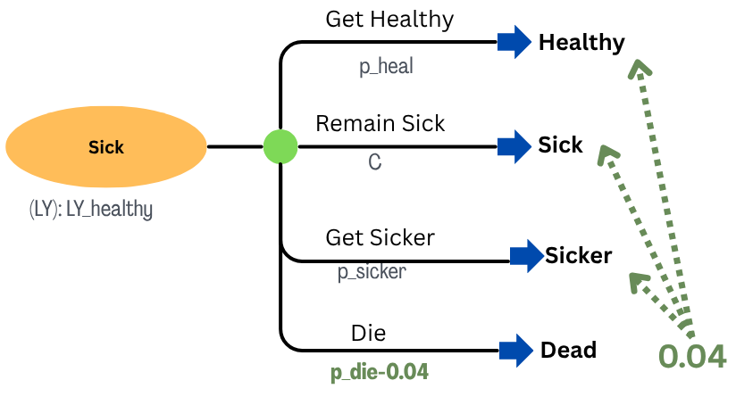
:::
:::::

## What Amua does

:::::: split-content
:::: content-text
However, Amua uses the complimentary probability to determine where the "left over" individuals go.

As the diagram shows, in this example, all 0.04 "left-over" individuals are staying in sick. They do not have a chance to become healthy or get sicker.

::: bold
This does not match the clinical reality for the population and disease.
:::
::::

::: content-visual
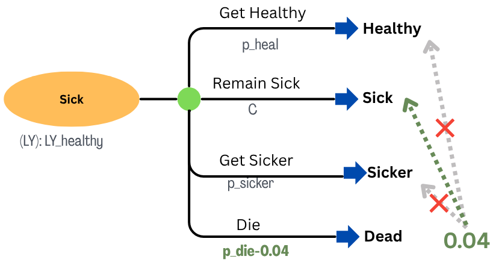
:::
::::::

## A Fix

The best way to avoid this in Amua is to use paired branches as shown below.

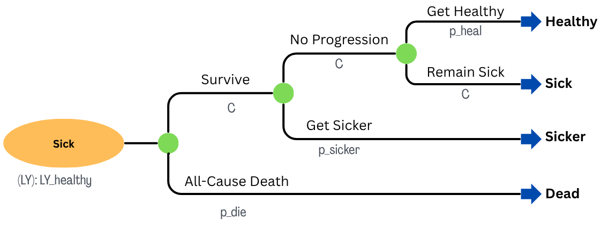

## Running the OWSA

The new model is running and now it is time for the OWSA.

We again use the (fake) data to adjust p_die by 4%

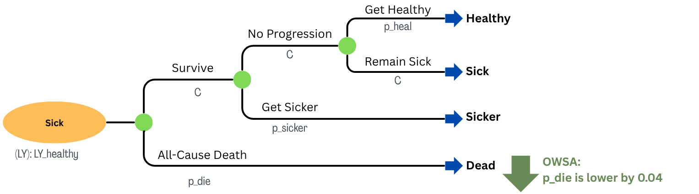

## What Amua does

Now the "left-over" individuals are moved to the "Survive" branch. This allows them to continue to flow through the other possible events.

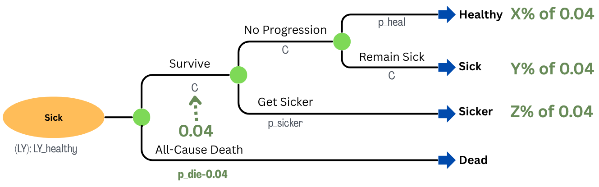

##  {.summary-end-slide}

::::::: summary-circle
::: end-title
Key Takeaways
:::

::: end-subtitle
Amua Model Structures
:::

:::: key-points
::: incremental
-   Having a plan for "left-overs" is very important in any software
-   Using a two-branch system is best for most scenarios in Amua
:::
::::
:::::::
