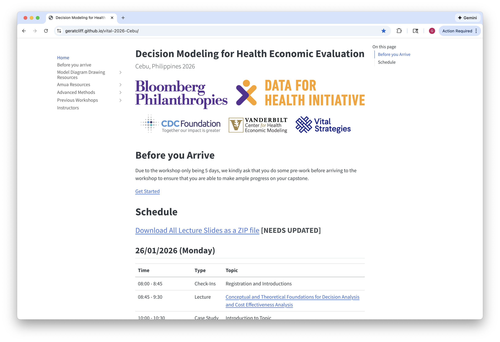
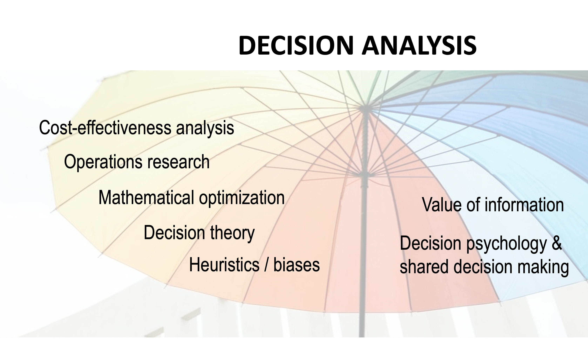
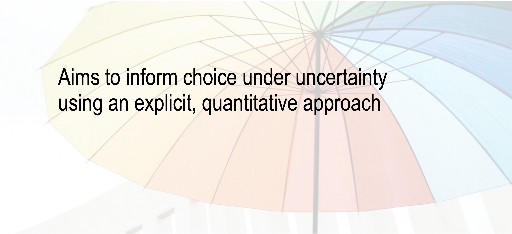

##  {.numbered-list-slide}

<h2>Outline</h2>

::::::::::::::: number-list
::::: list-item
::: number
01
:::

::: text
Introductions
:::
:::::

::::: list-item
::: number
02
:::

::: text
Motivation
:::
:::::

::::: list-item
::: number
03
:::

::: text
Examples of Decision Analysis
:::
:::::

::::: list-item
::: number
04
:::

::: text
Workshop objectives
:::
:::::
:::::::::::::::

## Course Website

::::: split-content
::: content-text
**What is it?**

-   All course materials (slides, case studies) are posted here.

-   Our (likely evolving) schedule will also be posted here, and updated regularly.

-   Additional Resources (Quick Start Guide, Data Collection Tool, Etc.)
:::

::: content-visual

:::
:::::

::: {style="font-size: 1.0em"}
<https://geratcliff.github.io/vital-2026-Cebu/>
:::

## Introductions {.section-slide}

::: section-number
01
:::

## Motivation {.section-slide}

::: section-number
02
:::

## The Past Two Decades ...

:::: icon-bullets
::: incremental
-   Cured Hepatitis C
-   Significantly reduced incidence of HIV
-   Potential cure for relapsed/refractory leukemia & lymphoma
-   Perfected vaccines (e.g. HPV vaccine) to prevent diseases such as cervical & other cancers
-   Strides in preventing cardiovascular disease
:::
::::

## Despite these advances ...

##  {.big-number-slide}

::: big-number
74%
:::

::: big-number-label
of deaths globally are from non-communicable diseases.
:::

::: big-number-context
86% of those deaths are in low- and middle-income countries (LMICs) Burden of NCDs like cancer, cardiovascular disease, and diabetes is growing.
:::

Source: [WHO](https://www.who.int/news-room/fact-sheets/detail/noncommunicable-diseases)

## 

::: arrow-bullets
-   Governments cannot afford all the healthcare from which people could possibly benefit

-   Either implicitly or explicitly, we make choices about which programs to fund, which populations to screen, and which expensive new drugs to provide to which patients
:::

:::: highlight-box
::: box-title
**Decision Analysis can help us ensure that we prioritize the highest value care possible at an efficient price point**
:::
::::

## 

:::::::: definition-box
::: term
Decision Analysis
:::

::: definition
a methodology that is uniquely beneficial when there are ***meaningful tradeoffs*** between healthcare interventions, but the best strategies for obtaining optimal outcomes are uncertain.
:::

::::: example
::: example-label
Example:
:::

::: example-text
The introduction of a new drug provides hope at more survival and better quality of life. However, based on the high cost it is unknown if the new drug is worth implementing over the current drug.
:::
:::::
::::::::

## 

## 

## Value

::: highlight-box
Economists have long defined value as "outcomes relative to costs
:::

If we only consider benefits when we define value, it's no different than efficacy or effectiveness research.

### [But, we do NOT want to just consider costs without benefits!]{style="text-align: center; display: block;"}

## Examples of Decision Analysis {.section-slide}

::: section-number
03
:::

## Ex 1. HIV

::: {.highlight-box .primary}
You have been appointed as Director of a funding allocation committee responsible for prevention & treatment initiatives for HIV.
:::

::: incremental
1.  How will the committee decide on the proportion of funds for prevention efforts versus treatment?

2.  Should any of the funds be used for research?

3.  How do you respond to a member who argues that the funds are better spent on childhood vaccinations?
:::

## Ex 2. Birth Defects {auto-animate="true"}

A hypothetical birth defect...

::::::::::: stats-grid
:::::: stat-box
::: stat-value
1 in 1,000
:::

::: stat-label
children
:::

::: stat-description
are born with it
:::
::::::

:::::: stat-box
::: stat-value
50%
:::

::: stat-label
fatality rate
:::

::: stat-description
unless treated
:::
::::::
:::::::::::

## Ex 2. Birth Defects {auto-animate="true"}

::: {.highlight-box .thin}
***Should we test for this hypothetical birth defect?***
:::

:::::: concept-grid
::: {.concept-box .fragment data-fragment-index="1"}
Diagnostic test: Perfectly accurate
:::

::: {.concept-box .fragment data-fragment-index="2"}
All newborns in whom the defect is identified can be successfully cured
:::

::: {.concept-box .accent .fragment data-fragment-index="3"}
The test itself can be lethal **4 in every 10,000** infants tested will die as a direct and observable result of the testing procedure
:::
::::::

## Ex 2. Birth Defects {auto-animate="true"}

::: {.highlight-box .secondary .thin}
**Objective**: Minimize total expected deaths
:::

Consider a population of **100,000 newborns**

::::::::: comparison-table
::::: comparison-column
::: column-header
Testing
:::

::: column-content
Produces: (0.0004 x 100,000) = **40** expected deaths

[✓ **Fewer deaths**]{.fragment style="color: green;"}
:::
:::::

::::: comparison-column
::: column-header
No testing
:::

::: column-content
Produces: (0.001 x 0.5 x 100,000) = **50** expected deaths
:::
:::::

-   [**Anyone got a problem with this??**]{.fragment style="color: darkred;"}
:::::::::

## **Different lives are lost**

::::::::: comparison-table
::::: {.comparison-column .fragment data-fragment-index="1"}
::: column-header
Testing
:::

::: column-content
Virtually all 40 deaths occur in infants born **without** the fatal condition
:::
:::::

::::: {.comparison-column .fragment data-fragment-index="2"}
::: column-header
No testing
:::

::: column-content
All 50 expected deaths occur from "natural causes" (i.e. unpreventable birth defect)
:::
:::::
:::::::::

## **Different lives are lost**

:::: incremental
::: arrow-bullets
-   "Innocent deaths" inflicted on children who had **"nothing to gain"** from testing program
-   We may treat one child's death as more tolerable than some other's -- even when we have no way, before the fact, of distinguishing one infant from the other.
:::
::::

## Ex 3. Substance use treatment in pregnancy

::: {style="font-size: 0.8em"}
**Another example of "Competing interests"**
:::

::: {style="font-size: 0.6em"}
\[Leech AA, 2024\]
:::

{width="395"}

## Ex 3. Opioid/substance use in pregnancy

::: {style="font-size: 0.6em"}
\[Leech AA, 2024\]
:::

{width="420"}

## Ex 3. Opioid/substance use in pregnancy

::: {style="font-size: 0.6em"}
\[Leech AA, 2024\]
:::

{width="420"}

## Ex 3. Opioid/substance use in pregnancy

::: {style="font-size: 0.6em"}
\[Leech AA, 2024\]
:::

{width="420"}

## Ex 3. Opioid/substance use in pregnancy

::: {.highlight-box .thin}
The clear winner is buprenorphine!!
:::

Yes, BUT...

:::: arrow-bullets
::: incremental
-   We know that clinically, patient choice is really important for retention outcomes
-   We can also see that our final conclusions are driven by the infant outcomes (methadone actually has better retention outcomes)
-   We did not simulate the birthing parent over their lifetime
:::
::::

##  {.quote-slide}

::: quote-text
The appropriate balance of competing interests between the pregnant individual and the infant is an ethical exercise that is beyond the scope of simulation modeling.
:::

## Ex 3. Opioid/substance use in pregnancy

Even if buprenorphine is "dominating" in the parlance of decision science and health economics. Requiring this treatment creates poor policy with...

:::::: concept-grid
::: concept-box
Reduced Retention
:::

::: concept-box
Worse Outcomes
:::

::: concept-box
Higher Cost
:::
::::::

...than allowing individuals to [**CHOOSE**]{.accent-text} their preferred option.

## Estimating probabilities is fundamental to decision making {background="#43464B"}

:::: icon-bullets-triangle
::: incremental
-   Cannot readily obtain needed probabilities
-   Varying time periods / lengths
-   Methods to estimate probabilities
:::
::::

<!-- TK This needs to be a full page  -->

## Commonality of cases

:::: icon-bullets-triangle
::: incremental
-   Unavoidable tradeoffs
-   Different perspectives may lead to different conclusions
-   Multiple competing objectives
-   Complexity
-   Uncertainty
:::
::::

##  {.summary-end-slide}

::::::: summary-circle
::: end-title
Key Takeaways
:::

::: end-subtitle
Decision Analysis
:::

:::: key-points
::: incremental
-   Aims to inform choice under uncertainty using an explicit, quantitative approach
-   Aims to [identify, measure, & value the **consequences of decisions** under uncertainty]{.accent-text} when a decision needs to be made, most appropriately over time.
:::
::::
:::::::

## Workshop objectives {.section-slide}

::: section-number
04
:::

## Workshop Design

1.  We're *flexible* -- if there is a topic that is unclear to you, or that you would like expanded upon, **please let us know**!

  2. Mixed content

::: arrow-bullets
-   Lectures

-   Small group case studies

-   Large group case studies and "hands-on" Amua exercises

-   Time for Capstone work and guidance
:::

## Workshop Content

::::::::::::::: comparison-table
::::: comparison-column
::: column-header
Day 1
:::

::: column-content
Basics of decision analysis

-   Decision trees

-   Introduction to Amua

-   Introduction to Capstone
:::
:::::

::::: comparison-column
::: column-header
Days 2-3
:::

::: column-content
Basics of Cost-Effectiveness Analysis

-   Valuing cost and health outcomes

-   Incremental cost-effectiveness analysis

-   Introduction to Markov Modeling
:::
:::::

::::: comparison-column
::: column-header
Day 4-5
:::

::: column-content
Advanced Topic Preview

-   Risk Matrix

-   Progressive Disease

-   Sensitivity Analysis

-   Common CEA Errors

-   DALYs in Amua
:::
:::::
:::::::::::::::

## Questions? {.questions-slide}
:::{.next-info}
Next: Decision Trees
:::
