## Learning Objectives and Outline {.section-slide}

::: section-number
00
:::

## Learning Objectives

::: arrow-bullets
-   Construct and solve a decision problem by calculating an
    intervention's **expected value** across competing strategies in a
    decision tree

-   Determine the decision threshold across a range of scenarios

-   Differentiate between joint and conditional probabilities and
    demonstrate their use in decision trees
:::

## Outline {.numbered-list-slide}

::: number-list
::: list-item
::: number
01
:::

::: text
Structure of a Decision Analysis
:::
:::

::: list-item
::: number
02
:::

::: text
Determining the Decision Threshold
:::
:::

::: list-item
::: number
03
:::

::: text
Probabilities within Decision Trees
:::
:::

::: list-item
::: number
04
:::

::: text
Other Concepts in Decision Analysis
:::
:::

::: list-item
::: number
05
:::

::: text
Strengths and limitations of decision trees
:::
:::

::: list-item
::: number
06
:::

::: text
Decision tree do's and don'ts
:::
:::
:::

## The Structure of a Decision Analysis {.section-slide}

::: section-number
01
:::

## Recap: [Decision Analysis]{.accent-text}

::: concept-grid
::: concept-box.box-muted
Aims to inform choice under uncertainty using an explicit, quantitative
approach
:::

::: concept-box.box-muted
Aims to identify, measure, & value the **consequences of decisions**
(risks/benefits) & uncertainty when a decision needs to be made, most
appropriately over time
:::
:::

# Should I go to the beach or stay home? {background="#c2f0c2"}

## Should I go to the beach or stay home? {auto-animate="true"}

#### Possible States of the World:

::: {.image-grid .grid-2x2}
::: image-item


::: image-caption
At the beach with no rain.
:::
:::

::: image-item


::: image-caption
At the beach with rain.
:::
:::

::: image-item
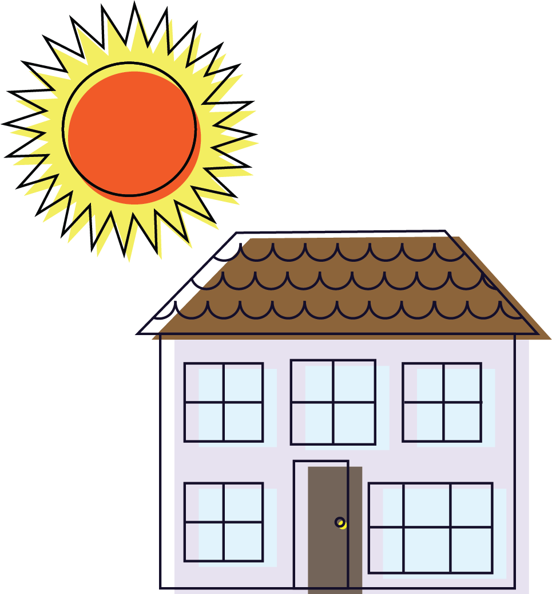

::: image-caption
At home with no rain.
:::
:::

::: image-item


::: image-caption
At home with rain.
:::
:::
:::

## Should I go to the beach or stay home? {auto-animate="true"}

### Considerations:

::: image-grid
::: image-item
::: fragment
[**Probabilities**]{.secondary-text
style="display: block; text-align: center; margin-bottom: 0.5em;"}
:::

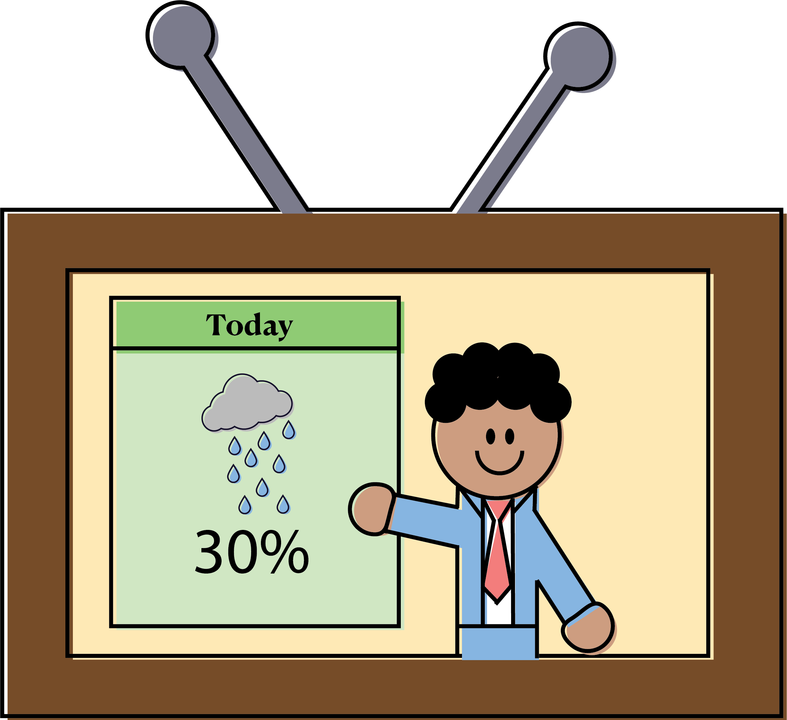

::: image-caption
Likelihood of Rain
:::
:::

::: image-item
::: fragment
[**Payoff**]{.secondary-text
style="display: block; text-align: center; margin-bottom: 0.5em;"}
:::


::: image-caption
My overall well being in each state.
:::
:::
:::

## Should I go to the beach or stay home? {auto-animate="true"}

### Considerations:

::: {.image-grid style="grid-template-columns: 1fr 2fr;"}
::: image-item
[**Probabilities**]{.secondary-text
style="display: block; text-align: center; margin-bottom: 0.1em;"}


::: image-caption
Likelihood of Rain
:::
:::

::: {style="display: grid; grid-template-columns: repeat(2, 1fr); gap: 1em;"}
::: {.image-item data-id="payoff-1"}
[**Payoff**]{.secondary-text
style="display: block; text-align: center; margin-bottom: 0em; font-size: 0.85em;"}

{style="max-height: 12vh; margin-top: 0em;"}

::: image-caption
Mood when it is sunny at the beach
:::
:::

::: {.image-item data-id="payoff-2"}
[**Payoff**]{.secondary-text
style="display: block; text-align: center; margin-bottom: 0em; font-size: 0.85em;"}

{style="max-height: 12vh; margin-top: 0em;"}

::: image-caption
Mood when it is raining at the beach
:::
:::

::: {.image-item data-id="payoff-3"}
[**Payoff**]{.secondary-text
style="display: block; text-align: center; margin-bottom: 0em; font-size: 0.85em;"}

{style="max-height: 12vh; margin-top: 0em;"}

::: image-caption
Mood when it is sunny at home
:::
:::

::: {.image-item data-id="payoff-4"}
[**Payoff**]{.secondary-text
style="display: block; text-align: center; margin-bottom: 0em; font-size: 0.85em;"}

{style="max-height: 12vh; margin-top: 0em;"}

::: image-caption
Mood when it is raining at home
:::
:::
:::
:::

```{r decision-trees}
#| echo = FALSE

###############################################################################################
# Note:
#   Mermaid images created with DiagrammeR are ridiculously hard to export as images,
#   and even when they do export, they end up with tons of unnecessary white space.
#   As a result, our solution here is to include the code that generates each 
#   decision tree, then to use the "Export" feature within Rstudio/Posit to
#   save it as a temporary .png. We then pare down the whitespace in the saved
#   image by cropping it accordingly, and then saving this image in the media directory. 
###############################################################################################

library(DiagrammeR)
#https://mermaid-js.github.io/mermaid/#/flowchart


dt_key <- mermaid("graph LR
        A[ ]---B[ ]
        B---C[Decision Node]
        D[ ]---E(( ))
        E---F(( Chance Node))
        linkStyle 1 stroke:#ff3,stroke-width:0px,color:red;
        linkStyle 3 stroke:#ff3,stroke-width:0px,color:red;
        style A fill:#ffffff,stroke:#333,stroke-width:0px
        style D fill:#ffffff,stroke:#333,stroke-width:0px
        style C fill:#ffffff,stroke:#333,stroke-width:0px
        style F fill:#ffffff,stroke:#333,stroke-width:0px")


dt_beachhome1 <- mermaid("graph LR
    A[ ]---B[ ]
    B---|Beach|C(( ))
    B---|Home|D(( ))
    C---|x|Rain[Rain]
    C---|1-x|NoRain[No Rain]
    D---|x|Rain2[Rain]
    D---|1-x|NoRain2[No Rain]
    style A fill:#ffffff,stroke:#333,stroke-width:0px
    style Rain fill:#ffffff,stroke:#333,strike-width:2px
    style NoRain fill:#ffffff,stroke:#333,strike-width:2px
    style Rain2 fill:#ffffff,stroke:#333,strike-width:2px
    style NoRain2 fill:#ffffff,stroke:#333,strike-width:2px")

dt_beachhome2  <- mermaid("graph LR
    A[ ]---B[ ]
    B---|Beach|C(( ))
    B---|Home|D(( ))
    C---|0.3|Rain[Rain]
    C---|0.7|NoRain[No Rain]
    D---|0.3|Rain2[Rain]
    D---|0.7|NoRain2[No Rain]
    style A fill:#ffffff,stroke:#333,stroke-width:0px
    style Rain fill:#ffffff,stroke:#333,strike-width:2px
    style NoRain fill:#ffffff,stroke:#333,strike-width:2px
    style Rain2 fill:#ffffff,stroke:#333,strike-width:2px
    style NoRain2 fill:#ffffff,stroke:#333,strike-width:2px")

dt_beachhome3 <- mermaid("graph LR
    A[ ]---B[ ]
    B---|Beach|C(( ))
    B---|Home|D(( ))
    C---|0.3|Rain[Rain]
    C---|0.7|NoRain[No Rain]
    D---|0.3|Rain2[Rain]
    D---|0.7|NoRain2[No Rain]
    Rain2---pHomeRain[0.6]
    NoRain2---pHomeNoRain[0.8]
    Rain---pBeachRain[0.4]
    NoRain---pBeachNoRain[1.0]
    linkStyle 10 stroke:#ff3,stroke-width:0px,color:red;     
    linkStyle 9 stroke:#ff3,stroke-width:0px,color:red; 
    linkStyle 7 stroke:#ff3,stroke-width:0px,color:red;    
    linkStyle 8 stroke:#ff3,stroke-width:0px,color:red;
    style pBeachRain fill:#ffffff,stroke-width:0px
    style pBeachNoRain fill:#ffffff,stroke-width:0px   
    style pHomeRain fill:#ffffff,stroke-width:0px
    style pHomeNoRain fill:#ffffff,stroke-width:0px   
    style A fill:#ffffff,stroke:#333,stroke-width:0px
    style Rain fill:#ffffff,stroke:#333,strike-width:2px
    style NoRain fill:#ffffff,stroke:#333,strike-width:2px
    style Rain2 fill:#ffffff,stroke:#333,strike-width:2px
    style NoRain2 fill:#ffffff,stroke:#333,strike-width:2px")

dt_beachhome_EVbeach <- mermaid("graph LR
    A[ ]---B[ ]
    B---|Beach|C(( ))
    B---|Home|D(( ))
    C---|0.3|Rain[Rain]
    C---|0.7|NoRain[No Rain]
    D---|0.3|Rain2[Rain]
    D---|0.7|NoRain2[No Rain]
    Rain2---pHomeRain[0.6]
    NoRain2---pHomeNoRain[0.8]
    Rain---pBeachRain[0.4]
    NoRain---pBeachNoRain[1.0]
    linkStyle 10 stroke:#ff3,stroke-width:0px,color:red;     
    linkStyle 9 stroke:#ff3,stroke-width:0px,color:red; 
    linkStyle 7 stroke:#ff3,stroke-width:0px,color:red;    
    linkStyle 8 stroke:#ff3,stroke-width:0px,color:red;
    style pBeachRain fill:#ffffff,stroke-width:0px
    style pBeachNoRain fill:#ffffff,stroke-width:0px   
    style pHomeRain fill:#ffffff,stroke-width:0px
    style pHomeNoRain fill:#ffffff,stroke-width:0px   
    style A fill:#ffffff,stroke:#333,stroke-width:0px
    style Rain fill:#f3bab6,stroke:#333,strike-width:2px
    style NoRain fill:#f3bab6,stroke:#333,strike-width:2px
    style Rain2 fill:#ffffff,stroke:#333,strike-width:2px
    style NoRain2 fill:#ffffff,stroke:#333,strike-width:2px")

dt_beachhome_EVhome <- mermaid("graph LR
    A[ ]---B[ ]
    B---|Beach|C(( ))
    B---|Home|D(( ))
    C---|0.3|Rain[Rain]
    C---|0.7|NoRain[No Rain]
    D---|0.3|RainH[Rain]
    D---|0.7|NoRainH[No Rain]
    RainH---pHomeRain[0.6]
    NoRainH---pHomeNoRain[0.8]
    Rain---pBeachRain[0.4]
    NoRain---pBeachNoRain[1.0]
    linkStyle 10 stroke:#ff3,stroke-width:0px,color:red;     
    linkStyle 9 stroke:#ff3,stroke-width:0px,color:red; 
    linkStyle 7 stroke:#ff3,stroke-width:0px,color:red;    
    linkStyle 8 stroke:#ff3,stroke-width:0px,color:red;
    style pBeachRain fill:#ffffff,stroke-width:0px
    style pBeachNoRain fill:#ffffff,stroke-width:0px   
    style pHomeRain fill:#ffffff,stroke-width:0px
    style pHomeNoRain fill:#ffffff,stroke-width:0px   
    style A fill:#ffffff,stroke:#333,stroke-width:0px
    style Rain fill:#ffffff,stroke:#333,strike-width:2px
    style NoRain fill:#ffffff,stroke:#333,strike-width:2px
    style RainH fill:#f3bab6,stroke:#333,strike-width:2px
    style NoRainH fill:#f3bab6,stroke:#333,strike-width:2px")

dt_beachhome_pB <- mermaid("graph LR
    A[ ]---B[ ]
    B---|Beach=0.82|C(( ))
    B---|Home=0.74|D(( ))
    C---|p_B|Rain[Rain]
    C---|1-p_B|NoRain[No Rain]
    D---|0.3|Rain2[Rain]
    D---|0.7|NoRain2[No Rain]
    Rain2---pHomeRain[0.6]
    NoRain2---pHomeNoRain[0.8]
    Rain---pBeachRain[0.4]
    NoRain---pBeachNoRain[1.0]
    linkStyle 10 stroke:#ff3,stroke-width:0px,color:red;     
    linkStyle 9 stroke:#ff3,stroke-width:0px,color:red; 
    linkStyle 7 stroke:#ff3,stroke-width:0px,color:red;    
    linkStyle 8 stroke:#ff3,stroke-width:0px,color:red;
    style pBeachRain fill:#ffffff,stroke-width:0px
    style pBeachNoRain fill:#ffffff,stroke-width:0px   
    style pHomeRain fill:#ffffff,stroke-width:0px
    style pHomeNoRain fill:#ffffff,stroke-width:0px   
    style A fill:#ffffff,stroke:#333,stroke-width:0px
    style Rain fill:#ffffff,stroke:#333,strike-width:2px
    style NoRain fill:#ffffff,stroke:#333,strike-width:2px
    style Rain2 fill:#ffffff,stroke:#333,strike-width:2px
    style NoRain2 fill:#ffffff,stroke:#333,strike-width:2px")
```

## Decision Trees

::: simple-comparison
::: fragment
::: comparison-column
::: column-header
<u>Square decision node</u>
:::

::: column-content
-   Indicates a decision point between alternative options

::: {style="text-align: center; margin-top: 1.5em;"}
{style="max-height: 12vh;"}
:::
:::
:::
:::

::: fragment
::: comparison-column
::: column-header
<u>Circular Chance Node</u>
:::

::: column-content
-   Shows a point where two or more alternative events for a patient are
    possible

::: {style="text-align: center; margin-top: 1.5em;"}
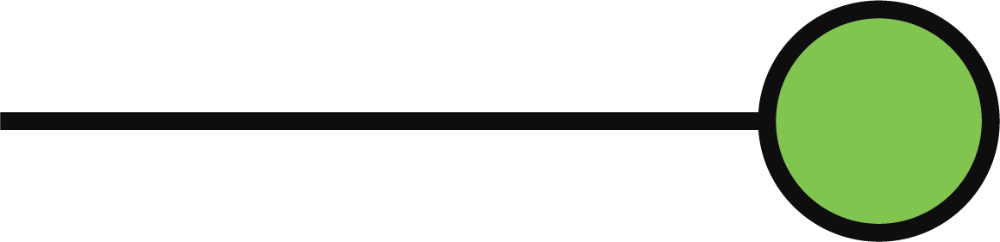{style="max-height: 12vh;"}
:::
:::
:::
:::
:::

::: notes
(1) We start with a decision node -- which just visually shows the
    decision point (so no probabilities are attached here)

(2) From our decision node, we would then want to create chance nodes,
    or probability nodes, to model out the probabilities of our
    different options

(3) The corresponding events from the chance nodes need to sum to 1 as
    per the "law of total probability"
:::

## Decision Trees

::: incremental
::: icon-bullets
-   Pathways are [**mutually exclusive**]{.accent-text} sequences of
    events and are the routes through the tree.
-   Probabilities show the likelihood of particular event occurring at a
    chance node.
:::
:::

## Should I go to the beach or stay home? {auto-animate="true"}

### Decision Tree:

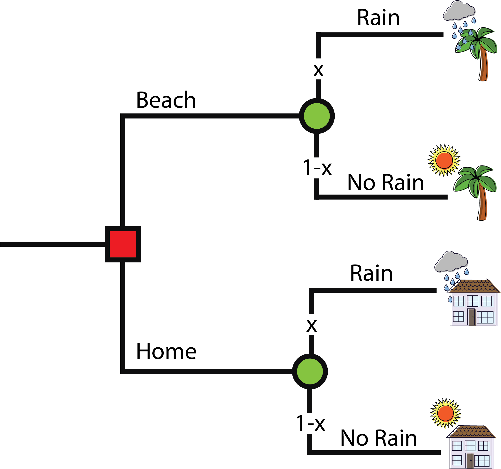{fig-align="center"}

::: notes
(2) The outcomes we care about for this model are RAIN versus NO RAIN,
    so we add that to the end of our branches, which represent the
    terminal nodes -- or the end states of our model
:::

## Probability of rain = 30%

{fig-align="center"}

## Should I go to the beach or stay home? {auto-animate="true"}

### Decision Tree:

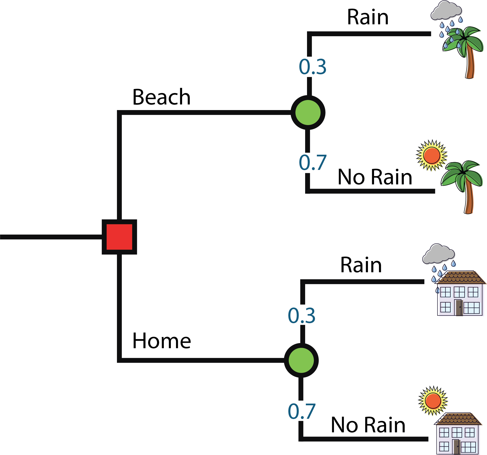{fig-align="center"}

::: notes
(1) The probability of rain is 30% - whether you stay home or go to the
    beach & we know that the branches have to add to 1 because of the
    law of total probability\
(2) However, we aren't done yet, as \*\*\*It would be helpful if we had
    some way to VALUE the outcomes -- in terms of say, rain at the
    beach, versus if it rained at home, etc.
(3) \*\*If you don't place value on the different outcomes, then we are
    essentially saying that we value RAIN versus NO RAIN the same among
    the beach and home options
(4) But if I had to guess, this probably isn't true unless you're the
    type of person that likes rain at the beach just as much as rain at
    home)
:::

## Should I go to the beach or stay home?

### Payoffs

::: {style="position: relative; min-height: 300px;"}
::: {.fragment .fade-out fragment-index="2" style="position: absolute; top: 0; left: 0; width: 100%;"}
| Scenario                                                                                                                                 | Payoff |
|-----------------------------------------------|-------------------------|
| {style="max-height: 5vh; margin-bottom: 0"} At beach, no rain                                              | 1.0    |
| {style="max-height: 5vh; margin-bottom: 0"} At beach, rain [↓]{.fragment .accent-text fragment-index="1"} | 0.4    |
| {style="max-height: 5vh; margin-bottom: 0"} At home, no rain [↑]{.fragment .accent-text fragment-index="1"} | 0.8    |
| {style="max-height: 5vh; margin-bottom: 0"} At home, rain [↑]{.fragment .accent-text fragment-index="1"}   | 0.6    |
:::

::: {.fragment .fade-in fragment-index="2" style="position: absolute; top: 0; left: 0; width: 100%;"}
| Scenario                                                                                                         | Payoff |
|-----------------------------------------------|-------------------------|
| {style="max-height: 5vh; margin-bottom: 0"} At beach, no rain [BEST]{.accent-text} | 1.0    |
| {style="max-height: 5vh; margin-bottom: 0"} At home, no rain                        | 0.8    |
| {style="max-height: 5vh; margin-bottom: 0"} At home, rain                          | 0.6    |
| {style="max-height: 5vh; margin-bottom: 0"} At beach, rain [WORST]{.accent-text}  | 0.4    |
:::
:::

::: notes
(1) We will get into this down the line, but utilities are measured
    between 0 and 1.
(2) For health states, for example, 0 = worst health & 1 = perfect
    health
(3) Here, we are valuing "beach, no rain" as the "most ideal state" we
    want to be in
:::

## Should I go to the beach or stay home?

### Decision Tree:

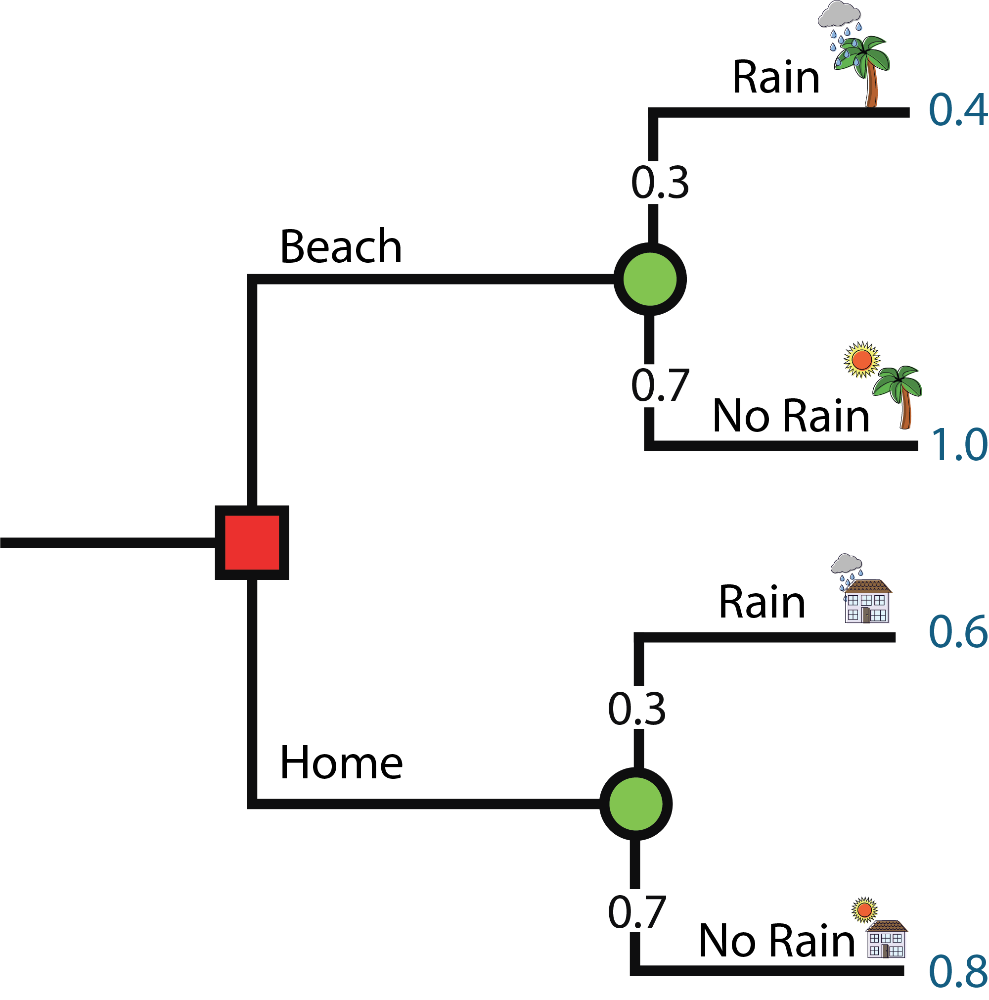{fig-align="center"}

## What is the expected value of going to the beach?

::: columns
::: {.column width="50%"}
$\color{green}{0.82} = \underbrace{\color{red}{0.3} * \color{blue}{0.4}}_{\text{Rain}} + \underbrace{\color{red}{0.7} * \color{blue}{1.0}}_{\text{No Rain}}$

-   Probabilities in [red]{style="color: red;"}.
-   Payoffs in [blue]{style="color: blue;"}.
-   Expected value in [green]{style="color: green;"}.
:::

::: {.column width="50%"}
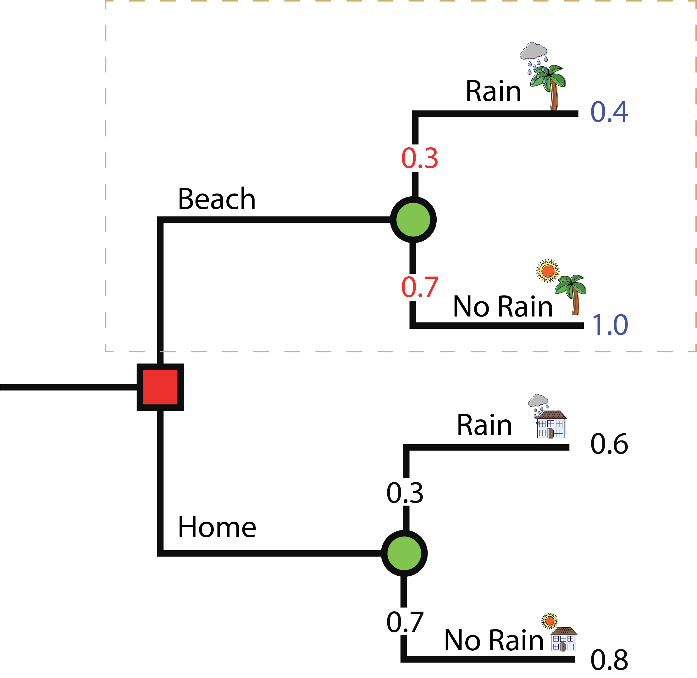{fig-align="center"}
:::
:::

## What is the expected value of staying home?

::: columns
::: {.column width="50%"}
$\color{green}{0.74} = \underbrace{\color{red}{0.3} \cdot \color{blue}{0.6}}_{\text{Rain}} + \underbrace{\color{red}{0.7} \cdot \color{blue}{0.8}}_{\text{No Rain}}$

-   Probabilities in [red]{style="color: red;"}.
-   Payoffs in [blue]{style="color: blue;"}.
-   Expected value in [green]{style="color: green;"}.
:::

::: {.column width="50%"}
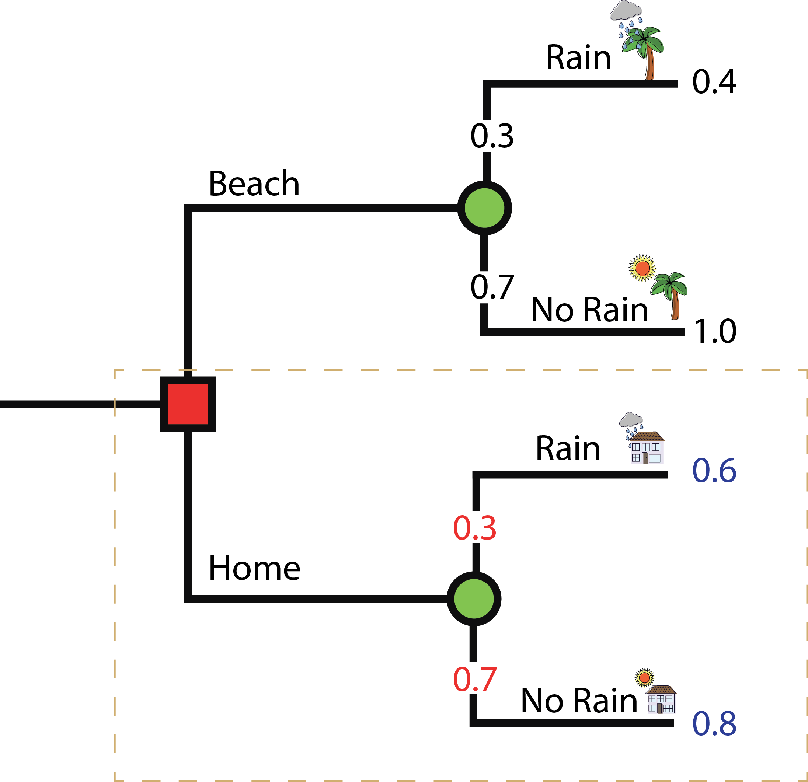{fig-align="center"}
:::
:::

##  {.big-number-slide}

::: big-number
 Beach
:::

::: big-number-context
EV(Beach)=0.82 \> EV(Home)=0.74
:::

## Expected Values

-   Expected value = The sum of the multiplied probabilities for each
    chance option or intervention

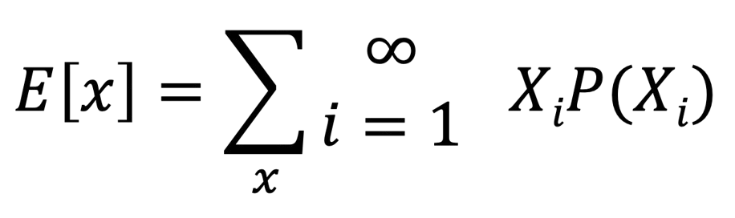{width="187"}

::: notes
Equation: 1 to infinity -- represents the infinite \# of branches in the
decision tree. In our example, we only had 2 branches, but if you had 3
or 4 or 5... you would represent it as i=3, 4, 5 and then you multiply
the probabilities.

Xi = payoff and P = probability
:::

## 

::: definition-box
::: term
Expected Values
:::

::: {.definition .arrow-bullets}
-   The expected value within the context of decision trees are the
    "payoffs" weighted by their preceding probabilities
-   What we get is: the result that is expected ON AVERAGE for any one
    decision alternative (e.g. length of life, quality of life, lifetime
    costs)
:::

::: {.example .fragment .fade-in fragment-index="2"}
::: example-label
Example:
:::

::: example-text
On average, patients given Treatment A will live 0.30 years (or 3.6
months \[=0.30\*12\]) longer than patients given Treatment B
:::
:::

::: {.fragment .fade-in fragment-index="3"}
::: {.callout-important appearance="simple"}
Maximizing expected value is a reasonable criterion for choice given
uncertain prospects; though it does not necessarily promise the best
results for any **one individual**
:::
:::
:::

## Determining the Decision Threshold {.section-slide}

::: section-number
02
:::

## At what probability $p$ are the two choices equal?

::: fragment
Suppose we want to know at what probability of rain $p$ we are
indifferent between going to the beach vs. staying at home...
:::

::: arrow-bullets
::: incremental
-   Write the equation for each choice using a variable, p, for the
    probability in question

-   Set the equations equal to to one other and solve for p.
:::
:::

## At what probability $p$ are the two choices equal? {auto-animate="true"}

**Beach:** [0.82]{style="color:green;"} = 0.3 x 0.4 + 0.7 x 1.0

**Home:** [0.74]{style="color:green;"} = 0.3 x 0.6 + 0.7 x 0.8

## At what probability $p$ are the two choices equal? {auto-animate="true"}

$\underbrace{0.3 * 0.4 + 0.7 * 1.0}_{\text{Beach}} = \underbrace{0.3 * 0.6 + 0.7 * 0.8}_{\text{Home}}$

## At what probability $p$ are the two choices equal? {auto-animate="true"}

Replace probability of rain with **P** and **1-P** and solve for "P"

<br>

p \* 0.4 + (1-p) \* 1.0 = p \* 0.6 + (1-p) \* 0.8

<br>

$\underbrace{0.3 * 0.4 + 0.7 * 1.0}_{\text{Beach}} = \underbrace{0.3 * 0.6 + 0.7 * 0.8}_{\text{Home}}$

## At what probability $p$ are the two choices equal? {auto-animate="true"}

p \* 0.4 + (1-p) \* 1.0 = p \* 0.6 + (1-p) \* 0.8

## At what probability $p$ are the two choices equal? {auto-animate="true"}

p \* 0.4 + (1-p) \* 1.0 = p \* 0.6 + (1-p) \* 0.8

<br>

**0.4p + 1-p = 0.6p + 0.8 - 0.8p**

**1-0.6p = 0.8 - 0.2p**

**1-0.8 = 0.6p - 0.2p**

**0.2 = 0.4 \* p**

[**0.5 = p**]{style="color:green;"}

## At what probability $p$ are the two choices equal? {auto-animate="true"}

When the probability of rain is 50% at BOTH the beach and home, given
how we weighted the outcomes, going to the beach would be the same as
staying at home

::: highlight-box
::: box-title
In other words, you would be indifferent between the two -- staying at
home or going to the beach; \<50%, you would choose the beach.
:::
:::

## At what probability ($p_B$) of rain for <u>the beach</u> are you indifferent between the two options? {auto-animate="true"}

::: incremental
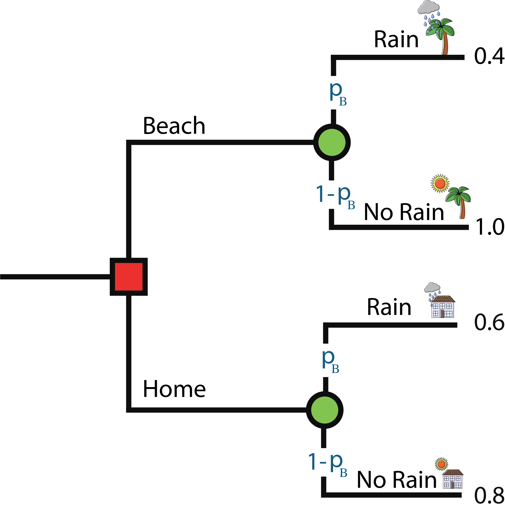{fig-align="center" width="50%"}
:::

## At what probability ($p_B$) of rain for the beach are you indifferent between the two options? {auto-animate="true"}

Earlier, we solved for the expected value of remaining at home:

[**0.74**]{.accent-text} (which was a lower expected value than going to
the beach when the chance of rain at both was 30%)

::: {.highlight-box .primary}
::: incremental
-   **What would** $p_B$ need to be to yield an expected value *at the
    beach* of 0.74?
    -   We just solved for the **indifference threshold** assuming the
        probability of rain was the same at the beach and at home.
    -   Now we **vary rain at the beach** while keeping the probability
        of rain at home fixed at **30%**.
-   In other words, at what probability of rain at the beach would you
    be indifferent between staying at home & going to the beach?
:::
:::

::: notes
(1) Now, let's ask a slightly different question -- At what
    probabiility....
(2) Let's now assume that the probability of rain for the HOME option
    does not change (so stays at 0.3)
(3) KEY DIFFERENCE FROM THE LAST EXAMPLE: In the last example, the
    probabilities were the same & we wanted to get our threshold of
    indifference between the beach and staying at home
(4) \*\*Now we are assuming that there's still a probability of 30% that
    it rains if you stay home, but at what probability of rain at the
    beach would you be indifferent between the two options? (Since we
    CHOSE BEACH when the probabilities both equaled 30%)

-   In other words, at what probability of RAIN AT THE BEACH would you
    be indifferent between the beach & home
:::

## At what probability ($p_B$) of rain for the beach are you indifferent between the two options? {auto-animate="true"}

<br>

Set 0.74 (expected value of remaining at home) equal to the **beach**
payoffs and solve for $p_B$, **because we are varying the probability of
rain at the beach (**$p_B$), not the probability of rain at home
($p_H$).

<br>

p~B~ \* 0.4 + (1 - p~B~) \* 1.0 = 0.74

## At what probability ($p_B$) of rain for the beach are you indifferent between the two options? {auto-animate="true"}

::: {.fragment .fade-out}
p~B~ \* 0.4 + (1 - p~B~) \* 1.0 = 0.74
:::

::: incremental
p~B~ \* 0.4 + 1 - p~B~ = 0.74
:::

## At what probability ($p_B$) of rain for the beach are you indifferent between the two options? {auto-animate="true"}

::: incremental
p~B~ \* -0.6 = -0.26
:::

## At what probability ($p_B$) of rain for the beach are you indifferent between the two options? {auto-animate="true"}

::: incremental
p~B~ = -0.26 / -0.6 = [**0.43**]{style="color:green;"}
:::

## At what probability ($p_B$) of rain for the beach are you indifferent between the two options? {auto-animate="true"}

When the probability of rain at the beach is 43% (probability of rain at
home remains at 30%), we would be indifferent between staying at home &
going to the beach (because the EV would both = 0.74).

::: {.highlight-box .primary}
::: box-title
If the probability of rain at the beach in \>43%, then we would stay
home
:::
:::

*Remember:* when the probability of rain was **30% at both locations**,
we would choose the **beach**.

## Probabilities within Decision Trees {.section-slide}

::: section-number
03
:::

## 

::: definition-box
::: term
Mutually exclusive events
:::

::: definition
2 things that cannot occur together (one event cannot occur at the same
time as the other event)
:::

::: example
::: example-label
Examples:
:::

::: {.example-text .arrow-bullets}
-   2 events -- survive or die
-   2 events -- cured or not cured
:::
:::
:::

## Mutually exclusive events in Decision Trees

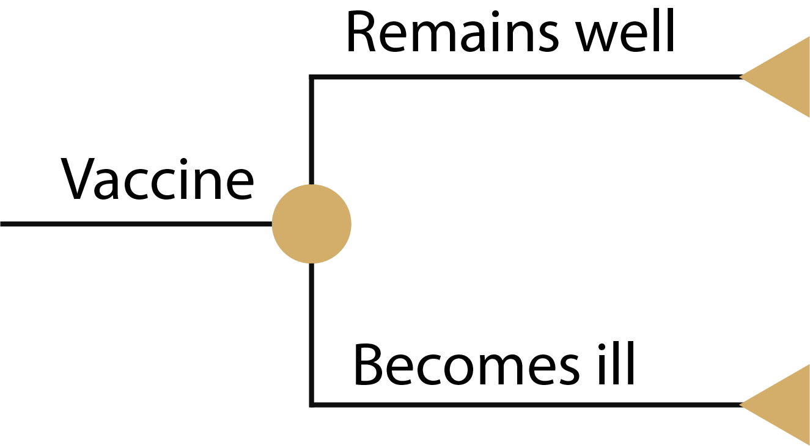{width="356"}

## Mutually exclusive events

Assuming events are mutually exclusive, then the probability of 2 events
occurring is the <u>sum of the probability of each event occurring
individually</u>

::: highlight-box
$$
P(A or B) = P(A) + P(B) 
$$
:::

*This is what we do when summing pathways for a single decision*\
(e.g., **Beach** = rain **or** no rain; **Home** = rain **or** no rain).

## Probabilities within Decision Trees

::: definition-box
::: term
Joint probability
:::

::: definition
P(A and B): The probability of two events occurring at the same time.
:::
:::

::: definition-box
::: term
Conditional probability
:::

::: definition
P(A\|B): The probability of an event A given that an event B is known to
have occurred.
:::
:::

```{r}
#| echo = FALSE

dt_evans97 <- mermaid("
graph LR
Attack[ ]---|Migrane Attack|Decision[ ]
Decision---|Treatment A|TrtA(( ))
Decision---|Treatment B|TrtB(( ))

style Attack fill:#ffffff,stroke-width:0px


TrtA---|\"Relief (0.558)\"|ReliefA(( ))
TrtA---|\"No Relief (0.442)\"|NoReliefA(( ))
ReliefA---|\"No recurrence (0.594)\"|NoRecA((A))
ReliefA---|\"Recurrence (0.406)\"|RecA((B))
NoReliefA---|\"Endures Attack (0.92)\"|AttackA((C))
NoReliefA---|\"ER (0.08)\"|ERA(( ))
ERA---|\"Relief (0.998)\"|ERReliefA((D))
ERA---|\"Hospitalization (0.002)\"|ERHospA((E))
style NoRecA fill:#ffffff,stroke-width:0px
style RecA fill:#ffffff,stroke-width:0px
style AttackA fill:#ffffff,stroke:#333,stroke-width:0px      
style ERReliefA fill:#ffffff,stroke:#333,stroke-width:0px  
style ERHospA fill:#ffffff,stroke:#333,stroke-width:0px


TrtB---|\"Relief (0.379)\"|ReliefB(( ))
TrtB---|\"No Relief (0.621)\"|NoReliefB(( ))
ReliefB---|\"No recurrence (0.703)\"|NoRecB((F))
ReliefB---|\"Recurrence (0.297)\"|RecB((G))
NoReliefB---|\"Endures Attack (0.92)\"|AttackB((H))
NoReliefB---|\"ER (0.08)\"|ERB(( ))
ERB---|\"Relief (0.998)\"|ERReliefB((I))
ERB---|\"Hospitalization (0.002)\"|ERHospB((J))

style NoRecB fill:#ffffff,stroke-width:0px
style RecB fill:#ffffff,stroke-width:0px
style AttackB fill:#ffffff,stroke:#333,stroke-width:0px      
style ERReliefB fill:#ffffff,stroke:#333,stroke-width:0px  
style ERHospB fill:#ffffff,stroke:#333,stroke-width:0px

")

```

## 

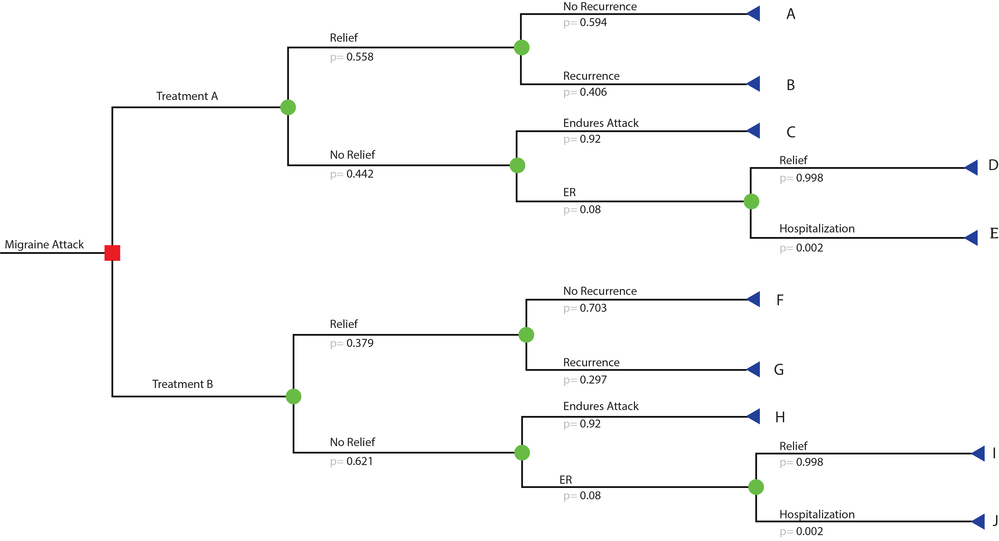

## Probabilities

::: split-content
::: incremental
::: {.content-text .arrow-bullets}
-   Moving from left to right, the first probabilities in the tree show
    the probability of an event.
-   Subsequent probabilities are [conditional]{.bold .primary-text}. The
    probability of an event given that an earlier event did or did not
    occur.
-   Multiplying probabilities along pathways estimates the pathway
    probability, which is a [joint]{.bold .primary-text} probability.
:::
::: 


::: content-visual


*Decision Tree*
:::
:::

## 

::: definition-box
::: term
Pathways
:::

::: definition
A sequence of events that lead to a subsequent "pay off" In other words,
a sequence of events leads to an outcome/consequence, or payoff.
:::

::: example
::: example-label
Example:
:::

::: example-text
Our beach example has 4 pathways; At home with sun, at home with rain,
at the beach with sun, and at the beach with rain.
:::
:::
:::

## Pathways {.split-wrapper}

::: split-content
::: content-visual
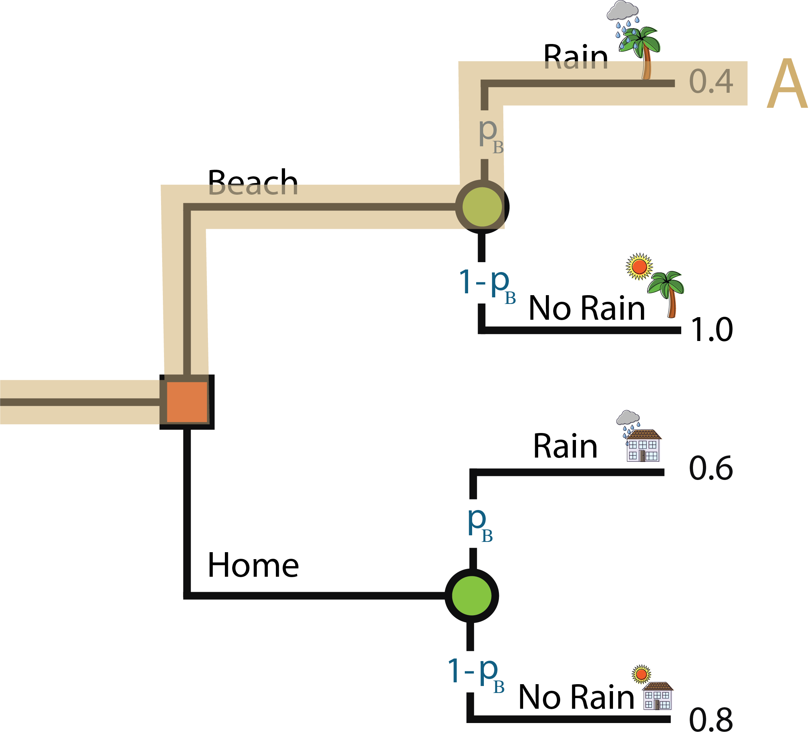

*Pathway A: This person goes to the beach but it rains*
:::

::: content-visual
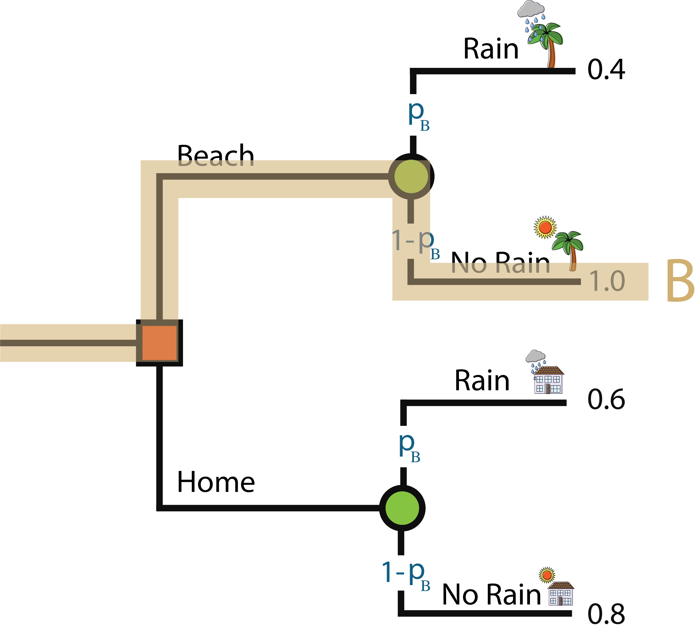

*Pathway B: This person goes to the beach but there is no rain*
:::
:::

## 

::: definition-box
::: term
Conditional probability
:::

::: definition
Probability of an event occurring (B) given that another event occurred
(A) $$
P(A|B) = P(A and B) / P(B) 
$$
:::

::: example
::: example-label
Example:
:::

::: example-text
What is the conditional probability of death within a year of birth,
given the infant has a mother who smokes?
:::
:::
:::

## Conditional probability, 2x2 review

::: {.highlight-box .thin}
What is the conditional probability of death within a year of birth,
given the infant has a mother who smokes?
:::

::: split-content
::: content-text
[P(A\|B)]{.bold .accent-text} <br> = P(death in first year \| mother who
smokes) <br> = 16,712 / (1,197,142 + 16,712) <br> = 14 per 1,000 births
:::

::: content-visual
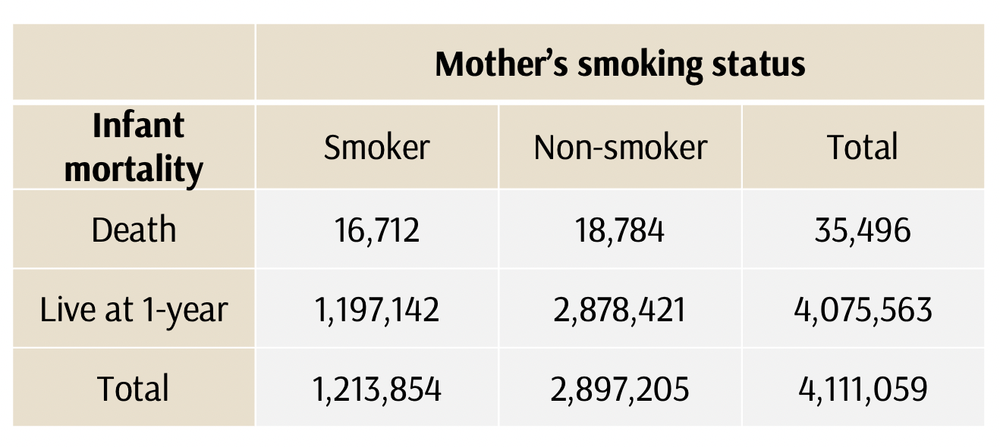
:::
:::

## Conditional probability, 2x2 review

Or, if we wanted to use the conditional probability equation

::: split-content
::: content-text
[P(A\|B) = P(A and B)/P(B)]{.bold .accent-text} <br> *\*A= death in
first year; B=mother who smokes* <br>

[P(A and B)]{.bold .accent-text} = 16,712 / 4,111,059 = 0.0041 <br>
[P(B)]{.bold .accent-text} = 1,213,854/4,111,059 = 0.295 <br>
[P(A\|B)]{.bold .accent-text} = 0.0041/0.295 = 0.014
:::

::: content-visual

:::
:::

## Conditional probability, A\|B vs B\|A

::: {.highlight-box .thin}
Probability of A\|B is different from that of B\|A
:::

::: split-content
::: content-text
If A = death in first year; B=normal birth weight infant, <br> THEN, the
conditional probability of P(A\|B) = the probability of an infant death,
given that the child has a normal birth weight
:::

::: content-visual
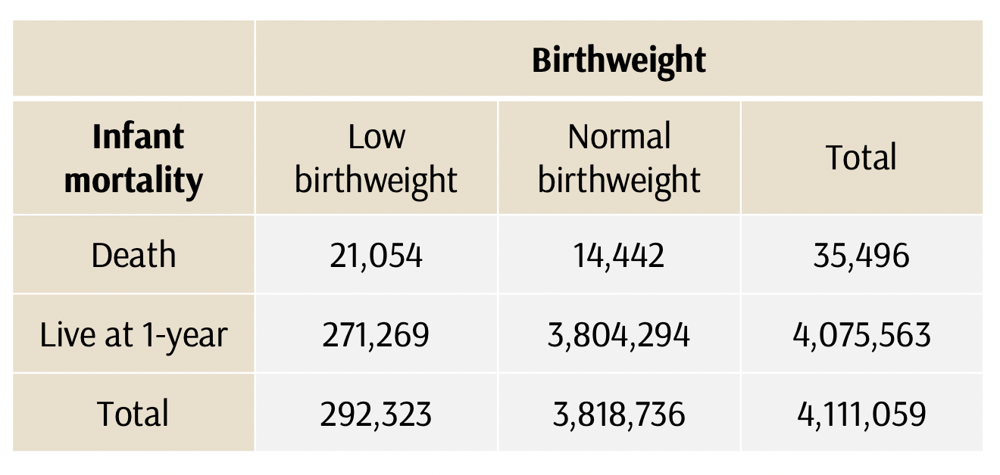
:::
:::

## Conditional probability, A\|B vs B\|A

::: {.highlight-box .thin}
What is the conditional probability of an infant death, given that the
child has a normal birth weight?
:::

::: split-content
::: content-text
If A = death in first year; B=normal birth weight infant <br>

[P(A\|B)]{.bold .accent-text} <br> = 14,442 / (14,442+ 3,804,294) <br> =
3.8 deaths per 1,000 births
:::

::: content-visual

:::
:::

## Conditional probability, A\|B vs B\|A

Or, if we wanted to use the conditional probability equation

::: split-content
::: content-text
[P(A\|B) = P(A and B)/P(B)]{.bold .accent-text} <br>

[P(A and B)]{.bold .accent-text} = 14,442 <br> [P(B)]{.bold
.accent-text}= 3,818,736 <br> [P(A\|B)]{.bold .accent-text} =
14,442/3,818,736 = 0.0038

*\* A= death in first year; B=normal birth weight infant*
:::

::: content-visual

:::
:::

## Conditional probability, A\|B vs B\|A

::: split-content
::: content-text
On the other hand, the conditional probability of P(B\|A) is the
probability that an infant had normal birth weight, given that the
infant died within 1 year from birth

*\*B=normal birth weight infant; A = death in first year*
:::

::: content-visual

:::
:::

## Conditional probability, A\|B vs B\|A

::: {.highlight-box .thin}
Probability of A\|B is 3.8 deaths per 1,000 births
:::

::: split-content
::: content-text
Solve P(B\|A) -- the probability that an infant had normal birthweight,
given that the infant died within 1 year from birth

[P(B\|A)]{.bold .accent-text}<br> = 14,442 / (14,442+ 21,054) <br> =
0.41

[4.1 normal birthweights of 1,000 baby deaths within 1 year from
birth]{.bold .accent-text}

*\*B=normal birth weight infant; A = death in first year*
:::

::: content-visual

:::
:::

## Other Concepts in Decision Analysis {.section-slide}

::: section-number
04
:::

## Decision Philosophies {auto-animate="true"}

::: highlight-box
Maximizing expected value is a reasonable criterion for choice given
uncertain prospects; though it does not necessarily promise the best
results for any one individual.
:::

::: comparison-table
::: comparison-column
::: column-header
Mini-max regret
:::

::: {.column-content .fragment fragment-index="1"}
-   Never go to the beach unless 0% rain.
:::
:::

::: comparison-column
::: column-header
Maxi-max
:::

::: {.column-content .fragment fragment-index="2"}
-   Always go to the beach unless 100% rain.
:::
:::

::: comparison-column
::: column-header
Expected utility
:::

::: {.column-content .fragment fragment-index="3"}
-   Depends on the weather.
:::
:::
:::

::: notes
(1) Let's quickly touch on decision philosophies when it comes to
    preference weighting. There are different levels of risk aversion &
    there are different decision philosophies for these behaviors

(2) Mini-max regret philosophy essentially means that you would never go
    to the beach unless there was 0% rain

-   For instance, physicians may be risk averse & therefore minimize max
    regret

(3)(a) Maxi-max gain is the reverse -- where you would always go to the
beach unless there was 100% rain -- you are risk seeking -- you love the
beach so much that you're going to give it a try.

(3)(b) Another example of this in a medical context -- is the desperate
patient example -- you're going to die anyways, so we are going to give
you this treatment, but it has nasty side effects -- cancer --
chemotherapies -- even bone marrow transplants, 2nd or third line -- a
high probability of bad outcome but if you do nothing then you're going
to die.

(4) If you're going to base your decision on expected utility, then your
    decision depends on the weather & how much value you give to certain
    outcomes -- this is the rationale thinker approach -- how much you
    value sitting at home weighed by the utility loss of not having the
    beach experience, for example.
:::

## Payoffs

::: {.icon-bullets .incremental}
-   Each state of the world is assigned a cost or outcome.
-   Our goal is often to calculate the expected value of these payoffs.
:::

[We'll cover more on the theories and frameworks underlying various
payoffs in the next few lectures]{.fragment}

## Strengths/limitations of decision trees {.section-slide}

::: section-number
05
:::

## Strengths/limitations of decision trees

::: pros-cons-new
::: pros-column
::: column-title
Strengths
:::

::: incremental
-   They are easy to describe and understand
-   Works well with limited time horizon
-   Decision trees are a powerful framework for analyzing decisions and
    can provide rapid/useful insights, but they have limitations.
:::
:::

::: cons-column
::: column-title
Limitations
:::

::: incremental
-   No explicit accounting for the elapse of time.
    -   Recurrent events must be separately built into model.
    -   Fine for short time cycles (e.g., 12 months) but we often want
        to model over a lifetime.
-   Difficult to incorporate real clinical detail - Tree structure can
    quickly become complex.
:::
:::
:::

## Some Do's & Dont's {.section-slide}

::: section-number
06
:::

## Some Do's & Dont's as you think about your own trees
<br>

1.  **Balance risks and benefits** <br>

> Each strategy must include all relevant risks *and* benefits. 
<br> 
> If one option carries only risks or only benefits, either the model is misspecified or the clinical problem does not require a decision analysis (the decision would be "obvious" in the latter case).

## Some Do's & "Dont's"
<br>

2.  **Two branches versus three** <br>

> There is nothing inherently wrong with having three (or more) branches, as long as events are mutually exclusive and probabilities sum to 1. 
<br> 
> However, additional branches increase model complexity & can complicate sensitivity analyses without necessarily adding insight.

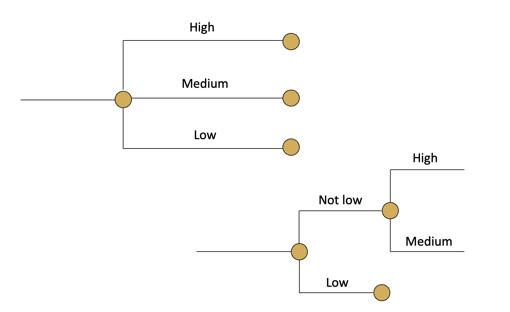

## Some Do's & "Dont's"
<br>

3.  **No embedded decisions** <br>

> Each decision tree should address a single decision problem. 
<br>
> Embedding multiple decisions (e.g., screening *and* downstream treatment choices) complicates interpretation and validation.

##  {.summary-end-slide}

::: summary-circle
::: end-title
Key Takeaways
:::

::: end-subtitle
Decision Trees
:::

::: key-points
::: incremental
-   Decision trees compare strategies by expected value
-   Probabilities in trees are conditional by construction
-   Good trees require mutually exclusive, exhaustive branches
:::
:::
:::

## Preview of what's to come

More complex trees!

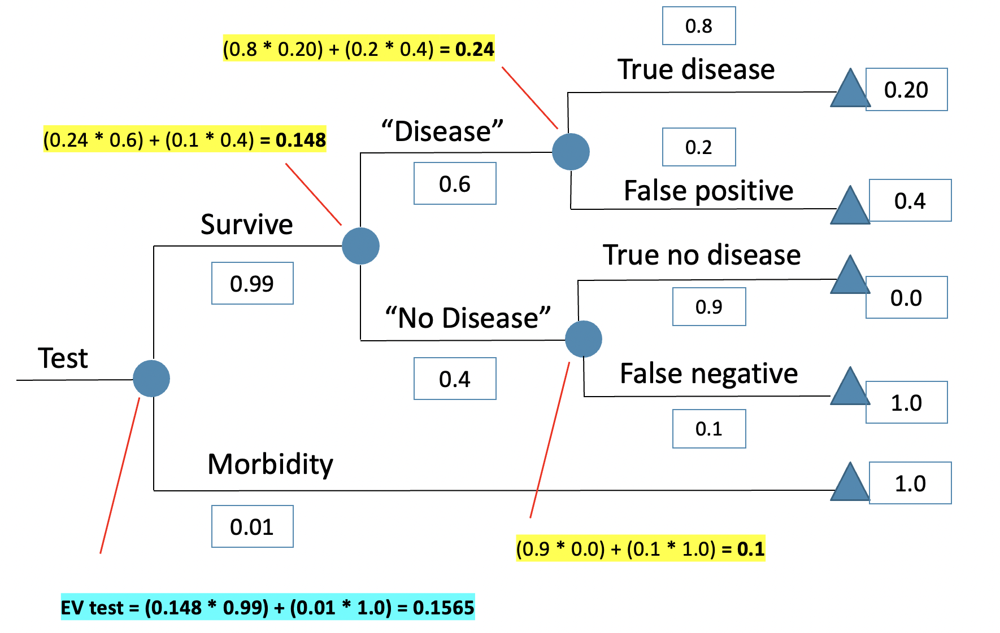{width="591"}

## Questions? {.questions-slide}

::: next-info
Next: CEA Fundamentals 1: Costs
:::
