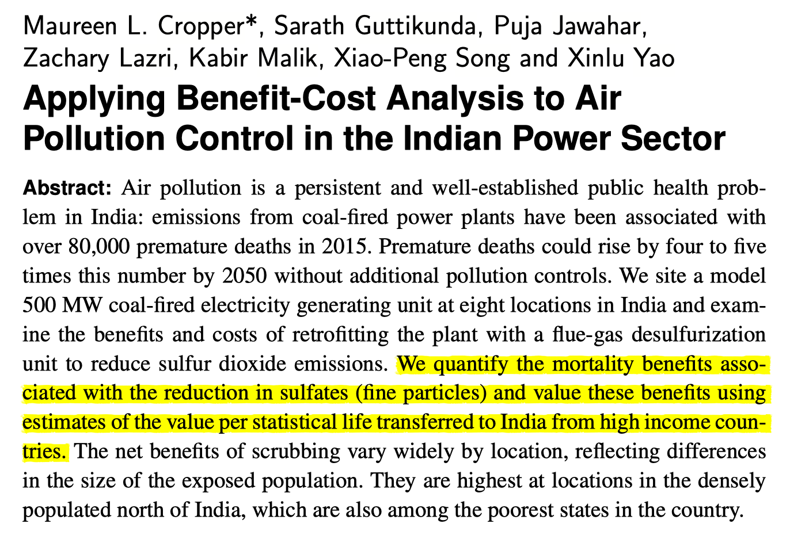
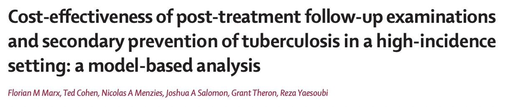
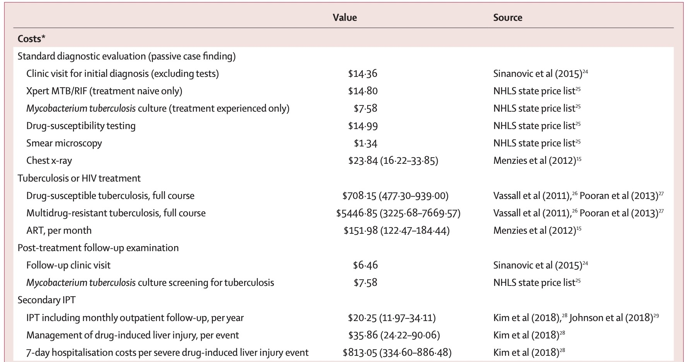
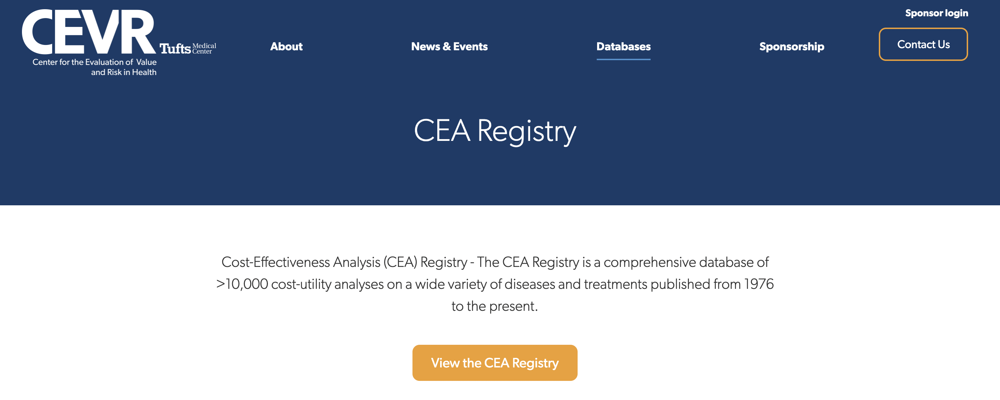
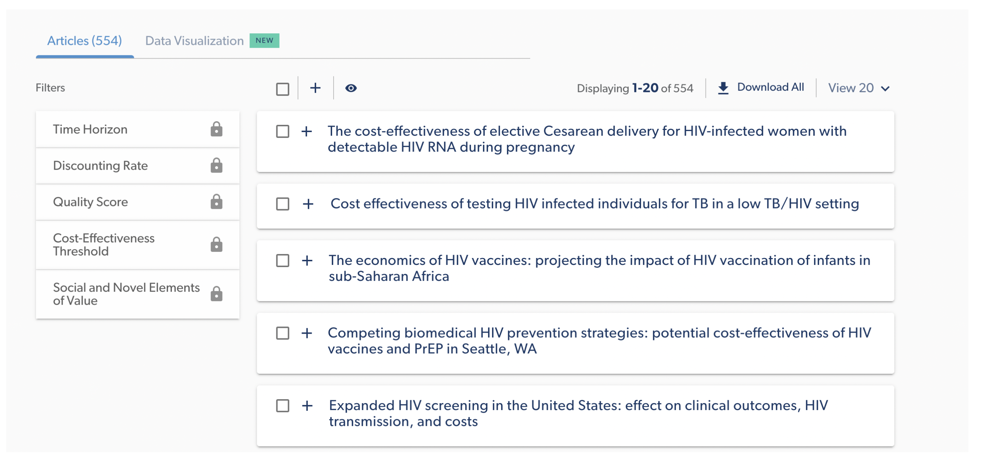
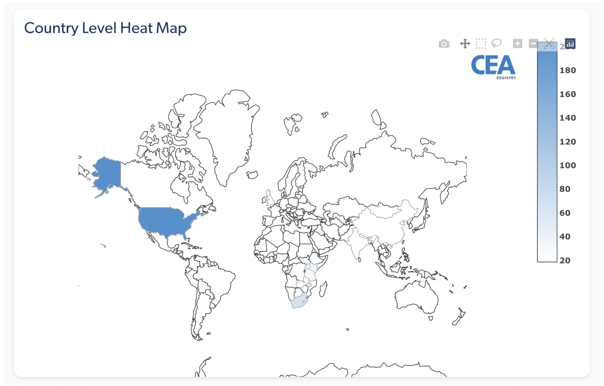
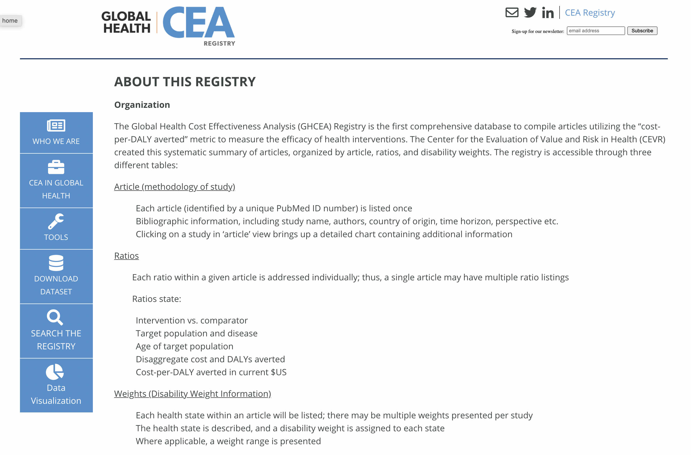
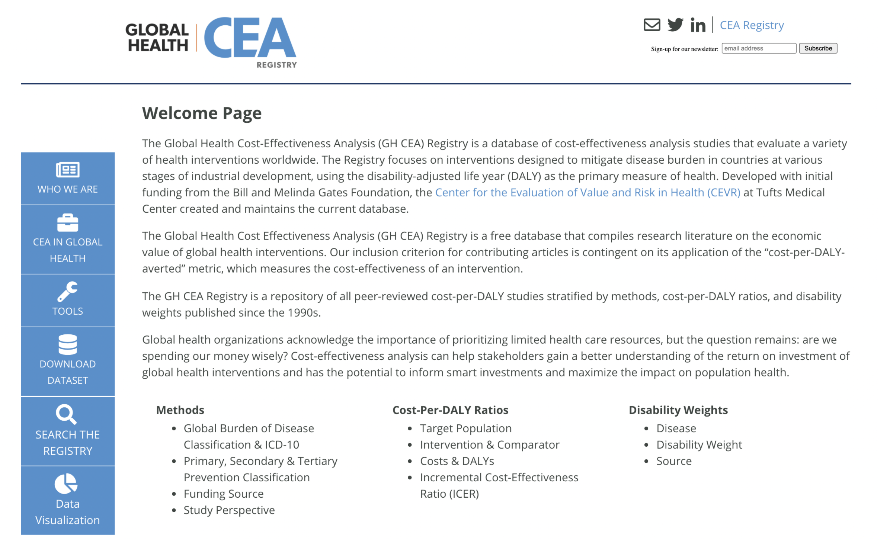
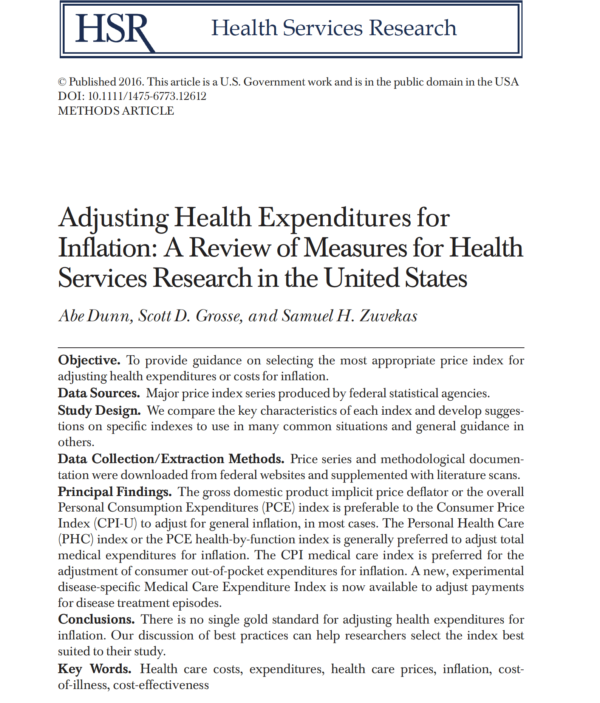

## Learning Objectives and Outline {.section-slide}

::: section-number
00
:::

## Learning Objectives

::: arrow-bullets
-   Identify theoretical and methodological differences between
    different economic evaluation techniques

-   Grasp the foundations of cost-effectiveness analysis

-   Describe the steps of valuing costs in economic evaluations &
    identify ways to curate cost parameters
:::

## Outline {.numbered-list-slide}

::::::::::::::: number-list
::::: list-item
::: number
01
:::

::: text
Introduction to economic evaluations
:::
:::::

::::: list-item
::: number
02
:::

::: text
CEAs: Identifying Alternatives
:::
:::::

::::: list-item
::: number
03
:::

::: text
Valuing Costs
:::
:::::

::::: list-item
::: number
04
:::

::: text
Data Collection
:::
:::::
:::::::::::::::

## Introduction to Economic Evaluations {.section-slide}

::: section-number
01
:::

## So far... {background="#43464B"}

We've touched on the basic framework for decision analysis, focusing on:
 

::: icon-bullets
-   Decision trees & probabilities

-   Bayes theorem & probability revision

-   Constructing decision trees using Amua
:::

## Now... {background="#43464B"}

We will start to touch on some of the core concepts for representing
[costs and health benefits]{.bold .secondary-text} within decision
problems.

::: notes
:::

## Economic Evaluation {.split-wrapper}

:::::: split-content
:::: content-text
::: incremental
-   Relevant when decision alternatives have different costs and health
    consequences.

-   We want to measure the relative value of one strategy in comparison
    to others.

-   This can help us make resource allocation decisions in the face of
    constraints (e.g., budget).
:::
::::

::: content-visual

*Balancing \$\$ and Health Outcomes*
:::
::::::

## Features of Economic Evaluation

::: {.icon-bullets .incremental}
-   Systematic quantification of costs and consequences.
-   Comparative analysis of alternative courses of action.
:::

## Techniques for Economic Evaluation {.smaller}

| Type of study | Measurement/valuation of costs | Identification of consequences | Measurement / valuation of consequences |
|------------------|------------------|------------------|-------------------|
| Cost analysis | Monetary units | None | None |

::: footer
Source: [@drummond2015a]
:::

## Cost analysis

::: icon-bullets-triangle
-   Only looks at healthcare costs

-   Relevant when alternative options are equally effective (provide
    equal benefits). [Rarely the case in reality!]{.bold
    .secondary-text}

-   Costs are valued in monetary terms (e.g., U.S. dollars)

-   Decision criterion: often to minimize cost
:::

## Techniques for Economic Evaluation {.smaller}

 

| Type of study | Measurement/Valuation of costs | Identification of consequences | Measurement / valuation of consequences |
|------------------|------------------|------------------|-------------------|
| [Cost analysis]{style="color: grey;"} | [Monetary units]{style="color: grey;"} | [None]{style="color: grey;"} | [None]{style="color: grey;"} |
| Cost-effectiveness analysis | Monetary units | Single effect of interest, common to both alternatives, but achieved to different degrees. | Natural units (e.g., life-years gained, disability days saved, points of blood pressure reduction, etc.) |

::: footer
Source: [@drummond2015a]
:::

## Cost-Effectiveness Analysis (CEA)

Most useful when decision makers consider multiple options within a
budget, and the relevant outcome is common across strategies

:::::: info-cards
::: card
**Costs**

Costs are valued in monetary terms (\$)
:::

::: card
**Benefits**

Benefits are valued in terms of clinical outcomes (e.g., cases
prevented, lives saved, years of life gained)
:::

::: card
**Results**

Results reported as a cost-effectiveness ratio
:::
::::::

## Cost-Effectiveness Analysis Example

:::: {.highlight-box .secondary}
::: box-title
Life Extension Example
:::

Suppose we are interested in the prolongation of life after an
intervention:

-   **Outcome of interest:** life-years gained
-   The outcome is common to alternative strategies; they differ only in
    the magnitude of life-years gained
-   **Results reported as:** \$/Life-years gained
::::

## Techniques for Economic Evaluation {.smaller}

| Type of study | Measurement/Valuation of costs both alternative | Identification of consequences | Measurement / valuation of consequences |
|------------------|------------------|------------------|-------------------|
| [Cost analysis]{style="color: grey;"} | [Monetary units]{style="color: grey;"} | [None]{style="color: grey;"} | [None]{style="color: grey;"} |
| [Cost-effectiveness analysis]{style="color: grey;"} | [Monetary units]{style="color: grey;"} | [Single effect of interest, common to both alternatives, but achieved to different degrees.]{style="color: grey;"} | [Natural units (e.g., life-years gained, disability days saved, points of blood pressure reduction, etc.)]{style="color: grey;"} |
| Cost-utility analysis | Monetary units | Single or multiple effects, not necessarily common to both alternatives. | Healthy years (typically measured as quality-adjusted life-years) |

::: footer
Source: [@drummond2015a]
:::

## Cost-Utility Analysis

::: {.icon-bullets-triangle .incremental}
-   Essentially a variant of cost-effectiveness analysis.
-   [Major feature:]{.bold .secondary-text} use of summary measure of
    health: [QALY.]{.bold .secondary-text}
-   Quality-Adjusted Life Year (QALY): A metric that reflects both
    changes in life expectancy and quality of life (pain, function, or
    both).
-   By far the most widely published form of economic evaluation.
:::

## Techniques for Economic Evaluation {.smaller}

::: {style="font-size: 0.8em"}
| Type of study | Measurement/Valuation of costs both alternative | Identification of consequences | Measurement / valuation of consequences |
|------------------|------------------|------------------|-------------------|
| [Cost analysis]{style="color: grey;"} | [Monetary units]{style="color: grey;"} | [None]{style="color: grey;"} | [None]{style="color: grey;"} |
| [Cost-effectiveness analysis]{style="color: grey;"} | [Monetary units]{style="color: grey;"} | [Single effect of interest, common to both alternatives, but achieved to different degrees.]{style="color: grey;"} | [Natural units (e.g., life-years gained, disability days saved, points of blood pressure reduction, etc.)]{style="color: grey;"} |
| [Cost-utility analysis]{style="color: grey;"} | [Monetary units]{style="color: grey;"} | [Single or multiple effects, not necessarily common to both alternatives.]{style="color: grey;"} | [Healthy years (typically measured as quality-adjusted life-years)]{style="color: grey;"} |
| Cost-benefit analysis | Monetary units | Single or multiple effects, not necessarily common to both alternatives | **Monetary units** |
:::

## Cost-Benefit Analysis {.smaller}

::: {.icon-bullets-triangle .incremental}
-   Also known as Benefit-Cost Analysis
-   Relevant for resource allocation between health care and other areas
    (e.g., education)
-   [Costs and health consequences are valued in monetary terms (e.g.,
    U.S. dollars)]{.bold .secondary-text}
-   Valuation of health consequences in monetary terms (\$) is obtained
    by estimating individuals willingness to pay for life saving or
    health improving interventions. (e.g. US estimate of value per
    statistical life \~\$9 million)
-   Cost-benefit criterion: the benefits of a program \> its costs  
    [Notice that we're not making comparisons *across* strategies--only
    comparisons of costs and benefits for the same strategy]{.highlight}
:::

To read more: [Robinson et al,
2019](https://www.cambridge.org/core/product/identifier/S2194588819000046/type/journal_article)

## Cost-Benefit Analysis

## Cost-Benefit Analysis

# Back to [Cost-Effectiveness Analysis]{.accent-text}!

## Cost-Effectiveness Analysis Formula

:::: highlight-box
::: box-title
The CEA Formula
:::

Relevant when healthcare alternatives have different costs & health
consequences

$$\frac{\text{Cost (Intervention A) - Cost (Intervention B)}}{\text{Benefit (A) - Benefit (B)}}$$

Relative VALUE of an intervention in comparison to its alternative is
expressed as a cost-effectiveness RATIO
::::

::: notes
(1) Cost-effectiveness analysis is relevant when healthcare alternatives
    between different services/interventions have DIFFERENT costs AND
    varying health consequences EXAMPLE: Different types of chemotherapy

(2) A KEY OUTCOME in cost-effectiveness analyses is what's called the
    ICER \[or incremental cost-effectiveness ratio\], which gives us the
    relative VALUE of an intervention compared to an alternative.

(3) In other words, THE PRICE PER UNIT BENEFIT of one intervention over
    the other

(4) We have 2 full classes on ICERs in the coming weeks & how to
    interpret these ratios across interventions What we will focus on
    TODAY is the components that make up the numerator (i.e. COSTS) &
    the denominator (i.e. BENEFITS)

(5) WHAT'S IMPORTANT HERE - By estimating the magnitude of health
    outcomes and costs of interventions, cost-effectiveness analyses can
    show the trade-offs involved across interventions AND THEREFORE,
    hopefully contribute to better decision making
:::

## Who uses economic evaluations?

:::::::::::: comparison-table
::::: {.comparison-column .fragment}
::: column-header
Health Technology Advisory Committees
:::

::: {.column-content style="font-size: 0.7em"}
-   NICE (The National Institute for Health and Care Excellence, **UK**)

-   **Canada**'s Drug and Health Technology Agency

-   PBAC (Pharmaceutical Benefits Advisory Committee in **Australia**)

-   **Brazil**'s health technology assessment institute
:::
:::::

::::: {.comparison-column .fragment}
::: column-header
Groups developing clinical guidelines
:::

::: {.column-content style="font-size: 0.7em"}
-   WHO

-   CDC

-   Disease-specific organizations: American Cancer Society; American
    Heart Association; European Stroke Organisation
:::
:::::

::::: {.comparison-column .fragment}
::: {.column-header style="min-height: 3em;"}
Regulatory agencies
:::

::: {.column-content style="font-size: 0.7em"}
-   FDA (U.S. Food and Drug Administration)

-   EPA (U.S. Environmental Protection Agency)
:::
:::::
::::::::::::

::: notes
When we look at how cost-effectiveness is used around the world --

Unlike the US, many country governments have their own institutional
bodies that conduct formal assessments on the cost-effectiveness of
drugs & devices -- some of which include:

(1) The UK - which is a single-payer system known as the NHS & has an
    independent body called NICE that evaluates the cost-effectiveness
    of health strategies for the NHS -- NICE recommends to the NHS what
    they should cover based on VALUE (i.e. cost-effectiveness).

-   & the NHS is legally obligated to fund medicines/treatments
    recommended by NICE

(2) Canada also has a health technology assessment body called the
    Canadian Agency for Drugs and Technologies in Health (CADTH), which
    works in a similar way as NICE

(3) & likewise, Australia as well as Brazil, Germany, France, Italy,
    Sweden, the Netherlands, etc. all have similar government
    institutions

(4) Groups developing clinical guidelines around CEA, includes...
:::

## CEAs: Identifying Alternatives {.section-slide}

::: section-number
02
:::

## Identifying Alternatives {.smaller}

Decision modeling / economic evaluation requires identifying strategies
or alternative courses of action.

### [Alternatives Include:]{.secondary-text}

::::::::: concept-grid
::: concept-box
Different therapies
:::

::: concept-box
Different policies
:::

::: concept-box
Different technologies
:::

::: concept-box
Different combinations
:::

::: concept-box
Different sequences of events
:::

::: concept-box
Different treatment ages
:::
:::::::::

::::: fragment
:::: highlight-box
Once we have identified the alternatives, we'll want to quantify their
associated consequences in terms of:

::: arrow-bullets
-   Health outcomes
-   Costs
:::
::::
:::::

## CEA components

 

$$\frac{\text{Cost (Intervention A) - Cost (Intervention B)}}{\text{Benefit (A) - Benefit (B)}}$$

::: notes
(1) We will now get into the components of cost-effectiveness analyses
    by first looking at what comprises the NUMERATOR of the
    cost-effectiveness ratio & then delving into the DENOMINATOR
:::

## Valuing Costs {.section-slide}

::: section-number
03
:::

## Valuing Costs: Steps

::::::::::::::::::: timeline
:::::::::::::::::: timeline-items
::::::: timeline-item
::: timeline-marker
1
:::

::::: timeline-content
::: timeline-title
Identify
:::

::: timeline-description
Estimate the different categories of resources likely to be required
   [(e.g., surgical staff, medical equipment, surgical
complications, re-admissions)]{.accent-text}
:::
:::::
:::::::

::::::: timeline-item
::: timeline-marker
2
:::

::::: timeline-content
::: timeline-title
Measure
:::

::: timeline-description
Estimate how much of each resource category is required    [(e.g.
type of staff performing the surgery and time involved, post-surgery
length of stay, re-admission rates)]{.accent-text}
:::
:::::
:::::::

::::::: timeline-item
::: timeline-marker
3
:::

::::: timeline-content
::: timeline-title
Value
:::

::: timeline-description
Apply unit costs to each resource category    [(e.g., salary
scales from the relevant hospital or national wage rates for staff
inputs, cost per inpatient day for the post-surgery hospital
stay)]{.accent-text}
:::
:::::
:::::::
::::::::::::::::::
:::::::::::::::::::

[Source: Gold 1996, Drummond 2015, Gray 2012)]{style="font-size: 0.7em"}

## We can [identify]{.underline} different types of healthcare costs

:::::::::::::::::: horizontal-comparison
::::: {.comparison-row .fragment}
::: row-header
Direct Health Care Costs
:::

::: row-content
-   Hospital, office, home, facilities
-   Medications, procedures, tests, professional fees
:::
:::::

::::: {.comparison-row .fragment}
::: row-header
Direct Non-Health Care Costs
:::

::: row-content
-   Childcare, transportation costs
:::
:::::

::::: {.comparison-row .fragment}
::: row-header
Time Costs
:::

::: row-content
-   Patient time receiving care, opportunity cost of time
:::
:::::

::::: {.comparison-row .fragment}
::: row-header
Productivity Costs
:::

::: row-content
-   Impaired ability to work due to morbidity
-   Lost economic productivity due to death
:::
:::::

::::: {.comparison-row .fragment}
::: row-header
Unrelated Healthcare Costs
:::

::: row-content
-   Cumulative trajectory of total healthcare costs over time (unrelated
    to medical interventions)
:::
:::::
::::::::::::::::::

## Identifying Costs in Practice

::: icon-bullets
-   Count what is likely to matter
:::

::: icon-bullets-x
-   Exclude what is likely to have little effect or equal effects across
    alternatives
-   Any exclusion must be noted & possible bias examined
-   We are constrained by what data are available
:::

## We can [measure]{.underline} costs using different approaches {.smaller}

:::::::::::: horizontal-comparison
::::: {.comparison-row .fragment}
::: row-header
Micro-costing  (bottom-up)
:::

::: row-content
-   Measure all resources used by individual patients, then assign the
    unit cost for each type of resource consumed to calculate the total
    cost
:::
:::::

::::: {.comparison-row .fragment}
::: row-header
Gross-costing  (top-down)
:::

::: row-content
-   Estimate cost for a given volume of patients by dividing the total
    cost by the volume of service use
-   Example: Downstream costs (e.g., hospitalization due to opioid
    overdose)\
:::
:::::

::::: {.comparison-row .fragment}
::: row-header
Ingredients-based approach  (P x Q x C)
:::

::: row-content
-   Probability of occurrence (P)
-   Quantity (Q)
-   Unit costs (C)
:::
:::::
::::::::::::

::: notes
(1) Micro-costing: most precise (which is a bottom up approach where we
    measure, for instance, all the lab tests, hospital bed, provider
    time, imaging tests, equipment used, etc.)

(2) Gross-costing: Usually what we have to quantify "downstream costs"
    -- but we can also use this approach for costing out an intervention
    if we don't have the data for the micro-costing approach.

-   For example, if we know that 10 total knee replacements cost us
    \$300,000 last month, that's \$30,000 per procedure.

(3) Ingredients approach: Suppose we know that 10% of surgeries are
    complicated, and complicated surgeries require 50% more surgeon
    time, and surgeon time costs what \$500/hr
:::

## Whose perspective?

## Whose perspective?

PERSPECTIVE MATTERS

::::: info-cards
::: card
**Formal Healthcare Sector:** Medical costs borne by third-partypayers &
paid for out-of-pocket by patients. Should include current + future
costs, related & unrelated to the condition under consideration
:::

::: {.card .accent}
**Societal perspective:** Represents the wider "public interest" &
inter-sectoral distribution of resources that are important to
consider - reflects costs on all affected parties
:::
:::::

::: notes
(1) PERSPECTIVE really matters when you're deciding what costs to
    include in your analysis; we typically conduct CEAs from two
    different perspectives:

<!-- -->

(a) The formal healthcare sector perspective includes medical costs
    borne by third-party payers & paid for out-of-pocket by patients.
    Modelers should include current + future costs, related & unrelated
    to the condition under consideration.

-   Analysts have mostly used this perspective over the last 20 years
-   It is the most useful perspective to decision makers within the
    healthcare sector
-   As mentioned earlier NICE in the UK usually takes the perspective of
    the healthcare payer, whereas ICER tries to do analysis from both a
    formal healthcare sector & wider societal perspective

(b) Societal perspective includes everything in the formal health sector
    PLUS other things like time costs of patients seeking and receiving
    care, time costs of informal (unpaid) caregivers, transportation
    costs, effects on future productivity and consumption, and other
    costs and effects outside the healthcare sector.

<!-- -->

(2) The second panel on cost-effectiveness in health & medicine (the
    "gold standard" CEA recommendations in the US) recommends that
    studies be conducted from BOTH healthcare sector + societal
    perspectives so then we can more fully understand the wider
    implications of decision making.
:::

## Perspective Example: Mammography

:::::::: info-cards
:::: card
**Formal Healthcare Sector:**

::: {style="font-size: 2.5vh;"}
-   [Costs associated with the screening itself \[mammogram procedure +
    physician time\]]{.fragment fragment-index="1"}
-   [Costs of follow-up tests for both false-positive & true positive
    results]{.fragment fragment-index="2"}
-   [Downstream costs (or savings) associated with cases of breast
    cancer, such as: Hospitalization + treatment costs]{.fragment
    fragment-index="3"}
-   [Costs unrelated to medical intervention/disease; of living longer
    due to mammography]{.fragment fragment-index="4"}
:::
::::

::::: {.card .accent}
**Societal perspective:**

::: {.fragment style="font-size: 2.5vh;" fragment-index="5"}
-   Costs associated with the screening itself \[mammogram procedure +
    physician time\]
-   Costs of follow-up tests for both false-positive & true positive
    results
-   Downstream costs (or savings) associated with cases of breast
    cancer, such as: Hospitalization + treatment costs
-   Costs unrelated to medical intervention/disease; of living longer
    due to mammography
:::

::: {style="font-size: 2.5vh;"}
-   [Patient productivity losses associated with the screening or cancer
    treatment]{.highlight .fragment fragment-index="6"}
-   [Childcare/transportation costs]{.highlight .fragment
    fragment-index="7"}
:::
:::::
::::::::

::: notes
(1) Let's look at an example - Mammography for breast cancer screening

(2) If we were going to cost this out from a Healthcare Sector
    perspective, we would need to account for:

-   Costs associated with the screening itself -- accounting for the
    costs of the procedure + clinician time

-   Costs of follow-up tests for both false-positive & true positive
    results

-   Downstream costs (or savings) associated with cases of breast
    cancer, including hospitalizations & treatment costs

\*\*\*EXAMPLE: Let's say that we wanted to examine the difference
between routine mammography screening at age 40 versus 50 -- - There
will be higher upfront costs for Age 40, BUT if we catch more cases of
breast cancer than if we waited, then that could potentially save a lot
of treatment/hospitalization costs down the line

LISA, BOOK says AVERTED COSTS for downstream costs

(3) Costs unrelated to the medical intervention due to living longer (we
    will discuss in the next few slides)
:::

## Data Collection {.section-slide}

::: section-number
04
:::

## Two Approaches for Data Collection

::::: info-cards
::: card
**Approach 1**

Alongside [clinical trials]{.bold .secondary-text}

Collect cost data directly during the trial
:::

::: {.card .accent}
**Approach 2**

Using [secondary data]{.bold .accent-text}

Leverage existing databases, registries, and published literature
:::
:::::

::: {.highlight-box .thin .fragment}
International versus US will have different approaches
:::

## Costs (International)

::::::::::::::::::: process-flow
:::::: step
::: step-number
1
:::

::: step-title
Local Data
:::

::: step-content
In-country registries, hospital data, donor databases
:::
::::::

:::::: step
::: step-number
2
:::

::: step-title
Literature
:::

::: step-content
Published cost studies
:::
::::::

:::::: step
::: step-number
3
:::

::: step-title
Tufts CEA Registry
:::

::: step-content
Comprehensive database
:::
::::::

:::::: step
::: step-number
4
:::

::: step-title
DCP3
:::

::: step-content
Disease Control Priorities
:::
::::::
:::::::::::::::::::

::::: {.highlight-box .thin .secondary}
::: box-title
The key is to get as close to the "true" cost associated with each
procedure per patient
:::

::: {style="font-size: 2vh;"}
E.g., "TB healthcare & diagnostics are from official price list of the
National Health Laboratory Service in South Africa; Costs for follow-up
reflect local clinic and culture-based screening for
active-tuberculosis"
:::
:::::

## Costs (Published Literature)

## Costs (Published Literature)

## Costs (Tufts CEVR)

https://cevr.tuftsmedicalcenter.org/databases/cea-registry

## Costs (Tufts CEVR)

## Costs (Tufts CEVR)

## Costs (Tufts CEVR)

http://ghcearegistry.org/ghcearegistry/

## Costs (Tufts CEVR)

## Costs (DCP3) 

::: notes
-   The Disease Control Priorities is a multi-year project funded in
    2010 by the Bill & Melinda Gates Foundation.
-   From 2010 -- 2017, it was led by the University of Washington, which
    worked with local organizations to promote and support the use of
    economic evaluation (CEAs) for priority setting at both global and
    national levels
-   The DCP3 is now hosted at the London School of Hygiene and Tropical
    Medicine (LSHTM). It is currently collaborating with a number of
    pilot countries in the area of priority setting, development and
    implementation of UHC Essential Packages of Health Services.
:::

## Adjustments needed for [Valuing]{.underline} Costs {.numbered-list-slide}

:::::::::::: number-list
::::: list-item
::: number
01
:::

::: text
Inflation adjustment
:::
:::::

::::: list-item
::: number
02
:::

::: text
Adjusting for currency and currency year
:::
:::::

::::: list-item
::: number
03
:::

::: text
Discounting
:::
:::::
::::::::::::

## Inflation Adjustment

## Inflation Adjustment: Motivation

::::: info-cards
::: card
**The Problem**

\$100 in 2000 is not equivalent to \$100 in 2020

[\$100 could buy a lot more in 2000!]{.highlight}
:::

::: {.card .accent .fragment}
**The Solution**

Important to adjust for the price difference over time, especially when
working with cost sources from multiple years
:::
:::::

## Inflation Adjustment: Example {.smaller}

## Inflation Adjustment: Method

::::::::::::::: process-flow
:::::: step
::: step-number
1
:::

::: step-title
Choose Reference Year
:::

::: step-content
Usually the current year of analysis
:::
::::::

:::::: step
::: step-number
2
:::

::: step-title
Convert All Costs
:::

::: step-content
Convert to reference year
:::
::::::

:::::: step
::: step-number
3
:::

::: step-title
Apply Formula
:::

::: step-content
Use price index ratio
:::
::::::
:::::::::::::::

::: {.highlight-box .fragment}
Converting cost in Year X to Year Y (reference year):

$$
    \textbf{Cost(Year Y)} = \textbf{Cost(Year X)} \times \frac{\textbf{Price index(Year Y)}}{\textbf{Price index(Year X)}}
$$
:::

## Inflation Adjustment: Example

::::::::: definition-box
::: term
Example Problem
:::

::: definition
Cost of hospitalization for mild stroke in the US was \~\$15,000 USD in
2016. Convert to 2020 USD.
:::

:::::: {.example .fragment}
::: example-label
Solution:
:::

::: example-text
-   PCE (Personal Consumption Expenditure Health Price Index) in 2016:
    105.430
-   PCE in 2020: 112.978

$$
\textbf{Cost(2020)} = 15,000 \times \frac{112.978}{105.430} = \$16,674 \text{ (2020 USD)}
$$
:::

::: {style="font-size: 1.5vh;"}
[(second column of Table 3
(PCE,health))](https://meps.ahrq.gov/about_meps/Price_Index.shtml)
:::
::::::
:::::::::

# Currency Conversion

## Currency Conversion Basics

::::: info-cards
::: card
**When Needed**

Not required for CEA but may be useful:

-   Convert local currency to USD for international comparisons
-   Cost-effectiveness thresholds often estimated in USD per DALY
:::

::: card
**How to Convert**

Example: 1,000 Philippine Peso to USD

-   Current exchange rate (2026): 1 Philippine Peso = \~0.017 USD
-   **Result:** 1,000 Peso = \$16.87 USD
:::
:::::

# Discounting

## Why Discounting?

::::: info-cards
::: card
**Purpose**

Adjust costs at social discount rate to reflect social "rate of time
preference"
:::

::: card
**Reasons**

-   Pure time preference ("impatient")
-   Potential catastrophic risk in the future
-   Economic growth/return on investment
:::
:::::

## Discounting

A \$ today is [NOT]{.bold} worth a \$ tomorrow

:::::: {.concept-grid .with-arrows}
::: concept-box
\$100 now
:::

::: {.concept-box .accent}
2% net return
:::

::: concept-box
\$102 next year
:::
::::::

 

The "present value" of \$102 next year is \$100 today.  Similarly,
\$100 next year = \$98.04 today

::: notes
(1) If you have \$100 now, this could either be consumed or invested in
    the most profitable alternative (e.g., risk free government bond)

(2) Let's say the net return on the bond is 2%, then this means that
    next year the current \$100 has grown to \$102

(3) The "present value" of \$102 next year is \$100 today

(4) Similarly, \$100 next year = \$98.04 today
:::

## Inflation vs. Discounting

::::::::: simple-comparison
::::: comparison-column
::: column-header
Inflation Adjustment
:::

::: column-content
We convert **PAST** costs to present-day values
:::
:::::

::::: comparison-column
::: column-header
Discounting
:::

::: column-content
We convert **FUTURE** costs to present-day values
:::
:::::
:::::::::

## 

::::::: definition-box
::: term
Present Value Formula
:::

::: definition
$$PV = \frac{FV}{(1+r)^t}$$

Where:

-   FV = future value, the nominal cost incurred in the future

-   r = [annual discount rate]{.bold .accent-text} (analogous to
    interest rate)

-   t = number of years in future when cost is incurred

[Standard rate:]{.bold .accent-text} Reasonable consensus around 3% per
year (may vary by country guidelines)
:::

:::: example
::: example-text
[Important!]{.bold .secondary-text} Adjust for inflation and currency
first, then discount
:::
::::
:::::::

## Intuition

:::: split-content
::: content-text
$r = 0.03$

$PV = FV/(1+r)^t$, and we're at Year 0:

| Year | Formula     | Value of \$1 |
|------|-------------|--------------|
| 0    | \$1/1.03\^0 | \$1          |
| 1    | \$1/1.03\^1 | \$0.97       |
| 2    | \$1/1.03\^2 | \$0.94       |
| 3    | \$1/1.03\^3 | \$0.92       |
:::

::: {.content-visual .incremental .bold .secondary-text}

-   What would \$1 be in Year 2 be in the PRESENT VALUE of today?

-   Today, it will be [0.94.]{.accent-text}
:::

:::::

::: notes
(1) We generally value future costs and effects less than current costs
    and effects AND their value diminishes the more distant into the
    future they occur

(2) Because we can invest in a dollar today to yield a higher return on
    investment later
:::

## Discounting Example

:::: definition-box
::: term
Example Problem
:::

::: definition
Assume in year 5, a patient develops disease, and there is a treatment cost of $500. What is the present value?
:::

::::: example
::: example-label
Solution:
:::

::: {.example-text .fragment}
$$PV = \frac{FV}{(1+r)^t} = \frac{500}{(1+0.03)^5} = \$431.30$$
:::
:::::
::::

## {.summary-end-slide}

::::: summary-circle
::: end-title
Key Takeaways
:::

::: end-subtitle
Costs
:::

<ul class="key-points">
<li>Different types of economic evaluation</li>
<li>CEA uses cost-effectiveness ratios</li>
<li>Perspective matters for cost inclusion</li>
<li>Adjust for inflation & discount future costs</li>
</ul>
:::::

## Questions? {.questions-slide}

::: next-info
Next Lecture: <strong>Benefits & QALYs</strong>
:::

