## Learning Objectives and Outline {.section-slide}

::: section-number
00
:::

## Learning Objectives

::: arrow-bullets
-   Understand the concepts of summary measures of health, specifically,
    quality-adjusted life years (QALYs)

-   Describe the general differences between direct and indirect methods
    for estimating health state utilities

-   Curate model parameters for quantifying "benefits" (the denominator
    in the C/E ratio)
:::

## Outline {.numbered-list-slide}

:::::::::::: number-list
::::: list-item
::: number
01
:::

::: text
Clinical Outcomes
:::
:::::

::::: list-item
::: number
02
:::

::: text
Summary Measurements
:::
:::::

::::: list-item
::: number
03
:::

::: text
Where to get values
:::
:::::
::::::::::::

# ICER review

## 

:::::::::: definition-box
::: term
Numerator (costs)
:::

::: definition
Valued in monetary terms
:::

::::::: split-content
::::: content-text
:::: example
Examples:

::: arrow-bullets
-   \$USD
-   ₦NGN
-   KES
-   R
:::
::::
:::::

::: content-text
$$
\frac{\colorbox{#CfAE70}{$C_1 - C_0 \quad  (\Delta C)$}}{E_1 - E_0 \quad  (\Delta E)}
$$
:::
:::::::
::::::::::

## 

:::::::::: definition-box
::: term
Denominator (benefits)
:::

::: definition
Valued in terms of **clinical outcomes**
:::

::::::: split-content
::::: content-text
:::: example
Examples:

::: arrow-bullets
-   \# of HIV cases prevented
-   \# of children seizure free
-   \# of quality-adjusted life years gained
:::
::::
:::::

::: content-text
$$
\frac{C_1 - C_0 \quad  (\Delta C)}{\colorbox{#CfAE70}{$E_1 - E_0 \quad  (\Delta E)$}}
$$
:::
:::::::
::::::::::

## Benefits

::: {.arrow-bullets .incremental}
-   What's important for the question at hand
-   Most analyses report several different outcomes
-   QALYs/DALYs enable comparability across disease areas
:::

# Valuing Health Outcomes

## Clinical Outcomes {.section-slide}

::: section-number
01
:::

## What are they?

Clinical outcomes allow us to measure particular events in a decision
tree or health economic model.

For Example:

:::::: {.concept-grid .text-smaller}
::: concept-box
\# of HIV cases prevented
:::

::: concept-box
\# of children seizure free
:::

::: concept-box
\# of healthy pregnancies
:::
::::::

:::::: {.concept-grid .text-smaller}
::: concept-box
\# of hospital visits
:::

::: concept-box
\# of disease deaths
:::

::: concept-box
\# of cancer progressions
:::
::::::

## When are they be used

::: icon-bullets-triangle
-   Policy holders need the information
-   The outcome holds high importance
-   Short-term models
:::

## How do you choose one?

"Is implementing screening for colon cancer cost-effective?"

[**What concerns might arise for each of these?**]{.accent-text
.fragment fragment-index="0"}

-   Number of cases of colon cancer [Screening will increase the number
    of cases caught.]{.accent-text .fragment fragment-index="1"}
-   Number of cases of STAGE 1 colon cancer [Could heavily favor
    Screening]{.accent-text .fragment fragment-index="2"}
-   Number of cancer deaths [Deaths aren't the healthcare
    burden]{.accent-text .fragment fragment-index="3"}
-   Number of hospitalizations from colon cancer [Minimal
    Data]{.accent-text .fragment fragment-index="4"}
-   Number of screenings completed [Focuses on
    implementation]{.accent-text .fragment fragment-index="5"}
-   etc.

[**All these are still great outcomes, they just highlight important
considerations when choosing the one for your research
question**]{.accent-text .fragment fragment-index="6"}

## A Well Defined Clinical Outcome

::: horizontal-comparison
::: comparison-row
::: row-header
Specific
:::
::: row-content
-   Each outcome should describe one clear event or condition.

-   If you combine too many things into one outcome, it can be hard
        to understand why strategies are different.

-   When possible, use separate outcomes for different events (for
        example: survival, complications, hospitalizations).
:::
:::
::: comparison-row
::: row-header
Prevent biasing a strategy
:::

::: row-content
-   Make sure the outcome truly shows **what is happening
        clinically**, not just what is cheap or expensive.
-   Some bad events may look “good” in a model because they cost
        less.
    -   For example, **death has low cost**, but it is clearly a bad outcome.
    
:::
:::
::: comparison-row
::: row-header
Answers your research question
:::

::: row-content
-   Chosen outcomes should generate information that is meaningful
        for the research objective and decision context.
-   Focus model structure and computational effort on outcomes that:
    -   Influence policy, reimbursement, or clinical decision‑making
    -   Drive differences in costs, utilities, or survival
    
:::
:::

::: comparison-row
::: row-header
Data is available
:::

::: row-content
-   As with much of economic modeling, clinical outcomes rely on
        accurate data
    
:::
:::

:::

## Summary Measurements {.section-slide}

::: section-number
02
:::

## Why summary measures of health?

### [QALYs and DALYs both provide a summary measure of health]{.accent-text}

Allow comparison of health attainment/disease burden

::: icon-bullets
-   Across diseases
-   Across populations
-   Over time
-   Etc.
:::

## Intro to QALYs

:::::::: split-content
:::::: content-text
Origin story: welfare economics

-   [Utility]{.bold} = holistic measure of satisfaction or well-being

With [QALYs]{.bold .accent-text}, two dimensions of interest:

::::: concept-grid
::: {.concept-box .accent}
[Length of life]{.bold .db-text}  measured in life-years
:::

::: {.concept-box .accent .text-smaller}
[Quality of life]{.bold .db-text}   measured by utility weight,
usually between 0 and 1
:::
:::::
::::::

::: content-visual
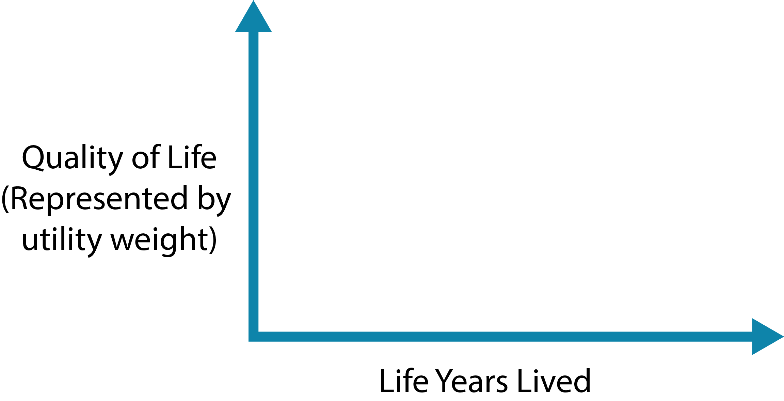
:::
::::::::

## 

:::::::::: definition-box
::: term
QALYs
:::

::: definition
A metric that reflects both changes in life expectancy and quality of
life (pain, function, or both).
:::

::::::: example
::: example-label
Formula:
:::

::::: split-content
::: content-text
Quality Adjusted Life Years =   Sum of weight \* duration of life
:::

::: content-visual
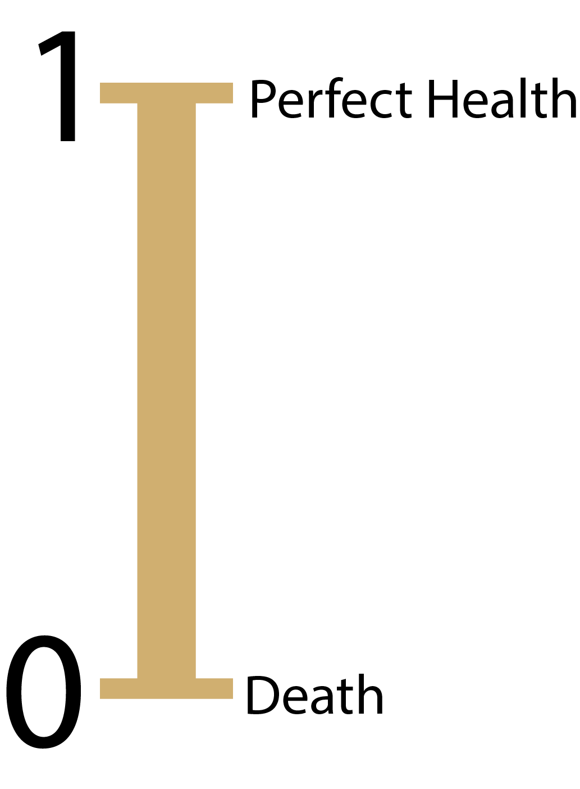
:::
:::::
:::::::
::::::::::

## Example: Patient with coronary heart disease [(with surgery)]{.accent-text}

::::: {style="position: relative; height: 500px;"}
::: {.fragment .fade-out fragment-index="0" style="position: absolute; top: 0; left: 50%; transform: translateX(-50%);"}
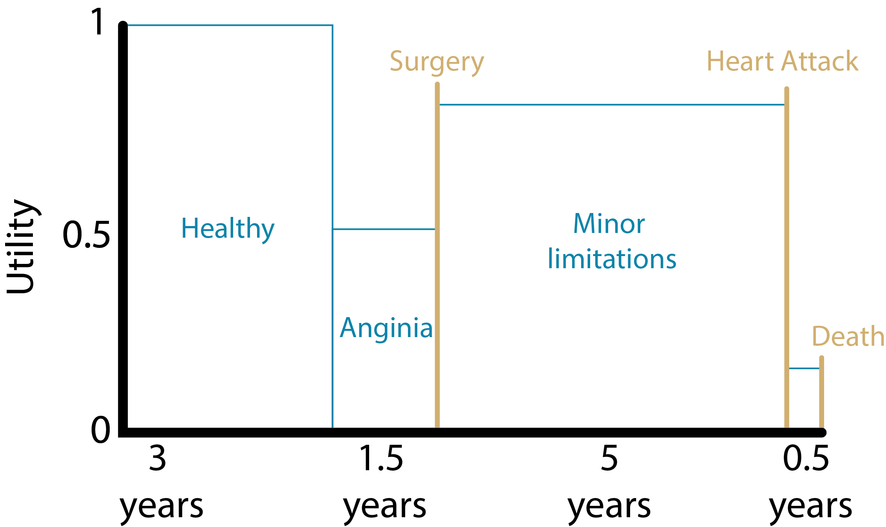{width="900"}
:::

::: {.fragment .fade-in fragment-index="0" style="position: absolute; top: 0; left: 50%; transform: translateX(-50%);"}
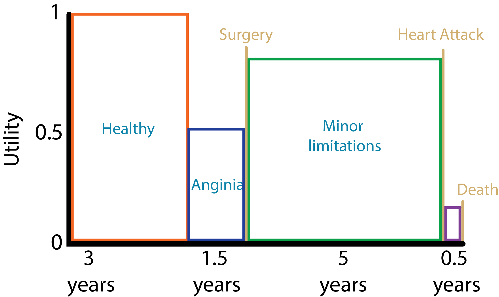{width="900"}
:::
:::::

::: {.fragment .center-text fragment-index="2"}
QALYS = [(3yrs \* 1.000)]{style="color:#f26522;"} + [(1.5yrs \*
0.5)]{style="color:#21409a;"} + [(5yrs \*
0.75)]{style="color:#00a14b;"} + [(0.5yrs \*
0.25)]{style="color:#7f3f98;"}  
:::

::: {.fragment .center-text .bold fragment-index="3"}
= 7.625 QALYs  
:::

::: {style="font-size: 0.6em"}
*Source: Harvard Decision Science*
:::

## Example: Patient with coronary heart disease [(without surgery)]{.accent-text}

::::: {style="position: relative; height: 500px;"}
::: {.fragment .fade-out fragment-index="0" style="position: absolute; top: 0; left: 50%; transform: translateX(-50%);"}
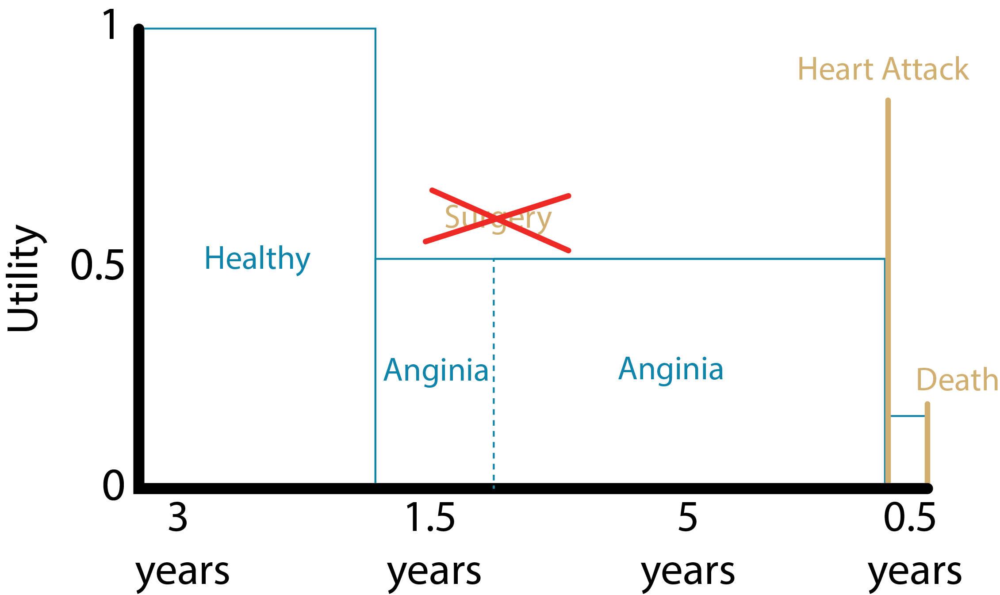{width="900"}
:::

::: {.fragment .fade-in fragment-index="0" style="position: absolute; top: 0; left: 50%; transform: translateX(-50%);"}
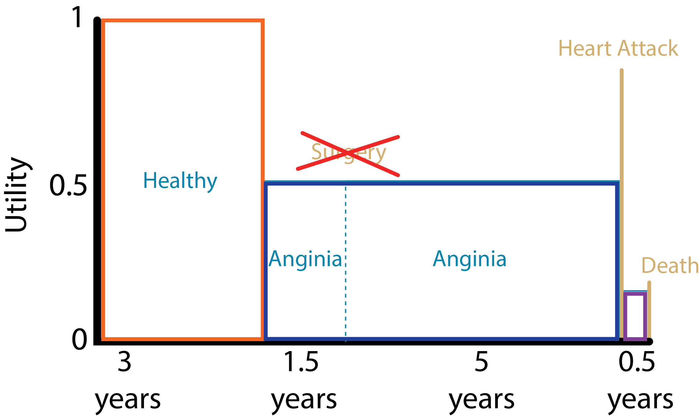{width="900"}
:::
:::::

::: {.fragment .center-text fragment-index="2"}
QALYS = [(3yrs \* 1.000)]{style="color:#f26522;"} + [(1.5yrs \*
0.5)]{style="color:#21409a;"} + [(5yrs \*
0.5)]{style="color:#21409a;"} + [(0.5yrs \*
0.25)]{style="color:#7f3f98;"}  
:::

::: {.fragment .center-text .bold fragment-index="3"}
= 6.375 QALYs  
:::

::: {style="font-size: 0.6em"}
*Source: Harvard Decision Science*
:::

## Example: Patient with coronary heart disease

::::::::: comparison-table
::::: comparison-column
::: column-header
Life Years
:::

::: column-content
-   With surgery: 10 LYs
-   Without surgery: 10 LYs
-   Benefit from surgery intervention:   10LYs -- 10LYs   [= 0
    LYs]{.bold .accent-text}
:::
:::::

::::: {.comparison-column .fragment}
::: column-header
QALYs
:::

::: column-content
-   With surgery: 7.625 QALYs
-   Without surgery: 6.375 QALYs
-   Benefit from surgery intervention:   7.625 QALYs -- 6.375 QALYs
      [= 1.25 QALYs]{.bold .accent-text}
:::
:::::
:::::::::

## Utility weights -- How are they obtained?

-   Utility weights for most health states are between 0 (death) and 1
    (perfect health)

::::::::: simple-comparison
::::: comparison-column
::: column-header
Direct methods:
:::

::: column-content
-   Standard gamble
-   Time trade-Off
-   Rating scales
:::
:::::

::::: comparison-column
::: column-header
Indirect methods:
:::

::: column-content
-   EQ-5D
-   Other utility instrument: SF-36; Health Utilities Index (HUI)
:::
:::::
:::::::::

## Direct methods - Standard Gamble (SG) {.split-wrapper .smaller}

[What risk of death would you accept in order to avoid \[living with an
**amputated leg** for the rest of your life\] and live the rest of your
life in perfect health?]{.accent-text}

::::: split-content
::: content-visual
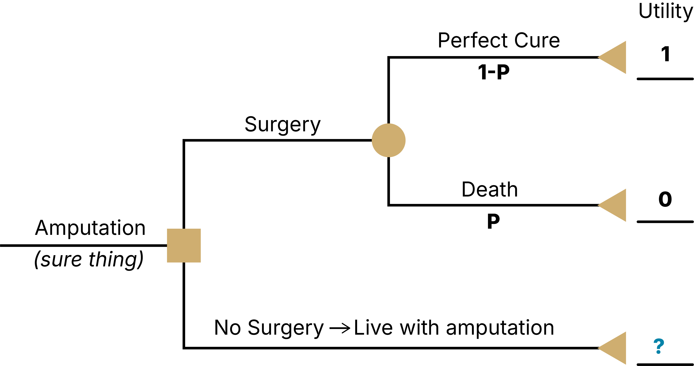
:::

::: {.content-text .incremental}
-   Find the threshold $p$ that sets EV(A) = EV(B)
-   Assume respondent answered that they would be indifferent between A
    and B at a threshold of $pDeath$ = 0.10
-   Then U(Amputation) = $p$\*U(Death) + $(1-p)$\*U(Perfect Health) =
    0.10\*0 + (1-0.10)\*1 = **0.9** = [threshold of indifference between
    surgery & no surgery (I will live with this rather than have a high
    risk of dying)]{.accent-text}
:::
:::::

::: notes
(1) The STANDARD GAMBLE technique asks patients (FOR EXAMPLE) - I WANT
    YOU TO IMAGINE

(2) Your leg gets amputated above the knee

(3) This doesn't impact your life expectancy, but you now live your life
    with an amputated leg

(4) Now, there's a NEW TREATMENT available where they can re-attach your
    leg

(5) But the treatment is RISKY & those undergoing it have a probability
    of dying

(6) The standard gamble technique asks you to find the THRESHOLD of
    indifference between SURGERY & NO SURGERY

(7) In other words, let's say you have a 30% probability of dying: Would
    you do the treatment?

-   What about a 20% probability of dying?

-   What about a 10%? - Ajay says yes, .90 is your utility value for the
    health state of living with an amputated knee Etc.

(8) Okay, I will live with this rather than have any high risk of
    dying"\*\*\*

This is the STANDARD GAMBLE TECHNIQUE
:::

## Direct methods - Standard Gamble (SG) {.split-wrapper .small}

[What risk of death would you accept in order to avoid \[living with
**stroke** for the rest of your life\] and livethe rest of your life in
perfect health?]{.accent-text}

:::::: split-content
::: content-visual
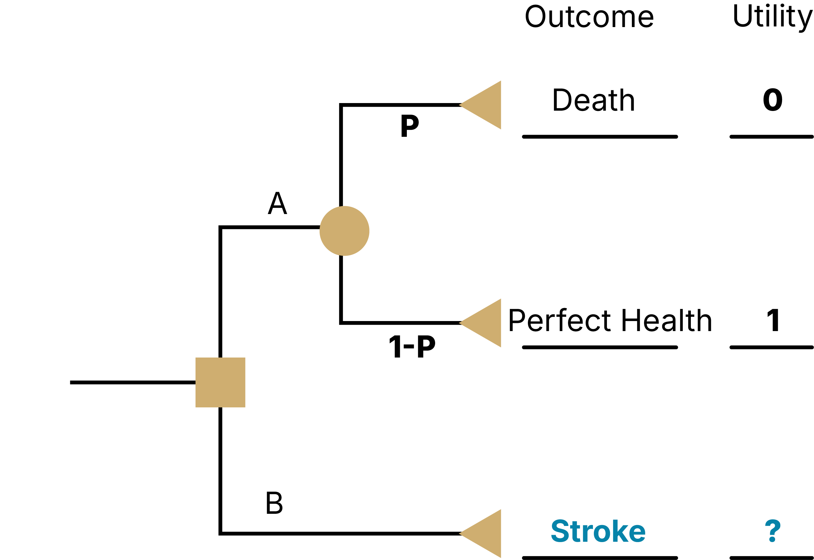
:::

:::: {.content-text .fragment}
[As a result of a stroke, you]{.secondary-text}

::: {style="font-size: 2.5vh;"}
-   Have impaired use of your left arm and leg

-   Need some help bathing and dressing

-   Need a cane or other device to walk

-   Experience mild pain a few days per week

-   Are able to work, with some modifications

-   Need assistance with shopping, household chores, errands

-   Feel anxious and depressed sometimes
:::
::::
::::::

## Direct methods - Time Trade-Off (TTO)

::: icon-bullets-triangle
-   An alternative to standard gamble

-   Instead of risk of death, TTO uses time alive to value health states

-   Does not involve uncertainty in choices

-   Task might be easier for some respondents compared to standard
    gamble
:::

## Direct methods - Time Trade-Off (TTO)

::::: center-text
[What portion of your current life expectancy of 40 years would you give
up to improve your current health state **stroke** to 'perfect
health'?]{.accent-text}

::: fragment
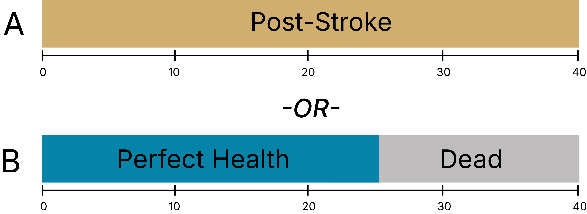{style="max-width: 50%;"}}
:::

::: fragment
U(Post-Stroke) \* 40 years [=]{.bold} U(Perfect Health) \* 25 years +
U(Dead) \* 15 years

U(Post-Stroke) \* 40 years [=]{.bold} 1 \* 25 years + 0 \* 15 years

U(Post-Stroke) = 25/40 = [0.625]{.bold}
:::
:::::

## SG vs TTO

::::::::: comparison-table
::::: comparison-column
::: column-header
Standard Gamble
:::

::: column-content
-   **Represents** decision-making under uncertainty
-   [Only valuing the health state]{.fragment fragment-index="2"}
-   [Risk posture **is** captured (risk aversion for death)]{.fragment
    fragment-index="3"}
-   [Utility values usually \> TTO for same state]{.fragment
    fragment-index="4"}
:::
:::::

::::: comparison-column
::: column-header
Time Trade-Off
:::

::: column-content
-   **Is** decision-making under certainty
-   [Might inadvertently capture time preference (i.e., we might value
    health in the future less than we do today)]{.fragment
    fragment-index="2"}
-   [Risk posture **is NOT** captured]{.fragment fragment-index="3"}
-   [Utility values usually \< SG for same state]{.fragment
    fragment-index="4"}
:::
:::::
:::::::::

## 

:::::::::: definition-box
::: term
Rating scales
:::

::::: example
::: example-label
Example:
:::

::: example-text
On a scale where 0 represents death and 100 represents perfect health,
what number would you say best describes your health state over the past
2 weeks?".
:::
:::::

::::: example
::: {.example-label .brown-text}
Problem:
:::

::: example-text
It does not have the interval property we desire. For example, a value
of "90" on this scale is not necessarily twice as good as a value of
"45"
:::
:::::
::::::::::

## Visual Analogue Scale (VAS)

The Visual Analog Scale (VAS) is a commonly-used rating scale

::: fragment

:::

## Direct methods -- Rating scales

::: icon-bullets-triangle
-   Easy to use: Rating scales often used where time or cognitive
    ability/literacy prevents use of other methods
-   Very subjective and prone to more extreme answers! Usually,
    utilities for **VAS \< TTO \< SG**
:::

## 

::::: split-content
::: content-text
<h2>Indirect methods - EQ-5D</h2>

-   System for describing health states

-   5 domains: mobility; self-care; usual activities; pain/discomfort;
    and anxiety/depression

-   3 levels: 243 distinct health states (e.g. 11223)

-   Valuations elicited through population based surveys with VAS, TTO
:::

::: {.content-visual style="padding: 0.5em; display: flex; align-items: center;"}
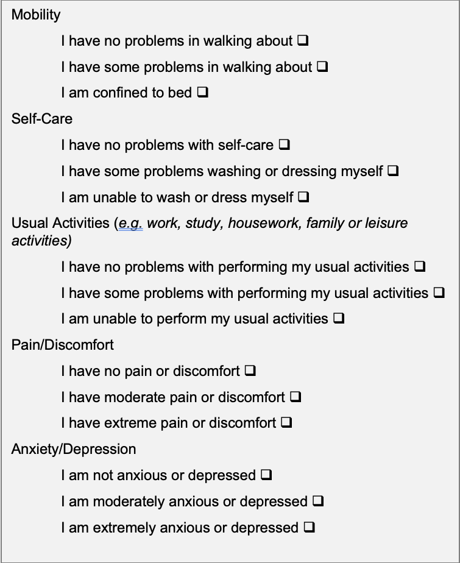{style="max-height: 70vh; width: auto;"}
:::
:::::

::: notes
(1) Indirect utility measures map preferences onto a utility scale via a
    generic health-related quality of life questionnaire
:::

## Indirect methods

::::::: concept-grid
::: concept-box
HUI   [Health Utility Index]{.db-text}
:::

::: concept-box
EQ5D   [EuroQol health status measure]{.db-text}
:::

::: concept-box
SF-6D   [Converts SF-36 & SF-12 scores to utilities]{.db-text}
:::

::: concept-box
QWB   [Quality of well-being scale]{.db-text}
:::
:::::::

::: notes
(1) I'm not going to get into detail for each of these since you don't
    need to know the granularity of each right now until you start
    exploring for your studies in the future, but just as an overview of
    some of the more well-known ones:

(2) HUI (Health Utility Index), based on a large, Canadian community
    sample (copyrighted, not free to use), patients are asked to
    consider their health over the past 2, 3, & 4 weeks

(3) EQ5D, European & US-based, asks participants to consider their
    health during the day of the interview; free but need to request
    permission & if you need to translate into other languages then it
    can be quite pricey

(4) SF-6D, 4 to 1-week recall period, converts the SF-36 & SF-12
    (validated, generic quality of life measures) into utility scores,
    conversion done by University of Sheffield developer John Brazier;
    published articles on the methodology to convert these

(5) QWB (Quality of Well-Being scale), asks participants to consider
    their health over the previous three days, primary care patients in
    San Diego, CA; contact UCSD health outcomes assessment program for
    access
:::

## Alternatives to ICERs

ICERs are the most common approach for describing CEA results

::::::: pros-cons-new
:::: pros-column
::: column-title
Advantages
:::

-   Summarizes all aspects of decision problem except WTP (which comes
    from decision-maker)
::::

:::: cons-column
::: column-title
Disadvantages
:::

-   Ratios can act poorly/are unstable; especially when there is a lot
    of uncertainty in the denominator, the incremental QALYs are small,
    or close to zero.
-   For cost-saving interventions, the ICER is meaningless.
::::
:::::::

## An Alternative

::: icon-bullets
[Maybe all of your interventions are cost-effective under accepted WTPs
& your goal, rather, is to quantify the short and long-term health
benefits of interventions.]{.fragment}

[If willing to choose a fixed willingness-to-pay threshold (e.g., λ=
100,000 / QALY), can write down an equation for the contribution of
health and cost to utility.]{.fragment}
:::

## 

::::: concept-grid
::: concept-box
Net Health Benefit (NHB)
:::

::: concept-box
Net Monetary Benefit (NMB)
:::
:::::

:::: concept-grid
::: {.concept-box .accent}
Objective: Select the strategy with the highest NHB/NMB
:::
::::

## Net Health Benefit (NHB)

$$
 NHB_s = E_s - \frac{C_s}{λ}
$$ $E_s$ is effectiveness of strategy s

$C_s$ is cost of s

$λ$ is WTP threshold

-   Effectiveness is already in QALYs, no conversion needed
-   Cost is in \$, needs conversion to QALYs (so need to divide by
    \$/QALY)

## Net Monetary Benefit (NMB)

$$
 NMB_s = E_s * λ - C_s
$$

where

$E_s$ is effectiveness of strategy s

$C_s$ is cost of s

$λ$ is WTP threshold

-   Cost is already in \$, no conversion needed

-   Effectiveness is in QALYs, needs conversion to \$ (multiply by
    \$/QALY)

## Example: NHB

::::: split-content
::: content-text
$E_1 = 0.07$ years

$E_2 = 0.10$ years

$C_1 = 1,500$

$C_2 = 2,800$

$λ = 50,000$ per year of life saved
:::

::: content-text
$ICER = \frac{2800 - 1500}{0.10 - 0.07}$

$=43,333$
:::
:::::

## Example: NHB

$NHB_1 = 0.07−\frac{1500}{50000} =0.040$

$NHB_2 = 0.10−\frac{2800}{50000} =0.044$

$IncNHB = 0.044−0.040=0.004$

::: {.arrow-bullets .incremental}
-   Suggests a small difference in QALYs between the interventions
    (.004\*365 = 1.46 days)
-   The cost adjusted NHB accounts for the tradeoffs between health
    outcomes and costs into a single measure.
:::

## Example: Net Monetary Benefit (NMB)

$NMB_1=(0.07×50000)−1500 = 2000$

$NMB_2=(0.10×50000)−2800=2200$

$IncNMB =2200−2000=200$

::: {.arrow-bullets .incremental}
-   Quantifies this improvement’s value in monetary terms. Treatment 2
    provides \$200 more net value than Treatment 1 after accounting for
    both its additional health benefit and higher cost.
:::

## NHB/NMB

The strategy with the highest incremental NHB or NMB is the preferred
option, given a specified WTP threshold.

::::: split-content
::: content-text
A higher NHB means more health gained after accounting for costs.
:::

::: content-visual
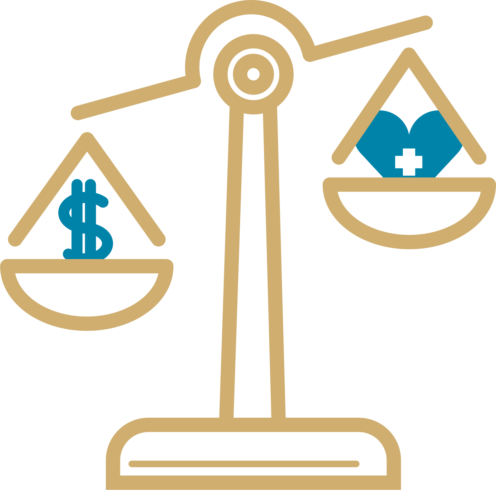
:::
:::::

##  {.summary-end-slide}

::::: summary-circle
::: end-title
Key Takeaways
:::

::: end-subtitle
Benefits
:::

<ul class="key-points">

<li>X</li>

<li>X</li>

<li>X</li>

<li>X</li>

</ul>
:::::

## Questions? {.questions-slide}

::: next-info
Next Lecture: <strong>Incremental CEA</strong>
:::
