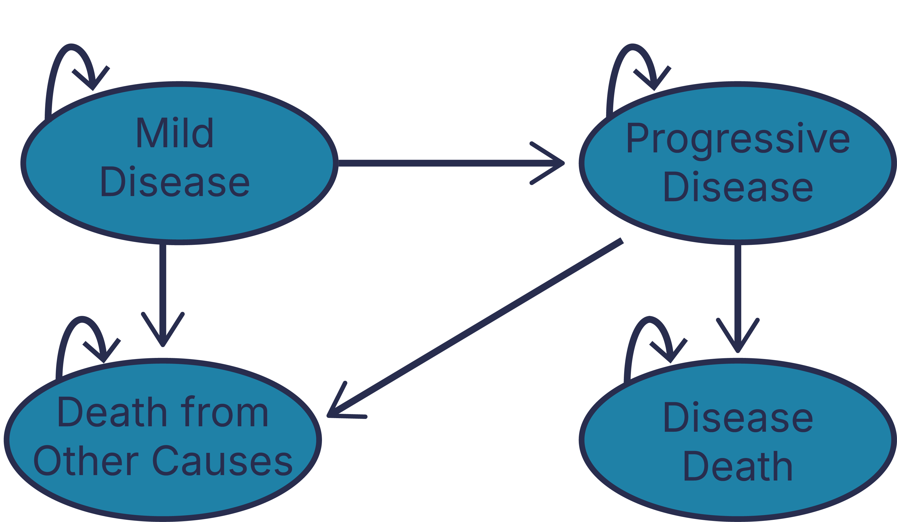

```{r}
#knitr::purl(here::here("modeling-dalys_harvard-2024.qmd"))
```

##  {.numbered-list-slide}

<h2>Learning Objectives</h2>

::::::::::::::: number-list
::::: list-item
::: number
01
:::

::: text
Review of DALY health outcomes
:::
:::::

::::: list-item
::: number
02
:::

::: text
Tips and tricks for modeling DALYs in Amua
:::
:::::
:::::::::::::::

## Overview of DALY Outcomes {.section-slide}

::: section-number
01
:::

## Common Outcomes

:::: icon-bullets
::: incremental
1.  Occupancy-based payoffs:

-   Utility/DALY weight applied for a time period / step.
-   Treatment/disease cost per time period / step.

2.  Transition-based payoffs:

-   One-time event-based cost (e.g., disease-related death, initial Dx,
    etc.).
-   One-time health outcome (e.g., years of life lost to premature
    mortality)
:::
::::

## Disability-Adjusted Life Years (DALYs)

:::: icon-bullets
::: incremental
-   Reflect both occupancy- and transition-based payoffs.
-   There's also *very* little guidance on how to structure a decision
    model for DALY outcomes.
-   We'll show you how today!
:::
::::

## DALYs

:::: icon-bullets
::: incremental
-   Origin story: Global Burden of Disease Study

-   Deliberately a measure of health, not welfare/utility

-   Similar to QALYs, two dimensions of interest:

    -   Length of life (differences in life expectancy)

    -   Quality of life (measured by disability weight)
:::
::::

## DALYs

{width="1500"}](https://en.wikipedia.org/wiki/Disability-adjusted_life_year)

::: fragment
:::: highlight-box
**DALYs = YLL + YLD**

-   YLL (Years of Life Lost)
-   YLD (Years Lived with Disability)
::::
:::


## Years of Life Lost to Disease

For a given condition $c$,

$$
YLD(c) = D_c \cdot L_c
$$

:::: icon-bullets
::: incremental
-   $D_c$ is the condition's disability weight
-   $L_c$ is the time lived with the disease.
:::
::::

## [Years of Life Lost to Premature Mortality]{.r-fit-text}

:::: icon-bullets
::: incremental
-   YLL are defined by by a "loss function."
-   Drawn from a reference life table, indicating remaining life
    expectancy at age $a$.
-   $$
    YLL(a)= Ex(a)
    $$
:::
::::

## [Years of Life Lost to Premature Mortality]{.r-fit-text}

:::: icon-bullets
::: incremental


:::
::::

## DALYs

$$
DALY(c,a) = YLD(c) + YLL(a)
$$

## Evolution of DALY Calculations

:::: icon-bullets
::: incremental
-   **Historical Practice:** Initial GBD studies applied age-weighting
    and 3% annual time discounting.
-   **Changes Post-2010:** Discontinuation of these practices for a more
    descriptive DALY measure.
:::
::::

## Current Discounting Practices

:::: icon-bullets
::: incremental
-   **WHO-CHOICE:** Time discounting of health outcomes.
:::
::::

##  {.summary-end-slide}

::::::: summary-circle
::: end-title
Key Takeaways
:::

::: end-subtitle
Modeling Without Discounting
:::

:::: key-points
::: incremental
-   Modeling DALYs in Amua is straightforward if you don't use
    discounting.
    -   For YLDs, use disability weight like you would a utility weight.
    -   For YLLs, use one-time "cost" of remaining life expectancy.
        - YLL = tbl_reference_life_table[initial_age + t, 1]
:::
::::
:::::::

##  {.summary-end-slide}

::::::: summary-circle
::: end-title
Key Takeaways
:::

::: end-subtitle
Modeling With Discounting
:::

:::: key-points
::: incremental
-   But if you do need to discount ...
    -   You're going to see some math expressions that take care of
        discounting for YLL outcomes.
    -   This math adds some complexity but not much insight, so I'll
        gloss over it a bit
    -   We'll provide you the formulas to use here and in the .amua
        model file.
:::
::::
:::::::

## Mathematical Formulation for DALYs in AMUA

::: arrow-bullets
-  $YLD(c) = D_c$.

-  $YLL(a,t)=  Ex(a)\exp(-\ln(1+r)*t)$.
    - $a$ is the time of death
    -   $r$ is the discount rate you're using in the model (e.g.,
    3%).

    - $t$ is the cycle number at which premature death occurs.
:::

## Mathematical Formulation for DALYs in AMUA

::: arrow-bullets
-  $YLD(c)=$ `dw_c`.

-   $YLL(a,t)=$ `tbl_ref_lt[initial_age+t,1]` $*\exp(-\log(1+$ `r_disc` $)*$ `t`$)$.
:::


## Overview of Decision Problem

:::: icon-bullets
::: incremental
-   Progressive disease model (from case study)
-   Focus only on cohort of individuals who develop mild disease.
-   Follow until death (from disease-related or other causes)
:::
::::

## Overview of Decision Problem

:::: icon-bullets
::: incremental
-   Major difference from case study: can ignore Healthy state.
-   Strategies: Status quo, prevention, treatment
:::
::::

## Methods: Structuring the Model {.section-slide}

::: section-number
02
:::

## State Transition Diagram {.nostretch}

{fig-align="center" width="800"}

## Defining Outcomes in Amua

:::: icon-bullets-triangle
::: incremental
-   YLD: New Outcome. Use disability weights instead of utility weights!
-   YLL: One-time "event" at time of death from disease.
    -   "Cost": present value of remaining life expectancy at age of death in
        the model.
    -   Intuition: we penalize premature death from disease using the
        remaining life expectancy at the age in which the person dies.
- Need to also define the discount rate as a parameter `r_disc`
:::
::::

## Interactive Amua Session

## Occupancy-Based Payoff: YLD

::: arrow-bullets
-   YLD is an "occupancy-based" payoff (i.e., YLD increments by
    disability weight for each cycle in that health state).
    -   Add `dw_mild` = 0.08
    -   Add `dw_progressive` = 0.15
    -   Add `dw_progressive_treated` = 0.13
-   Mild disease state: `dw_mild`
-   Progressive disease state: `dw_progressive`
:::

## Transition-Based Payoff: YLL

::: arrow-bullets
-   Remaining life expectancies are drawn from the reference life table,
    or from an endogenous life table.
-   Import reference life table as lookup table---just like we did with
    background mortality, etc.
-   Remember to use the "Truncate" option because the life table may not
    extend to the maximum age in the model.
:::

::: footer
Additional slides below (hit down button).
:::

## Life Expectancy & YLL

:::: icon-bullets
::: incremental
-   **Contextual Choices:** Remaining life expectancy values may vary by
    research context [@anand2019].
-   **Historical Method:** GBD uses an *exogenous* life table
    approximating maximum human lifespan.
-   **Alternatives:** *Endogenous* tables or models may be preferred in
    certain cases.
:::
::::

## Exogenous vs. Endogenous Life Tables

:::: icon-bullets
::: incremental
-   **Distinction:** Source of life expectancy values (external vs.
    internal).
-   **Exogenous:** Independent mortality risks, using GBD's reference
    table.
-   **Endogenous:** Specific to the population's mortality risks and
    health states.
:::
::::

## Incremental CEA

::: arrow-bullets
- ICERs are based on cost per DALYs *averted*
- Must export expected cost and DALY outcomes, then do ICER calculations outside Amua (e.g., Excel)
- Alternative: define YLL and YLD outcomes as their negative values.
  - CEA will work, but expected values will be negative.
:::

## Thanks! {.questions-slide}

::: {.highlight-box .primary}
Draft manuscript (with R code) available online at
<https://graveja0.github.io/dalys/>
:::

{fig-align="center" width="25%"}

:::{.next-info}
Next: Advanced Topics
:::

## References
