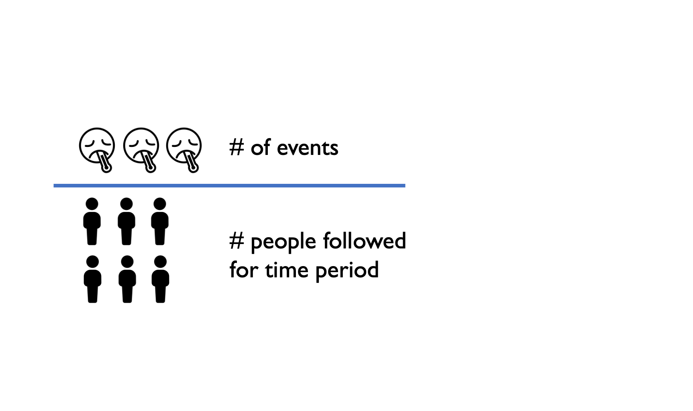
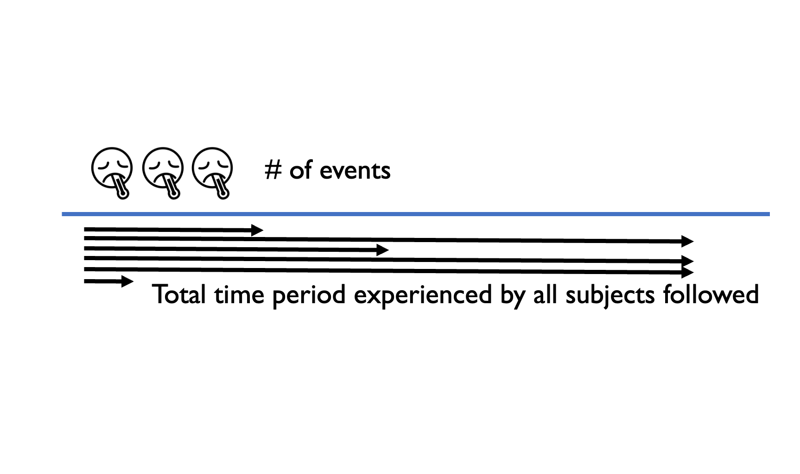
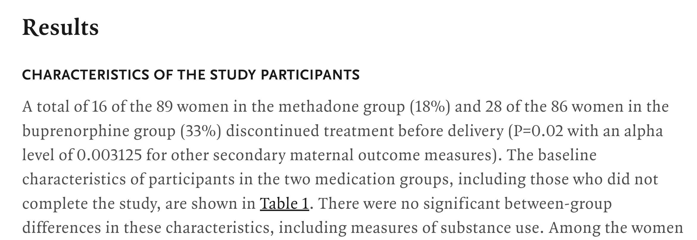
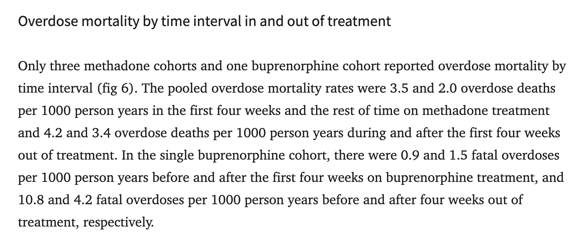

## Learning Objectives and Outline {.section-slide}

::: section-number
00
:::

## Learning Objectives

::: arrow-bullets
-   Differentiate between rates and probabilities conceptually

-   Interpret rates and probabilities in applied examples

-   Identify and correctly interpret rates and probabilities in the
    literature
:::

## Outline {.numbered-list-slide}

::: number-list
::: list-item
::: number
01
:::

::: text
Probability review
:::
:::

::: list-item
::: number
02
:::

::: text
Rates review
:::
:::

::: list-item
::: number
03
:::

::: text
Rates versus probabilities
:::
:::

::: list-item
::: number
04
:::

::: text
Summary
:::
:::

::: list-item
::: number
05
:::

::: text
Identifying rates and probabilities in the literature
:::
:::

::: list-item
::: number
06
:::

::: text
Translating between rates and probabilities
:::
:::
:::

## Probability Review {.section-slide background="#43464B"}

::: section-number
01
:::

## Probability

Probability is the likelihood that an event occurs **within a specified
time period**.

::: {layout-ncol="1"}
{width="539"}

> Out of everyone we followed for this period, what fraction experienced
> the event?
:::

## Probability can be reported in different ways
<br>

::: arrow-bullets
-   **Proportion / percentage:** 0.40 or 40%

-   **Frequency:** 40 per 100 (or 4 per 1,000)

-   **Odds:** $P/(1-P)$ (ranges from 0 to $\infty$)

-   **Epidemiologic terminology:** - **Cumulative incidence (risk):** the probability of experiencing the event by time *t* - Examples: "1-year risk," "5-year cumulative incidence"
:::


## Rates {.section-slide}

::: section-number
02
:::

## Rates involve person-time
<br>

::: arrow-bullets
-   **Incidence (hazard) rate:** number of events per unit of **person-time**

-   Rates describe **how fast** events occur

-   Rates can range from 0 to $\infinity$
::: 

## What is the difference between a rate and a probability? {background="#c2f0c2"}

## Rates vs. probabilities {.section-slide}

::: section-number
03
:::

## Rates vs. probabilities

::: arrow-bullets
-   **Probability (risk):** chance an individual experiences an event by a specified time\

-   **Rate:** speed at which events occur per unit of person-time\

-   **Key distinction:** rates use **person-time** in the denominator;
    probabilities do not
    -   **Probabilities collapse into a time window (10% by year 1; 30% by 3 years; it's cumulative);
    -   **Rates have time in the denominator 
::: 

## Rate (incidence rate)

{width="784"}


## Probability (risk)

{width="539"}


## Example: same study, probability vs. rate

::: arrow-bullets 
-   **Study:** 100 people followed for up to 4 years; 40 deaths.
-   **Probability (risk) over 4 years:** $40/100 = 0.40$\ ; 
-   *Interpretation:* 40% died within 4 years.

-   **Rate (if all 100 followed for 4 years):** Total person-time = $100 \times 4 = 400$ person-years;
    $40/400 = 0.10$ deaths per person-year <br> 
-   *Interpretation:* ≈1 death per 10 years of total follow-up across the study population (aggregated person time)
:::


## Timing & censoring
<br>

::: arrow-bullets
-   Rates change when **follow-up time differs**, even if the number of
    events is the same
-   **Censoring or dropout** reduces person-time and can increase the
    estimated rate
:::


## Example: events happen early vs. late

:::: {.definition-box .thin}

**Study:** 100 people, planned follow-up = 4 years <br>
**Case:** 40 deaths occur in Year 1

-   Person-time = $(40 \times 1) + (60 \times 4) = 280$ person-years\
-   **Rate:** $40/280 = 0.143$ deaths per person-year\
-   **Probability (risk):** $40/100 = 0.40$

::::


## When time-at-risk is not reported[^1]

[^1]: Source: @gidwaniEstimatingTransitionProbabilities2020

::: arrow-bullets
-   When individual follow-up time is unavailable, events are often
    assumed to be **evenly distributed**
-   This approximates equal person-time for everyone
-   If events occurred earlier, the true rate would be higher (and vice
    versa)
:::


## Summary: Rates vs. Probabilities {.section-slide}

::: section-number
04
:::

## Summary: Rates vs. Probabilities
<br>

::: arrow-bullets
-   **Probability**
    -   Answers: *What proportion of people experience the event by time
        X?*
-   **Rate**
    -   Answers: *How fast do events occur, per unit of time at risk?*
:::


## Summary: Rates vs. Probabilities


::: {style="font-size: 0.55em; line-height: 1.2;"}
| Measure                | Formula                                               | Range         | Used in              |
|-----------------|-------------------|-----------------|-------------------|
| **Rate**               | $\dfrac{\# \text{events}}{\text{total person-time}}$  | $0$--$\infty$ | Rate matrices        |
| **Probability / risk** | $\dfrac{\# \text{events}}{\# \text{people followed}}$ | $0$--$1$      | Probability matrices |
:::


## Identifying rates/probabilities through the literature {.section-slide}

::: section-number
05
:::

## Identifying rates/probabilities through the literature



## Identifying rates/probabilities through the literature



## Translating between rates and probabilities {.section-slide}

::: section-number
06
:::

## Converting rates/probabilities

::: arrow-bullets
-   **Rates** are instantaneous; they represent the speed of an event
    happening & because speed scales linearly with time, you can
    multiply or divide rates when the time period changes. 
<br>
-   **Probabilities** are accumulated outcomes (they are cumulative &
    bounded between 0-1); they do not scale linearly with time. You
    can't have more than 100% risk; so dividing/multiplying them does
    not preserve the correct relationship over time.
:::

## Another way of saying the same thing:

::: arrow-bullets
-   A rate tells us how fast an event occurs; it scales with time.
<br>
-   A probability tells us whether an event occurs within time "t"; it
    is cumulative & bounded. The relationship with time is non-linear
    because the chance of an event slows as fewer people remain at risk
    (i.e., why we say it's "cumulative")
::: 


## Conversions


::: columns
::: {.column width="60%"}
::: {.arrow-bullets .smaller}
- A standard Markov model assumes an **exponential (constant-hazard)** process.
- This allows conversion between **rates** (instantaneous) and **probabilities** (over time).
- If the hazard changes over time, simple conversions no longer apply.
:::
:::

::: {.column width="40%" style="display:flex; align-items:center; justify-content:center;"}
$$
p = 1 - e^{-rt}
$$
:::

:::


## Conversions

<br>

[Probability to Rate]{style="background-color: yellow;"} <br>

$$ r = \frac{-ln(1-p)} {t} $$

## Conversions

<br>

**Example:** Consider we have a 12-month probability of 10.8% that a
child under age 6 is newly diagnosed with elevated blood lead levels. If
your Markov model has a 3-month cycle length, a 3-month probability is
needed.

## Conversions {.smaller}

<br>

[STEP 1]{style="background-color: yellow;"} Convert the 12-month
probability to a 12-month rate (or 12-month probability to a 3-month
rate)

::: callout-note
Cannot divide/multiply probabilities
:::

$$ r = \frac{-ln(1-p)} {t} $$

$$ r = \frac{-ln(1-.108)} {1} = 0.1142891 $$

::: callout-note
Since the time period doesn't change, the denominator is 1
:::

::: notes
Ln = log
:::

## Conversions {.smaller}

<br>

[STEP 2]{style="background-color: yellow;"} Convert the 12-month rate to
a 3-month rate

$$ \frac{0.1142891}{4} = 0.02857228 $$

## Conversions {.smaller}

<br>

[STEP 2]{style="background-color: yellow;"} Convert 3-month rate to
3-month probability

$$
p = 1 - e^{-r\Delta t} 
$$

$$
p = 1 - e^{−0.02857228∗1} = 0.028168
$$

::: notes
3/12 = 1/4

If we wanted to convert to 1M rate, we would take 1/12

\*\*\* You take \# of months / 12. So, if you want a 5-year probability,
you take 60/12 = 5, so multiply by 5
:::

## Conversions {.smaller}

<br>

OR, [Step 1]{style="background-color: aquamarine;"} Convert the 12-month
probability to a 3-month rate

$$ r = \frac{-ln(1-p)} {t} $$

$$ r = \frac{-ln(1-.108)} {4} = 0.02857229 $$

## Conversions {.smaller}

<br>

[STEP 2]{style="background-color: aquamarine;"} Convert 3-month rate to
a 3-month probability

$$
p = 1 - e^{-r\Delta t} 
$$

$$
p = 1 - e^{−0.02857229∗1} = 0.028168 
$$

## Conversions

<br>

::: callout-note
\*\*\*IF we took the probability of .108 / 4 to get the 3M probability,
we would get 0.027. This is CLOSE but it could make a huge difference
when modeling hundredths of thousands of individuals, for example
:::

## Alternative Rate-to-Probability Conversions {.smaller}

## Alternative Rate-to-Probability Conversions {.smaller}

::: columns

::: {.column width="55%"}
::: {.arrow-bullets .smaller style="line-height:1.15"}
- Long cycles can include multiple transitions (healthy → sick → dead).
- Standard rate–probability conversion  
  $p_{HS}= 1 - e^{-r_{HS}\Delta t}$  
  treats transitions independently, ignoring competing risks.
- This hides within-cycle events.
- Can **underestimate deaths** with long cycles.
- Fix: shorter cycles or competing-risk conversions.
:::
:::

::: {.column width="45%"}
```{dot}
digraph G {
  layout = neato;
  Healthy [pos="0,0!" style="filled" fillcolor="#81aede"];
  Sick    [pos="1,1!" style="filled" fillcolor="#81aede"];
  Dead    [pos="1,-1!"];
  Healthy -> Healthy [color="#d9d0d0"];
  Sick    -> Sick    [color="#d9d0d0"];
  Healthy -> Sick    [color="blue" penwidth=3];
  Sick    -> Dead    [color="red" style="dotted" penwidth=3];
  Healthy -> Dead    [color="#d9d0d0"];
  Dead    -> Dead    [color="#d9d0d0"];
}
```
:::

:::


## Alternative Rate-to-Probability Conversions {.smaller}

A set of formulas often used to account for competing risks are as
follows:

$$
p_{HS}= \frac{r_{HS}}{r_{HS}+r_{HD}}\big ( 1 - e^{-(r_{HS}+r_{HD})\Delta t}\big )
$$

$$
p_{HD}= \frac{r_{HD}}{r_{HS}+r_{HD}}\big ( 1 - e^{-(r_{HS}+r_{HD})\Delta t}\big )
$$

$$
p_{HH} = e^{-(r_{HS}+r_{HD})\Delta t}
$$


## What to use 

::: {.smaller style="line-height:1.15"}

| Equation                                 | Use case                                                                                             | Advantage                                                                       |
|-----------------------|-----------------------|-------------------------|
| $p = 1 - e^{-rt}$                        | When you know a rate but need a probability for a fixed cycle length                         | Simple closed-form conversion under a constant (exponential) hazard             |
| $r = -\ln(1-p)/t$                        | When you have a probability but need a rate to rescale across time intervals                 | Preserves the correct exponential relationship when changing cycle length       |
| Competing-risk formulas $p_{HS}, p_{HD}$ | When more than one event can occur from the same state (e.g., *Healthy → Sick* and *Healthy → Dead*) | Properly accounts for competing hazards and prevents hidden within-cycle events |
:::


## Alternative Rate-to-Probability Conversions {.smaller}
<br>

::: {.highlight-box .larger}
There's an even more accurate way to correct for "competing risks" &
while it's beyond the scope of this introductory workshop, we will
briefly review how to do this within the Markov lecture.
:::


##  {.summary-end-slide}

::: summary-circle
::: end-title
Key Takeaways
:::

::: end-subtitle
Rates & Probabilities
:::

::: key-points
::: incremental
-   Probabilities are cumulative and bounded (0-1)
-   Rates are instantaneous and scale with time
-   Conversions require a constant hazard assumption
:::
:::
:::

