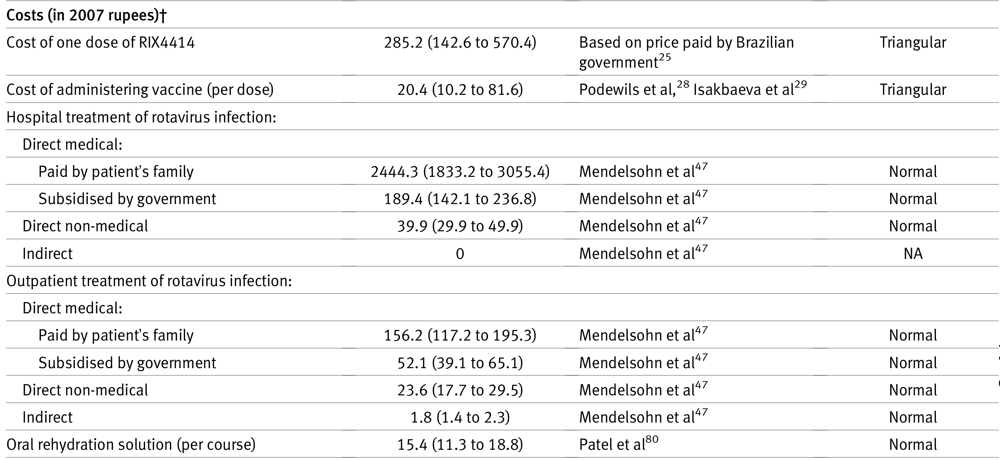
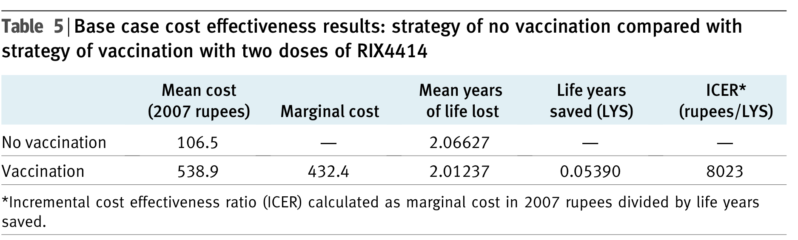
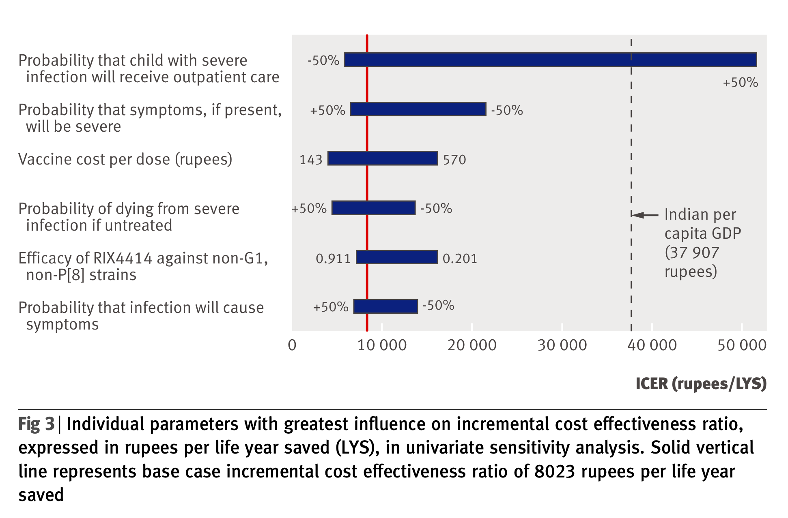

# Learning Objectives and Outline

## Learning Objectives

::: arrow-bullets
-   Explain the purpose of deterministic sensitivity analysis and
    provide examples of one-way versus two-way analyses.

-   Detail the advantages/disadvantages of deterministic sensitivity
    analysis.
::: 

## Outline {.numbered-list-slide}

::: number-list
::: list-item
::: number 01 :::
::: text
One-way sensitivity analysis
:::
:::
::: list-item
::: number 02 :::
::: text
Two-way sensitivity analysis
:::
:::
::: list-item
::: number 03 :::
::: text
Limitations and extensions
:::
:::
::: list-item
::: number 04 :::
::: text
Scenario analysis
:::
:::
::: list-item
::: number 05 :::
::: text
Threshold analysis
:::
:::
::: list-item
::: number 06 :::
::: text
Summing up analyses beyond the base case
:::
:::
:::

## Sensitivity Analyses

::: incremental
::: arrow-bullets
-   ICER for Prevention strategy is just above WTP threshold of
    \$50,000/QALY.
-   When evaluated using net monetary benefit at a $50,000/QALY threshold, treatment has a slightly higher NMB than prevention, indicating that the two strategies deliver nearly equivalent value for money.
-   How sensitive are these results to changes in specific model inputs?
:::
::: 

## One-way sensitivity analysis {.section-slide}

::: section-number
01
:::

## One-way sensitivity analysis

::: incremental
::: arrow-bullets
-   Usually the starting point for sensitivity analyses
-   Sequentially testing one variable at a time (i.e., Age, BMI, QALY,
    other clinically important parameters), while holding everything
    else constant
-   Determining how this variation impacts the results
-   One-way sensitivity analyses are often presented in a **tornado
    diagram**
    -   Used to visually rank the different variables in order of their
        overall influence on the magnitude of the model outputs 

:::
::: 

# Examples from publications

## Rotavirus study

## Rotavirus study

## Rotavirus study

## Other examples

## Other examples

## Other examples

{width="759"}

## Other examples

{width="777"}

# A hypothetical problem {background="#43464B"}

## Primary Results: Progressive Disease

| Strategy   | ICER    |
|------------|---------|
| Status Quo | \-      |
| Treatment  | 49,513  |
| Prevention | 139,630 |

-   Treatment is cost-effective at WTP=\$50,000/QALY---but *barely.*

-   How sensitive is this result to the input parameter values used?

## Two-way sensitivity analysis {.section-slide}

::: section-number
02
:::

## Two-way sensitivity analysis

::: incremental
::: arrow-bullets
-   A way to map the interaction effects between two parameters in a
    decision analysis model
-   Varies 2 parameters at a time
-   Explores the robustness of results in more depth
:::
::: 

# Examples from publications

## HIV prevention

{width="517"}

## HIV prevention

::: incremental
::: arrow-bullets
-   Markov model examining strategies for HIV prevention among
    serodiscordant couples seeking conception (woman does not have HIV
    and male has HIV)

-   We know that if the **male partner is consistently on medication for
    HIV** (i.e., resulting in virologic suppression), then the risk of
    transmission is small regardless of the woman taking PrEP
    (pre-exposure prophylaxis)

-   And we also know that PrEP has traditionally been really **costly**
:::
::: 

## HIV prevention

## Financial incentives for acute stroke care

{width="543"}

## Financial incentives for acute stroke care

::: incremental
::: arrow-bullets
-   Under pay for performance policies in the US, **physicians or
    hospitals are paid more for meeting evidence-based quality targets**

-   Study objective: Illustrate how pay-for-performance incentives can
    be quantitatively bounded using cost-effectiveness modeling, through
    the **application of reimbursement to hospitals for faster
    time-to-tPA for acute ischemic stroke**
:::
::: 

## Financial incentives for acute stroke care

> When administered quickly after stroke onset (within three hours, as
> approved by the FDA), tPA helps to restore blood flow to brain regions
> affected by a stroke, thereby limiting the risk of damage and
> functional impairment

## Financial incentives for acute stroke care

{width="520"}

## Limitations & extensions {.section-slide}

::: section-number
03
:::

# Limitations of deterministic sensitivity analyses {background="#43464B"}

## Caution: Limitations!

::: arrow-bullets
-   Limited by the subjectivity of the choice of parameters to analyze
-   That's why we also run PSAs!, i.e., varying ALL input parameters at
    the same time, using priors to play a distribution around each value
    -   PSA lecture will be available asynchronously 
::: 

## Scenario analysis {.section-slide}

::: section-number
04
:::

## Motivation

::: arrow-bullets
-   Rather than adding new strategies, we can model interventions under alternative assumptions—e.g., medication initiated pre-pregnancy versus during pregnancy, which has different startup risks and costs (hospital-based initiation vs no required stay if already stable).
:::

## Scenario analysis

::: incremental
::: arrow-bullets
-   Examines uncertainty in **model assumptions or structure**, often resulting in different parameter values across scenarios (while interventions/strategies remain the same)
-   Uses hypothetical or alternative scenarios (e.g., optimistic vs conservative assumptions about long-term survival).
-   Can include separate analyses by:
    -   Subgroups or sub-populations (e.g., age cohorts, risk levels)
    -   Perspective (societal vs healthcare sector)
    -   Time horizon

:::
::: 

## Examples

## Examples

## Examples

## Examples

## Examples

## Examples

{width="748"}

## Scenario analysis {.section-slide}

::: section-number
05
:::

## Threshold analysis

-   Answers the question: What does the input parameter need to be to meet the
    country thresholds of:
    -   \$50,000/QALY gained
    -   \$100,000/QALY gained
    -   \$150,000/QALY gained
    -   \$200,000/QALY gained

## Examples

## Examples

## Summing up analyses beyond the base case {.section-slide}

::: section-number
06
:::

## Analyses Beyond the Base Case

| Analysis type | What varies | What question it answers | What it does *not* tell you |
|--------------|------------|--------------------------|-----------------------------|
| One-way sensitivity analysis | One parameter at a time | Which inputs most influence results? | Joint uncertainty |
| Two-way sensitivity analysis | Two parameters jointly | How do two key inputs interact? | Full parameter uncertainty |
| Threshold analysis | A single parameter | At what value does the preferred strategy change? | How plausible that value is |
| Scenario analysis | Model assumptions or structure (with re-specified parameters) | How do results change under alternative plausible scenarios? | Key inputs may be unavailable, leading to partial or simplified scenario assumptions |
| Probabilistic sensitivity analysis (PSA) | All uncertain parameters simultaneously | What is the probability each strategy is cost-effective at a given WTP? | Does not address uncertainty in model structure or assumptions |

# Probabilistic Sensitivity Analysis (PSAs)

## PSAs: Asynchronous lecture 

::: arrow-bullets
-   Goes beyond other sensitivity analyses; instead of testing changes 1 at a time, PSA:
    -   Reflects how uncertain we actually are about each input simultaneously
    -   Combines that uncertainty across the entire model 
    -   Estimates the proportion of simulations in which each strategy is cost-effective at a given WTP (e.g., out of 10,000 iterations)

:::

# Thank you!
