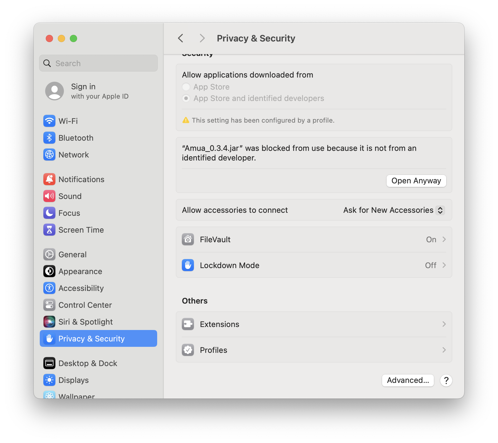
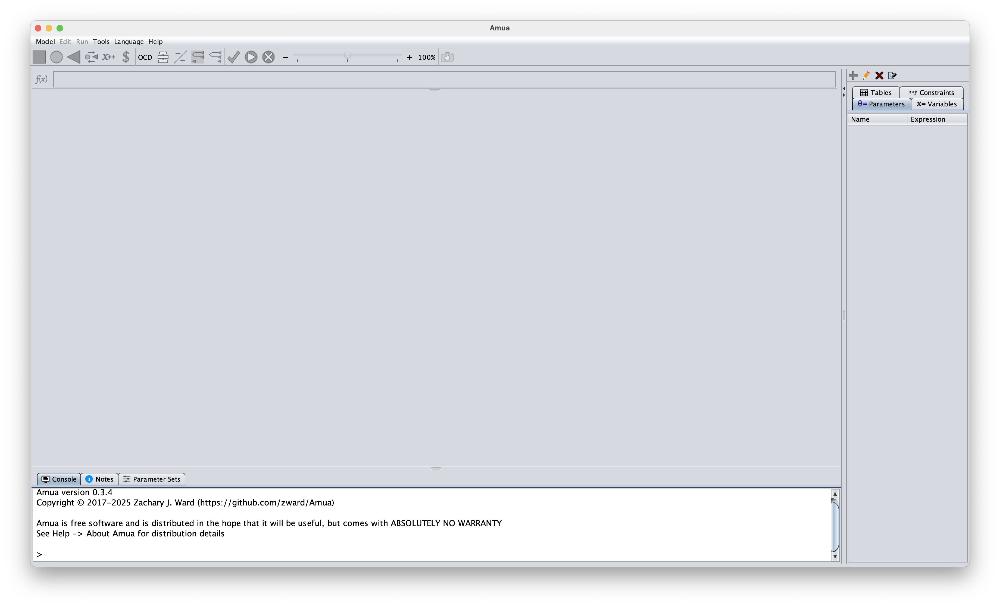

## Welcome Letter

Congratulations on being selected to join us for the Health Economics Decision Modeling Workshop in Cebu. To provide you the best experience possible, we are asking you to complete some pre-work.

This work is designed to help you prepare for the capstone project you’ll complete during the workshop. It may feel a bit unusual because, instead of learning the theory first and then applying it, we’re asking you to start with practical work. Since you may not have a modeling background, we’ve created tools to guide you in gathering the necessary information without requiring prior modeling experience. You might encounter challenges along the way, so please don’t hesitate to reach out if you have any questions, **we’re here to help.**

### Please complete the following before the workshop:

1.  Topic Survey that will sent to your email \[Due: December 12\]

2.  Collecting data using the [data collection tool](https://geratcliff.shinyapps.io/shinyapp_data/) \[Due January 8\]

    -   Data Collection Survey that will sent to your email to collect your progress

3.  Download AMUA \[Due January 15\]

4.  Slides to introduce yourself and your topic (format below) \[Due January 23\]

5.  Knowledge baseline that will sent to your email right before the workshop \[Due January 23\]

## How to create a PICOT Question

A PICOT question helps you clearly define the focus of your project by breaking it into five key components: Population, Intervention, Comparison, Outcome, and Timeframe. This structured approach ensures your work is specific, measurable, and aligned with evidence-based practice, making it easier to guide research, collect data, and evaluate results effectively.

<details>

<summary style="color: orange;">

Instructions

</summary>

<p style="color: black;">

We recommend using the PICOT guide created by the AWHONN

```{=html}
<iframe src="/media/PICOT-Questions.pdf" width="100%" height="600px"></iframe>
```

*Used with permission from AWHONN*

</p>

</details>

## How to search for Data

This section provides general resources on conducting academic searches, including tips for using databases and refining keywords. You’ll also find a PDF guide specifically focused on searching for cost-effectiveness analyses (CEAs), which walks you through strategies to locate studies efficiently.

<details>

<summary style="color: orange;">

General Best Practices

</summary>

<p style="color: black;">

### Finding Literature for Your Study

#### Use your PICO(T) Question

You can paste your PICO(T) question into an online search.

-   Do *not* include directional terms (decrease, improve, etc.). Including directional terms may return an incomplete and biased literature search.

::: callout-note
Example: In adolescents with anxiety or depression (P), how does cognitive behavioral therapy (I) compared to current practice (C) affect treatment outcomes (O)?
:::

#### Pull out Key Concepts

When you look through your PICO(T) questions what are the main themes that come up? These should be the topics that are specific enough to return helpful data but broad enough that research has been conducted.

::: callout-note
Key Concepts from Example:

• Adolescents

• Anxiety or depression

• Cognitive behavioral therapy
:::

#### Consider variations

To make sure that all papers related to your topic are captured, you will want to create a list of other words and phrases that can be used to describe the same thing. These will result in more papers related to your topic.

::: callout-note
Example variations in phrase and spelling:

• Adolescents – adolescent (s), youth (s), teen (s), teenager (s)

• Anxiety or depression – depressed, depressive, depression, anxiety, anxiousness, angst, nervousness, hypervigilant, hypervigilance

• Cognitive behavioral therapy – cognitive behavioral therapy (ies), cognitive behaviour therapy (ies), mindfulness, cognitive restructuring, cognitive reframing, cognitive psychotherapy (ies)
:::

#### Use Boolean operators to write your search

Boolean operators connect search terms together and define the results that are produced.

-   AND – all search terms must be present in results returned

-   OR – any of the search terms can be present in the results returned

-   NOT – ignore a search term; do not include it in the results returned Advanced search strategies can easily expand or specify your search.

-   \* – using the wild card returns results that include all terms with any ending in the root word

-   () – nesting works by grouping all like alternative terms

::: callout-note
Example search strategy: (adolescent\* OR your\* OR teen*) AND (depress* OR angst OR anxiety OR anxious\* OR nervous OR hypervigilan*) AND (“cognitive behavioral therap*” OR “cognitive behaviour therap*” OR mindfulness OR “cognitive restructure*” OR “cognitive reframe\*”)
:::

### Where to Find Papers

**PubMed®** <https://pubmed.ncbi.nlm.nih.gov/>

Largest biomedical and health sciences literature database comprising more than 39 million citations for biomedical literature from MEDLINE, life science journals, and online books. Hosted by the US National Library of Medicine.

Interactive tutorials on the PubMed® website:

• [Find Articles by Author](https://www.nlm.nih.gov/oet/ed/pubmed/quicktours/author/index.html)

• [Save Searches and Set E-mail Alerts](https://www.nlm.nih.gov/oet/ed/pubmed/quicktours/alerts/index.html)

• [Using the Advanced Search](https://www.youtube.com/watch?v=-JS5f0REiV0)

• [Subject Search: How It Works](https://www.nlm.nih.gov/oet/ed/pubmed/quicktours/topic_how_it_works/index.html)

• [PubMed Online Training](https://learn.nlm.nih.gov/rest/training-packets/T0042010P.html)

• [PubMed User Guide](https://pubmed.ncbi.nlm.nih.gov/help/)

**Web of Science** IP Address: 160.129.250.236

Paid-access platform

**Google Scholar** <https://scholar.google.com/>

Freely available search engine

**S.I.F.T Method** <https://hapgood.us/2019/06/19/sift-the-four-moves/>

Use this method to help you judge the veracity of the online source.

S – Stop

I – Investigate the source

F – Find better coverage

T – Trace quotes, claims, and media back to the original context

### Citation Management 

We will not be requiring this for the workshop. Please focus on collecting data over using citation management. However, we wanted to ensure that resources were still provided.

**ORCiD** Open Researcher and Contributor ID orcid.org

ORCiD is a free, unique, persistent identifier (PID) for individuals to use as they engage in research and scholarship activities.

**Mendeley** is a desktop and web program for managing and sharing research papers, discovering research data and collaborating online. It combines Mendeley Desktop, a PDF and reference management application (available for Windows, Mac and Linux) with Mendeley Web, an online social network for researchers.

Download Mendeley Applications

-   [Getting started with Mendeley Reference Manager](https://www.mendeley.com/guides/mendeley-reference-manager/)

-   [Mendeley Web Importer](http://www.mendeley.com/import/)

Import papers, web pages and other documents directly into your reference library from search engines and academic databases.

-   [Mendeley Videos & Tutorials](https://www.mendeley.com/guides/videos)

Available from mendeley.com

**Zotero** is a free, open-source citation management software.

Getting Started:

-   [Zotero Desktop Application](https://www.zotero.org/download/)

Download the application to your computer where you can view and manage your citations from your desktop.

-   [Zotero Web Account](https://www.zotero.org/user/register/)

Register for a free account. Sync your online account with your desktop application to view and manage your library online.

-   [Zotero Web Connecter](https://www.zotero.org/download/)

Install the web connector into your browser and import citations from the web directly into your Zotero library.

Zotero Support and Training: Information and materials available from Zotero's website.

-   [Zotero Quick Start Guide](https://www.zotero.org/support/quick_start_guide)

-   [Zotero Documentation](https://www.zotero.org/support/)

-   [Zotero Tutorial Videos](https://www.zotero.org/support/screencast_tutorials)

*Created based on tools from the Vanderbilt University Biomedical Library*

</p>

</details>

<details>

<summary style="color: orange;">

CEA Specific

</summary>

<p style="color: black;">

```{=html}
<iframe src="/media/data_search.pdf" width="100%" height="600px"></iframe>
```

</p>

</details>

## Data Collection Tool

As we mentioned before, we understand the difficulty of trying to collect data for your project without knowing the modeling methods. We have attempted to create tools to help you collect the information you need without modeling experience. However, you may run into challenges. There is a form submission at the bottom of the tool to ask for assistance from the team. Read the following below before starting the work within the tool.

<details>

<summary style="color: orange;">

Instructions

</summary>

<p style="color: black;">

### About the tool

This tool will walk you through tabs from left to right (Introduction → 1 → 2 → 3 → 4 → 5 → 6), to help you determine the data points that you need. The tool has been created without modeling specific text to help you understand the steps on each tab.

#### You will

-   Have an indepth understanding your disease/health condition

-   Choose strategies to compare

-   Identify health states

-   List events that happen

-   Collect data

### Saving your work

The tool will auto save your changes to your machine, but we HIGHLY recommend using the backup save after each session to ensure you do not lose all your data. When you click the `Manual Backup` button, a file will download to your computer (it ends in .rds)

::: callout-note
The Excel download on tab 6 cannot be loaded back into the tool.
:::

### Working together

We recommend that all participants complete tabs 1, 2, 3, 4, and 5. However, you can work on step 6 together once you agree on the other steps. The `.rds` file that is saved upon clicking the `Manual Backup` button can be shared with the rest of your assigned topic team so you can work together on data collection

::: callout-caution
The `.rds` file will include all the data you input. If you are using sensitive or classified data, you can make a note in the tool instead of uploading it and keep the data saved somewhere easy to access on your machine.
:::

**In early January, we will be asking for the `.rds` to understand the progress that has been made on data collection.**

### For assistance with the tool

Start with the walk-through under the `❓Help & FAQ` section. If that is unable to answer your questions, please reach out to get assistance.

### Workshop specific notes

...

</p>

</details>

## How to Download Amua

For the workshop, the free open-source tool Amua will be used to work on the case study and capstone. Amua is a user friendly decision modeling tool developed by Zach Ward, our colleague at Harvard University.

<details>

<summary style="color: orange;">

Download Instructions

</summary>

<p style="color: black;">

#### 1. Get Java on your computer

To check if java is on your computer do the following:

+---------------------------------------------------------+---------------------------------------------+
| On a Windows                                            | On a Mac                                    |
+=========================================================+=============================================+
| 1.  Press `Win + R`                                     | 1.  Press `Cmd + Space`                     |
| 2.  Type `wt` (for Windows Terminal), and press `Enter` | 2.  Type "Terminal," and press `Enter`      |
| 3.  Paste `java -version` into the terminal             | 3.  Paste `java -version` into the terminal |
+---------------------------------------------------------+---------------------------------------------+

If you have java it will print out a the version. It will look like this:

```         
USER@ComputerID ~ % java -version
java version "1.8.0_471" 
Java(TM) SE Runtime Environment (build 1.8.0_471-b09) 
Java HotSpot(TM) 64-Bit Server VM (build 25.471-b09, mixed mode)
```

If you do not see this, then you need to first download Java.

</p>

[Download Java](https://www.java.com/en/download/manual.jsp)

<p style="color: black;">

#### 2. Download Amua

Once Java is installed on your computer, you will need to download Amua. Follow the instructions on the website below.

</p>

[Install Amua](https://github.com/zward/Amua/wiki/Getting-Started)

::: callout-note
**Mac Users:** If it says “Amua_0.3.4.jar” cannot be opened because it is from an unidentified developer.", Go `Settings > Privacy & Security.` Scroll down until you see the app being blocked and click `Open Anyway`.


:::

<p style="color: black;">

#### 3. Open to make sure it works!

After you have downloaded Amua, open it to make sure that it works. You should see the following screen.



#### If this worked, you have successfully downloaded AMUA 🎉

</p>

::: callout-warning
### *If you were NOT able to do this successfully, please reach out to the team so we can assist you properly.*
:::

</details>

## Start creating your slides

One the first day of the workshop, you will meet in small groups and present your capstone information in small groups. These meetings will be the first few slides of your eventually final workshop. Each day we will

<details>

<summary style="color: orange;">

More Information

</summary>

<p style="color: black;">

Upon arrival you should have the following:

-   Slide 1: Introduction to you

-   Slide 2: Background of your topic

-   Slide 3: Strategies that you are comparing

Please use the following template and example to create your slides. These will be presented on day 1 of the workshop.

Here is a link to [download the presentation file](/media/inital-presentation.pptx).

</p>

</details>

<p style="font-size: 36px; text-align: center;">

**Thank you for all the time you have put into the pre-work, we look forward to seeing you at the Cebu 2026 workshop!**

</p>
