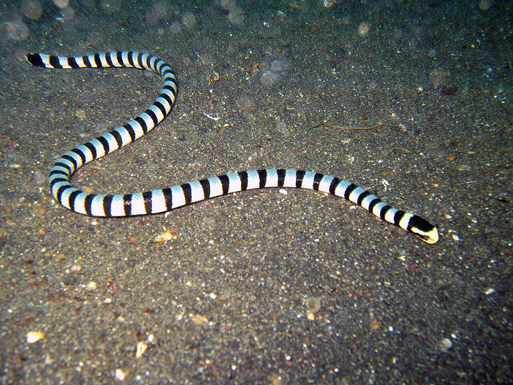

%20(1).png)

# CASE STUDY ANSWERS

## Incremental CEA

### **First Table - Just three hand written**

+-----------------+--------+--------+----------+--------+---------+-----------+
| Strategy        | Cost   | LY     | Inc Cost | Inc LY | ICER    | Status    |
+=================+========+========+==========+========+=========+===========+
| No Screen/Treat | 2800   | 19.04  |          |        |         |           |
+-----------------+--------+--------+----------+--------+---------+-----------+
| Screen all      | 4950   | 19.688 | 2150     | 0.648  | 3317.90 |           |
+-----------------+--------+--------+----------+--------+---------+-----------+
| Treat all       | 30000  | 19.484 |          |        |         | Dominated |
+-----------------+--------+--------+----------+--------+---------+-----------+

**Verify your results in Amua:** 3317.90

### **Second Table - Additional Strategies**

+-------------+---------+--------+----------+--------+------------+--------------------+
| Strategy    | Cost    | LY     | Inc Cost | Inc LY | ICER       | Status             |
+=============+=========+========+==========+========+============+====================+
| Nothing     | 2800.0  | 19.04  |          |        |            | Baseline           |
+-------------+---------+--------+----------+--------+------------+--------------------+
| Screening   | 4950    | 19.688 | 2150     | 0.648  | 3317.90    |                    |
+-------------+---------+--------+----------+--------+------------+--------------------+
| Treat High  | 29000   | 19.91  | 24050    | 0.22   | 108333. 33 |                    |
+-------------+---------+--------+----------+--------+------------+--------------------+
| Treatment   | 30000.0 | 19.484 |          |        |            | Strongly Dominated |
+-------------+---------+--------+----------+--------+------------+--------------------+
| screen High | 28000.0 | 19.89  |          |        |            | Weakly Dominated   |
+-------------+---------+--------+----------+--------+------------+--------------------+

**Verify your results in Amua:** 3317.90

**Verify your results in Amua (\$200,000/LY):** 108333. 33

